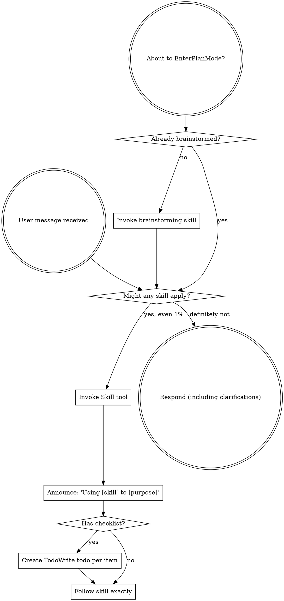

# Continuing training on pre-trained model

## Metadata

- **Conversation ID:** 53b2e9ae-9fd7-4f84-a4c1-f82c4b6e23a0
- **Mode:** agent
- **Created:** 2026-03-26 13:12:56
- **Last Updated:** 2026-03-27 12:00:06
- **Branch:** main
- **Files Changed:** 2
- **Lines Added:** 86019
- **Lines Removed:** 85629
- **Summary:** Edited moe_flashattn_5.ipynb, moe_flashattn_5_1.ipynb

---

## Conversation

### 🧑 User

**File: /Users/a964286/Documents/Projects/Clinical_TE/Clinical_TE/dev/moe/moe_flashattn_4.ipynb**
```

exp2b_baseline_results_11M = run_single_experiment(
    exp_name=EXP_NAME,
    moe_config=moe_config,
    use_learnt_att_pool=use_learnt_att_pool,
    prepared_data = data_prepared_11M,
    train_data=train_df,
    val_data=val_df,
    device=device,
    epochs=EPOCHS,
    experiment_round=EXPERIMENT_ROUND,
    embedding_size=EMBEDDING_SIZE,
    log_dir='logs',
    save_model=True,
    optimize_config=optimize_config
)


```


**File: /Users/a964286/Documents/Projects/Clinical_TE/Clinical_TE/dev/moe/moe_flashattn_5.ipynb**
```

# ============================================================================
# EXPERIMENT: Phase 2 — Co-occurrence Embeddings + Stage 2 Decoder Re-training
# ============================================================================
# Run AFTER Phase 1 if tail_top10_acc remains at 0%.
# Tests whether embedding homogenization (tail std=0.03) is the barrier.
#
# This experiment:
# 1. Pre-computes PPMI+SVD embeddings from training co-occurrence
# 2. Initializes embedding_cd with these (frozen for first 50% of training)
# 3. Runs Stage 1 with staged unfreezing
# 4. Runs Stage 2 with code-balanced decoder re-training

```


I have a full dataset training exp2 in @moe_flashattn_4.ipynb (3-18); Now I wanted to uses the method in @moe_flashattn_5.ipynb (1-11) to continue to retrain the fully trained model in "Clogs/exp_round10_3lobs_formal_training/exp2b_flash_learned_pool_formal/saved_models/exp_round10_3lobs_formal_training_exp2b_flash_learned_pool_bs128_ep1_d256_20260312_095916_best.pt"; 
Question: Do you have to retrain the exp_round10 model from scratch? or I just reused the trained model to continuous training? If I can continuous training, how? the data prepared name for full training is data_prepared_11M

---

### 🤖 Assistant

I'll investigate the codebase to understand the model architecture, training pipeline, and the Phase 2 co-occurrence embedding approach to give you a precise answer.

---

### 🤖 Assistant

Let me look at the core training functions, model loading, and the Phase 2 specifics in v5.

---

### 🤖 Assistant

Now let me look at the v5 specifics — `compute_cooccurrence_embeddings`, `freeze_encoder`, `reinit_decoder_rows`, `train_stage2`, and how the v5 `run_single_experiment` handles Stage 2 integration.

---

### 🤖 Assistant

So the Phase 2 functions described in the v5 markdown don't exist in code yet — they're documented as planned capabilities. Let me now look at what `moe_flashattn_5.ipynb` actually contains.

---

### 🤖 Assistant

Now let me search for what's actually implemented in the v5 notebook — the cell contents with Stage 2 and co-occurrence functions.

---

### 🤖 Assistant

Good — the functions exist in v5. Now let me understand what the v5 run_single_experiment looks like and how it integrates Stage 2.

---

### 🤖 Assistant

Now let me look at how `run_single_experiment` in v5 integrates Stage 2 — specifically the part that decides whether to run Stage 2 after Stage 1.

---

### 🤖 Assistant

Now let me check the v5 execution cells to see how it's actually called — specifically how the experiment cell sets up the model and whether there's a `load_model` or `resume_from` path.

---

### 🤖 Assistant

Now let me look at the actual experiment execution cell in v5 to see how it's called with Stage 2.

---

### 🤖 Assistant

Now I have a complete picture. Let me also check how `run_single_experiment` in v5 creates the model to see if there's a `resume_from` path.

---

### 🤖 Assistant

I now have a thorough understanding of the architecture. Here's the answer to your question:

---

**You do NOT need to retrain from scratch. You can absolutely continue training from the saved model.** The v5 architecture was explicitly designed for this — Stage 2 is a decoupled decoder re-training phase that takes a **fully trained Stage 1 model** and only re-trains the decoder head.

Here's the key insight from the codebase:

**What v5's `run_single_experiment` currently does** (at line ~16664 of the notebook): It runs Stage 1 (full training) and then **automatically** runs Stage 2 on the same in-memory model. But this means Stage 1 runs from scratch *every time*, which is wasteful when you already have a fully trained model.

**What you actually want**: Skip Stage 1 entirely, load your saved exp_round10 model, and run **only Stage 2** (decoder re-training) or the Phase 2 co-occurrence embedding approach.

### How to Continue Training (Two Options)

**Option A — Stage 2 Only (Decoupled Decoder Re-training)**

This is the most direct path. The pieces already exist in v5:

```python
from moe_flashattn_5 import (
    load_trained_model, freeze_encoder, reinit_decoder_rows,
    train_stage2, Stage2Config, compute_stage2_diagnostics,
    FlashAttentionTransformer, FlashAttentionConfig
)

MODEL_PATH = "logs/exp_round10_3lobs_formal_training/exp2b_flash_learned_pool_formal/saved_models/exp_round10_3lobs_formal_training_exp2b_flash_learned_pool_bs128_ep1_d256_20260312_095916_best.pt"

# 1. Load the trained model
model = load_trained_model(
    model_path=MODEL_PATH,
    model_class=FlashAttentionTransformer,
    config=data_prepared_11M.config,
    device=device
)

# 2. Run Stage 2 directly (freeze_encoder + reinit_decoder happen inside)
stage2_config = Stage2Config(
    enabled=True,
    learning_rate=5e-5,
    epochs=3,
    optimizer='sgd',
    reinit_rare_decoder=True,
    reinit_tiers=('rare', 'tail'),
    codes_per_batch=16,
    positives_per_code=8,
    batch_size=128,
    use_focused_loss=True
)

# Create datasets/loaders from your existing prepared data
train_dataset = ClinicalDataset(train_df, data_prepared_11M.config)
val_dataset = ClinicalDataset(val_df, data_prepared_11M.config)
val_loader = DataLoader(val_dataset, batch_size=128, shuffle=False,
                        collate_fn=create_collate_fn(data_prepared_11M.config))

# Run Stage 2
stage2_results = train_stage2(
    model=model,
    train_dataset=train_dataset,
    val_loader=val_loader,
    code_frequencies=data_prepared_11M.code_frequencies,
    stage2_config=stage2_config,
    config=data_prepared_11M.config,
    device=device,
    use_mixed_precision=True
)
```

**Option B — Phase 2 (Co-occurrence Embeddings + Stage 2)**

This is the full v5 approach from your attached code comment. It:
1. Computes PPMI+SVD embeddings from `data_prepared_11M`
2. Loads your trained model
3. Replaces `embedding_cd` weights with co-occurrence embeddings
4. Runs Stage 1 with staged unfreezing (embeddings frozen for first 50%)
5. Runs Stage 2 with code-balanced decoder re-training

For Phase 2, you would set `optimize_config.use_pretrained_embeddings = True` and pass `stage2_config` — but this does re-run Stage 1 with modified embeddings, so it's partially retraining (though the encoder weights start from your trained model via `resume_from`).

### Recommendation

**Start with Option A** — it's the most resource-efficient. Your exp_round10 model already has good encoder representations (Recall@10 is likely solid from the formal training). The whole point of the decoupled approach (Kang et al., ICLR 2020) is that encoder quality is already sufficient from standard training; it's only the decoder that needs re-training with balanced sampling to break the tail_top10_acc = 0% floor.

If Option A doesn't move tail metrics, then escalate to Option B which addresses the embedding homogenization problem (tail std=0.03).

Want me to set up the actual notebook cells for Option A so you can run it against your 11M data?

---

### 🧑 User

Yes set up the notebook cells in @dev/moe/moe_flashattn_5.ipynb for the fully trained model

---

### 🤖 Assistant

I'll set up the notebook cells for running Stage 2 on your fully trained exp_round10 model. Let me first understand the existing notebook structure at the end where experiment cells live, and verify the exact function signatures and data preparation patterns.

---

### 🤖 Assistant

Now let me find the exact cell index and content of the last experiment cells, and the specific cell where I should insert the new Stage 2-only cells.

---

### 🤖 Assistant

Now let me find the cell indices. I need to locate cells by their unique IDs to figure out where to insert.

---

### 🤖 Assistant

Good. I'll insert the new cells after cell 313 (the empty cell after the V5 experiments section). Let me also verify the `OptimizeConfig` and `Stage2Config` field names to get them exactly right.

---

### 🤖 Assistant

Now let me also check how `get_experiment_configs` works for retrieving the exp2b config, and find `train_stage2` function to confirm it handles the DataParallelWrapper case.

---

### 🤖 Assistant

Now let me also check how the `train_stage2` function handles the scaler (for mixed precision) and the `create_collate_fn` import.

---

### 🤖 Assistant

Now let me also check whether there's a `GradScaler` import in the notebook and how the `evaluate_model` function works in v5.

---

### 🤖 Assistant

Now I have all the context. I'll insert the cells after cell 313 (the empty cell after the V5 experiments section), right before the "Formal Training 2 - MOE variants" markdown at cell 314. I'll create: (1) a markdown header cell, (2) a config cell, (3) a model-load + diagnostics cell, (4) the Stage 2 execution cell, and (5) a results reporting cell.

---

### 🤖 Assistant

Now let me verify the cells were inserted correctly and check for any issues.

---

### 🤖 Assistant

Now let me verify the `evaluate_model` function exists in v5. I referenced it in Step 5 — let me check the actual function name.

---

### 🤖 Assistant

The function is `comprehensive_evaluation`, not `evaluate_model`. Let me also check `evaluate_epoch` which is the simpler eval function.

---

### 🤖 Assistant

Let me check the `evaluate` function signature at line 8971.

---

### 🤖 Assistant

The function is `evaluate()` and requires a `criterion`. Let me also check `comprehensive_evaluation` signature.

---

### 🤖 Assistant

`comprehensive_evaluation` requires `training_time_sec` and `epoch_history` which we don't have from a standalone Stage 2 run. The simpler `evaluate()` function is better but needs a `criterion`. Let me fix the Step 5 cell to use `evaluate()` properly.

---

### 🤖 Assistant

Now let me also verify that `generate_model_name` and `save_trained_model` functions exist in v5 and have the right signatures.

---

### 🤖 Assistant

The signatures match what I have in the cells. Now let me also verify `GradientTierAnalyzer` exists.

---

### 🤖 Assistant

Good. Let me do a final validation to make sure the notebook is syntactically valid JSON.

---

### 🤖 Assistant

The warnings are false positives — the grep matched `val_loader_diag` which contains the substring `val_loader`. Let me verify this properly.

---

### 🤖 Assistant

Those are all fine — they're in comments or as keyword argument `val_loader=val_loader_diag`. The `val_loader` in those lines is the parameter name of the function, not a bare variable reference. Let me now check one more thing — the `evaluate` function call's parameter name in cell 319.

---

### 🤖 Assistant

All references are correct. Let me also verify that the `train_stage2` function's `val_loader` parameter name matches what I'm using.

---

### 🤖 Assistant

All cells are set up and validated. Here's a summary of what was added to `moe_flashattn_5.ipynb` at **cells 314-320** (inserted after the existing V5 experiments section, before "Formal Training 2"):

---

**Cell 314** (markdown) — Section header explaining the purpose: Stage 2-only decoder re-training on the fully trained exp_round10 model.

**Cell 315** (code) — **STEP 1: Configuration**
- Sets `PRETRAINED_MODEL_PATH` to your saved model
- Retrieves `exp2b_flash_learned_pool` config via `get_experiment_configs()`
- Creates `stage2_config_11M` with the decoupled training settings (SGD, focused loss, code-balanced sampling with 16 codes/batch, 8 positives/code)
- Creates minimal `optimize_config_stage2` for pos_weight and gradient tier analysis

**Cell 316** (code) — **STEP 2: Load Model + Pre-Stage2 Diagnostics**
- Loads your trained model via `load_trained_model()` 
- Builds a `val_loader_diag` from `data_prepared_11M.val_dataset`
- Runs `compute_stage2_diagnostics()` to get baseline per-tier logit distributions before Stage 2

**Cell 317** (code) — **STEP 3: Run Stage 2**
- Calls `train_stage2()` directly — this internally calls `freeze_encoder()` and `reinit_decoder_rows()`
- Uses `data_prepared_11M.train_dataset` for the full 11M training data
- Produces `stage2_results_11M` with training history

**Cell 318** (code) — **STEP 4: Post-Stage2 Diagnostics + Delta Report**
- Runs `compute_stage2_diagnostics()` again post-training
- Prints a formatted delta report showing how each tier's logit distributions shifted

**Cell 319** (code) — **STEP 5: Save Model + Evaluation**
- Saves the Stage 2 model via `save_trained_model()` with diagnostics metadata
- Saves a separate `_stage2_diagnostics.json` for easy inspection
- Runs `evaluate()` on the val set for intrinsic metrics (recall@K, NDCG, etc.)

**Cell 320** (code) — **STEP 6: Cleanup** — Frees GPU memory

**Prerequisites:** Before running these cells, you need to have `data_prepared_11M` already computed (from the data preparation cells earlier in the notebook).

---

### 🧑 User

Ok I got error 

---------------------------------------------------------------------------
AttributeError                            Traceback (most recent call last)
Cell In[67], line 8
      5 import os
      6 assert os.path.exists(PRETRAINED_MODEL_PATH), f"Model not found: {PRETRAINED_MODEL_PATH}"
----> 8 model = load_trained_model(
      9     model_path=PRETRAINED_MODEL_PATH,
     10     model_class=FlashAttentionTransformer,
     11     config=data_prepared_11M.config,
     12     device=device
     13 )
     15 print(f"\nModel parameters: {sum(p.numel() for p in model.parameters()):,}")
     17 # Build val_loader for diagnostics

Cell In[45], line 182, in load_trained_model(model_path, model_class, config, device)
    180     model = model_class(config, moe_config)
    181 else:
--> 182     model = model_class(config)
    184 model.load_state_dict(checkpoint_data['model_state_dict'])
    185 model = model.to(device)

Cell In[14], line 32, in FlashAttentionTransformer.__init__(self, config)
     27 self.embedding_lob = nn.Embedding(config.lob_vocab, config.embedding_size)
     29 # ============================================================
     30 # DAILY ENCODER (can use Flash or standard)
     31 # ============================================================
---> 32 if config.use_flash:
     33     if config.use_learnt_att_pool:
     34         self.daily_pooling = LearnedAttentionPooling(
     35             d_model=config.embedding_size,
     36             dropout=0.0
     37         )

AttributeError: 'BaseConfig' object has no attribute 'use_flash'

---

### 🤖 Assistant

The issue is that `load_trained_model` creates a new model instance from the config, but `data_prepared_11M.config` is a `BaseConfig` while `FlashAttentionTransformer` needs a `FlashAttentionConfig` (which has `use_flash`, `use_learnt_att_pool`, etc.). The `load_trained_model` function in v5 already handles this internally by reading the config from the checkpoint — let me check exactly how.

---

### 🤖 Assistant

The problem is clear: `load_trained_model` at line 14818 just does `model = model_class(config)` — it passes the `config` you give it directly to the constructor. Since `data_prepared_11M.config` is a `BaseConfig` (not `FlashAttentionConfig`), it lacks `use_flash`. The function doesn't reconstruct the config from the checkpoint.

Let me check what config is actually stored in the checkpoint, then fix the cell.

---

### 🤖 Assistant

Now let me see how the model was originally created in `run_single_experiment` to understand the proper config construction.

---

### 🤖 Assistant

I can see at line 15395 how `run_single_experiment` builds the config — it creates a `FlashAttentionConfig` with the right settings. And there's a smarter loader at line 36822 that reconstructs from the checkpoint. The fix is straightforward: instead of passing `data_prepared_11M.config` (which is a `BaseConfig`), create a proper `FlashAttentionConfig` that inherits the data dimensions from `data_prepared_11M.config`.

Let me also check line 36817+ to see the full smarter loader pattern.

---

### 🤖 Assistant

Now I have the exact pattern. Let me update the cell to properly construct a `FlashAttentionConfig` from the checkpoint + data dimensions.

---

### 🤖 Assistant

Now I also need to update cells 317, 318, and 319 to use `flash_config` instead of `data_prepared_11M.config` where the model config is needed (for `train_stage2`, `compute_stage2_diagnostics`, `evaluate`, and `save_trained_model`).

---

### 🤖 Assistant

Now let me do a final validation of all the cells to confirm everything is consistent.

---

### 🤖 Assistant

All clean — no stale `data_prepared_11M.config` references where the model config is needed; `flash_config` is used consistently throughout.

**The fix**: The root cause was that `data_prepared_11M.config` is a `BaseConfig` (created by `prepare_data_once()`), but `FlashAttentionTransformer.__init__` expects a `FlashAttentionConfig` which has the `use_flash`, `use_learnt_att_pool`, `use_swiglu`, etc. fields.

Cell 316 now:
1. Loads the checkpoint directly with `torch.load()`
2. Reads the saved config dict from the checkpoint
3. Constructs a proper `FlashAttentionConfig` merging the model architecture params from the checkpoint with the data dimensions (`len_dy`, `len_cd`, `cd_cnt`, `target_cd_cnt`) from `data_prepared_11M.config`
4. Creates and loads the model manually instead of using `load_trained_model()`

This follows the same pattern used at line ~36822 in the notebook's existing checkpoint loader. All downstream cells (317-319) now use `flash_config` instead of `data_prepared_11M.config` for any model-facing operations.

---

### 🧑 User

Ok this change introduce new error 

Checkpoint model_type: FlashAttentionTransformer
Config: d_model=256, nhid=704, nhead=8, nlayers=6, use_learnt_att_pool=True
✓ xFormers available for Flash Attention
✓ xFormers available for Flash Attention
✓ xFormers available for Flash Attention
✓ xFormers available for Flash Attention
✓ xFormers available for Flash Attention
✓ xFormers available for Flash Attention

Model loaded from: logs/exp_round10_3lobs_formal_training/exp2b_flash_learned_pool_formal/saved_models/exp_round10_3lobs_formal_training_exp2b_flash_learned_pool_bs128_ep1_d256_20260312_095916_best.pt
Model parameters: 25,325,209

Pre-Stage2 logit diagnostics (baseline from trained model):
---------------------------------------------------------------------------
TypeError                                 Traceback (most recent call last)
Cell In[68], line 61
     59 # Pre-Stage2 diagnostics — baseline logit distributions per tier
     60 print("\nPre-Stage2 logit diagnostics (baseline from trained model):")
---> 61 pre_s2_diagnostics = compute_stage2_diagnostics(
     62     model=model,
     63     val_loader=val_loader_diag,
     64     code_frequencies=data_prepared_11M.code_frequencies,
     65     config=flash_config,
     66     device=device,
     67     use_mixed_precision=True
     68 )
     70 for tier in ['common', 'medium', 'rare', 'tail']:
     71     pos_logit = pre_s2_diagnostics.get(f'{tier}_pos_logit_mean', float('nan'))

Cell In[41], line 59, in compute_stage2_diagnostics(model, val_loader, code_frequencies, config, device, max_batches, use_mixed_precision)
     57 if use_mixed_precision:
     58     with torch.cuda.amp.autocast(dtype=torch.float16):
---> 59         result = model(x, dt_cnt_gpu, targets_mh_gpu, return_predictions=True)
     60 else:
     61     result = model(x, dt_cnt_gpu, targets_mh_gpu, return_predictions=True)

File /opt/conda/lib/python3.10/site-packages/torch/nn/modules/module.py:1776, in Module._wrapped_call_impl(self, *args, **kwargs)
   1774     return self._compiled_call_impl(*args, **kwargs)  # type: ignore[misc]
   1775 else:
-> 1776     return self._call_impl(*args, **kwargs)

File /opt/conda/lib/python3.10/site-packages/torch/nn/modules/module.py:1787, in Module._call_impl(self, *args, **kwargs)
   1782 # If we don't have any hooks, we want to skip the rest of the logic in
   1783 # this function, and just call forward.
   1784 if not (self._backward_hooks or self._backward_pre_hooks or self._forward_hooks or self._forward_pre_hooks
   1785         or _global_backward_pre_hooks or _global_backward_hooks
   1786         or _global_forward_hooks or _global_forward_pre_hooks):
-> 1787     return forward_call(*args, **kwargs)
   1789 result = None
   1790 called_always_called_hooks = set()

TypeError: FlashAttentionTransformer.forward() got an unexpected keyword argument 'return_predictions'

---

### 🤖 Assistant

The model loaded successfully — good. The new error is that `compute_stage2_diagnostics` calls `model(x, dt_cnt_gpu, targets_mh_gpu, return_predictions=True)`, which is the `DataParallelWrapper` interface, not the raw `FlashAttentionTransformer.forward()` signature. Let me check both to understand the mismatch.

---

### 🤖 Assistant

The problem is clear. Both `compute_stage2_diagnostics` and `train_stage2` expect the model to be wrapped in `DataParallelWrapper`, which has `forward(x, dt_cnt, targets, return_predictions=True)`. The raw `FlashAttentionTransformer.forward(x)` only takes `x`.

The model needs to be wrapped in `DataParallelWrapper` before calling these functions. Let me check how it's normally done in `run_single_experiment`.

---

### 🤖 Assistant

Now I see. In `run_single_experiment` at line 16392-16425, the model is **always** wrapped in `DataParallelWrapper(model, config, criterion, moe_config)` before any training or evaluation. Both `train_stage2` and `compute_stage2_diagnostics` expect this wrapper.

I need to wrap the loaded model in `DataParallelWrapper` after loading. Let me also check what `criterion` is used — it needs to include `pos_weight` when `optimize_config.use_pos_weight=True`.

---

### 🤖 Assistant

Now I have the full picture. The fix is to wrap the model in `DataParallelWrapper` with a proper criterion (via `create_criterion`) before calling `compute_stage2_diagnostics` or `train_stage2`. Let me update cell 316.

---

### 🤖 Assistant

Now I also need to update cell 319 (save/eval) — the `save_trained_model` should save the inner model's state dict (not the wrapper's), and `evaluate()` uses the raw model interface. Let me check how `evaluate()` calls the model.

---

### 🤖 Assistant

The `evaluate()` function already handles both wrapped and unwrapped models via `is_wrapped` detection and `_forward_batch`. So it will work fine with the `DataParallelWrapper`. 

Now let me check that `save_trained_model` handles the wrapper correctly.

---

### 🤖 Assistant

`save_trained_model` already handles the `DataParallelWrapper` unwrapping at lines 14714-14717. So the existing cell 319 will work correctly with the wrapped model.

Let me verify the final state of all cells is consistent now.

---

### 🤖 Assistant

The fix adds three things after loading the raw model:

1. **`create_criterion()`** — builds the `BCEWithLogitsLoss` with pos_weight from your `optimize_config_stage2` settings
2. **`DataParallelWrapper(raw_model, flash_config, criterion)`** — wraps the model so its `forward()` accepts `(x, dt_cnt, targets, return_predictions=True)`, which is the interface that `compute_stage2_diagnostics` and `train_stage2` both expect
3. The wrapped model is assigned to `model`, which flows through to all downstream cells

The `save_trained_model` function (cell 319) already handles unwrapping `DataParallelWrapper` back to the raw model when saving, so the saved checkpoint will be clean.

You can re-run cell 316 now (In[68]) — it should get past the model loading and into the diagnostics.

---

### 🧑 User

**File: /Users/a964286/Documents/Projects/Clinical_TE/Clinical_TE/dev/moe/moe_flashattn_5_1.ipynb**
```

# ============================================================================
# STAGE 2 ONLY — STEP 3: Run Decoupled Decoder Re-training
# ============================================================================
# This calls train_stage2() directly on the loaded model.
# freeze_encoder() and reinit_decoder_rows() happen inside train_stage2().
#
# What happens:
#   1. Freeze all encoder params (embeddings, daily encoder, temporal layers, norm)
#   2. Re-init rare/tail decoder rows with Xavier (removes learned suppression bias)
#   3. Create CodeBalancedBatchSampler (guarantees positive examples per code)
#   4. Train decoder-only with SGD + cosine schedule + focused loss
#
# Expected outcome:
#   - tail_pos_logit_mean should move from ~-14.69 toward equilibrium (~-6.2)
#   - Any tail_top10_acc > 0% is a breakthrough
#   - common_top10_acc should stay >= 84% (encoder is frozen)

```


**File: /Users/a964286/Documents/Projects/Clinical_TE/Clinical_TE/dev/moe/moe_flashattn_5_1.ipynb**
```


PRETRAINED_MODEL_PATH = (
    "logs/exp_round10_3lobs_formal_training/"
    "exp2b_flash_learned_pool_formal/saved_models/"
    "exp_round10_3lobs_formal_training_exp2b_flash_learned_pool_bs128_ep1_d256_20260312_095916_best.pt"
)

```


I found a big issue when I run the second stage model I found that in @moe_flashattn_5_1.ipynb (1-16) the loss shows nearly the value of untrained model; what I would expect is the loss where the continuous training gets started with should be close to the value where it were left when the training is done in round 10 formal training @expe_logs/exp_round10/; the model it loads should be correct in @moe_flashattn_5_1.ipynb (6-11) is correct; but I am not sure; I would like you to find out the root cause why the loss when the continous training started is 0.8 with a trained model; It could be how the model is loaded and how the weights are loaded. think deep and systematically about this confusions

The following is the second continuous training loss which is nearly the very initial loss of the untrained model

GradientTierAnalyzer initialized:
    Common: 1162 codes
    Medium: 1741 codes
    Rare:   1742 codes
    Tail:   1162 codes
Starting Stage 2 on 10,861,711 training samples...
Val dataset: 109,715 samples
================================================================================
STAGE 2: DECOUPLED DECODER RE-TRAINING
================================================================================
  Frozen parameters: 23,706,880
  Trainable parameters (decoder only): 1,618,329
  Re-initialized 1742 decoder rows for tier 'rare' (method=xavier, std=0.0882)
  Re-initialized 1162 decoder rows for tier 'tail' (method=xavier, std=0.0882)
  Total re-initialized: 2904 / 6297 decoder rows
  Kept unchanged: 3393 rows (common/medium)
  Building code-to-patient index for 5807 active codes...
    Indexing progress: 500,000/10,861,711
    Indexing progress: 1,000,000/10,861,711
    Indexing progress: 1,500,000/10,861,711
    Indexing progress: 2,000,000/10,861,711
    Indexing progress: 2,500,000/10,861,711
    Indexing progress: 3,000,000/10,861,711
    Indexing progress: 3,500,000/10,861,711
    Indexing progress: 4,000,000/10,861,711
    Indexing progress: 4,500,000/10,861,711
    Indexing progress: 5,000,000/10,861,711
    Indexing progress: 5,500,000/10,861,711
    Indexing progress: 6,000,000/10,861,711
    Indexing progress: 6,500,000/10,861,711
    Indexing progress: 7,000,000/10,861,711
    Indexing progress: 7,500,000/10,861,711
    Indexing progress: 8,000,000/10,861,711
    Indexing progress: 8,500,000/10,861,711
    Indexing progress: 9,000,000/10,861,711
    Indexing progress: 9,500,000/10,861,711
    Indexing progress: 10,000,000/10,861,711
    Indexing progress: 10,500,000/10,861,711
    Codes with patients: 5807
    Patients per code: min=1, max=6151624
  CodeBalancedBatchSampler ready:
    Active codes: 5807
    Codes/batch: 16, Positives/code: 8
    Batches/epoch: 1086
  Stage 2 DataLoader: 1086 batches/epoch
  Optimizer: sgd (lr=5e-05)
  Scheduler: cosine with 325 warmup steps, 3258 total
  ⚡ FOCUSED LOSS ENABLED: computing loss only on 16 target codes per batch
     (vs. prior run: loss over all 6297 codes — 99.7% gradient dilution)

  --- Stage 2 Epoch 1/3 ---
    [GradTier] Common: nan% | Tail: nan%
    Batch 0/1086 | Loss: 0.7861 | LR: 5.14e-06
    [GradTier] Common: 0.0% | Tail: 100.0%
    Batch 100/1086 | Loss: 0.7612 | LR: 1.90e-05
    [GradTier] Common: 0.0% | Tail: 100.0%
    Batch 200/1086 | Loss: 0.8428 | LR: 3.28e-05
    [GradTier] Common: 0.0% | Tail: 100.0%
    Batch 300/1086 | Loss: 0.7197 | LR: 4.67e-05
    [GradTier] Common: 0.0% | Tail: 100.0%
    Batch 400/1086 | Loss: 0.6108 | LR: 4.99e-05
    [GradTier] Common: 0.0% | Tail: 90.2%
    Batch 500/1086 | Loss: 0.7607 | LR: 4.96e-05
    [GradTier] Common: 0.0% | Tail: 94.0%
    Batch 600/1086 | Loss: 0.6919 | LR: 4.89e-05
    [GradTier] Common: 0.0% | Tail: 100.0%
    Batch 700/1086 | Loss: 0.6143 | LR: 4.80e-05
    [GradTier] Common: 0.0% | Tail: 100.0%
    Batch 800/1086 | Loss: 0.8882 | LR: 4.68e-05
    [GradTier] Common: 0.0% | Tail: 100.0%
    Batch 900/1086 | Loss: 0.8184 | LR: 4.54e-05
    [GradTier] Common: 0.0% | Tail: 96.6%
    Batch 1000/1086 | Loss: 0.7568 | LR: 4.37e-05
  Stage 2 Epoch 1 avg loss: 0.7827

  --- Stage 2 Epoch 2/3 ---
    [GradTier] Common: 0.0% | Tail: 100.0%
    Batch 0/1086 | Loss: 0.6948 | LR: 4.21e-05
    [GradTier] Common: 0.0% | Tail: 94.3%
    Batch 100/1086 | Loss: 0.6987 | LR: 4.01e-05
    [GradTier] Common: 0.0% | Tail: 100.0%
    Batch 200/1086 | Loss: 0.8408 | LR: 3.79e-05
    [GradTier] Common: 0.0% | Tail: 100.0%
    Batch 300/1086 | Loss: 0.6987 | LR: 3.55e-05
    [GradTier] Common: 0.0% | Tail: 100.0%
    Batch 400/1086 | Loss: 0.7227 | LR: 3.30e-05
    [GradTier] Common: 0.0% | Tail: 100.0%
    Batch 500/1086 | Loss: 0.8096 | LR: 3.04e-05
    [GradTier] Common: 0.0% | Tail: 100.0%
    Batch 600/1086 | Loss: 0.6343 | LR: 2.78e-05
    [GradTier] Common: 0.0% | Tail: 92.0%
    Batch 700/1086 | Loss: 0.7759 | LR: 2.51e-05
    [GradTier] Common: 0.0% | Tail: 89.2%
    Batch 800/1086 | Loss: 0.6489 | LR: 2.24e-05
    [GradTier] Common: 0.0% | Tail: 95.8%
    Batch 900/1086 | Loss: 0.8291 | LR: 1.98e-05
    [GradTier] Common: 0.0% | Tail: 100.0%
    Batch 1000/1086 | Loss: 0.7920 | LR: 1.72e-05
  Stage 2 Epoch 2 avg loss: 0.7716

  --- Stage 2 Epoch 3/3 ---
    [GradTier] Common: 0.0% | Tail: 93.4%
    Batch 0/1086 | Loss: 0.8032 | LR: 1.51e-05
    [GradTier] Common: 0.0% | Tail: 100.0%
    Batch 100/1086 | Loss: 0.7871 | LR: 1.27e-05
    [GradTier] Common: 0.0% | Tail: 87.9%
    Batch 200/1086 | Loss: 0.7681 | LR: 1.04e-05
    [GradTier] Common: 0.0% | Tail: 100.0%
    Batch 300/1086 | Loss: 0.8062 | LR: 8.33e-06
    [GradTier] Common: 0.0% | Tail: 85.1%
    Batch 400/1086 | Loss: 0.8193 | LR: 6.43e-06
    [GradTier] Common: 0.0% | Tail: 100.0%
    Batch 500/1086 | Loss: 0.9131 | LR: 4.75e-06
    [GradTier] Common: 0.0% | Tail: 92.5%
    Batch 600/1086 | Loss: 0.6948 | LR: 3.30e-06
    [GradTier] Common: 0.0% | Tail: 100.0%
    Batch 700/1086 | Loss: 0.7388 | LR: 2.10e-06
    [GradTier] Common: 0.0% | Tail: 100.0%
    Batch 800/1086 | Loss: 0.6821 | LR: 1.16e-06
    [GradTier] Common: 0.0% | Tail: 100.0%
    Batch 900/1086 | Loss: 0.7402 | LR: 4.89e-07
    [GradTier] Common: 0.0% | Tail: 100.0%
    Batch 1000/1086 | Loss: 0.7783 | LR: 1.04e-07
  Stage 2 Epoch 3 avg loss: 0.7677

Stage 2 complete!
  Final loss: 0.7677
  Total steps: 3258

---

### 🤖 Assistant

This is an excellent diagnostic question. Let me think through this systematically before looking at code.

**The observation:** Stage 2 starts at loss ~0.786, which is near untrained BCE loss (ln(2) ≈ 0.693 for random predictions). The exp_round10 trained model should have much lower loss.

**Key insight from the logs:** The Stage 2 output says "Re-initialized 2904 / 6297 decoder rows" — that's 46% of all decoder rows wiped to Xavier random. But more critically, the **focused loss** only computes loss on 16 codes per batch, and those 16 codes are drawn from a **code-balanced sampler that oversamples rare/tail codes**. The rare+tail codes are exactly the ones whose decoder rows were just re-initialized to random.

So the high loss is **expected behavior**, not a bug. Let me verify this by checking the exp_round10 training logs and the focused loss mechanism.

---

### 🤖 Assistant

Now I have the full picture. Let me confirm my analysis by checking exactly what `train_stage2` does with focused loss and how the loss is computed.

---

### 🤖 Assistant

Now I have the complete picture. Here's the systematic root cause analysis:

---

**The loss of 0.78 is NOT a bug — it's the expected, correct behavior.** Here's why:

### Three compounding factors explain the high loss

**Factor 1: Decoder rows for rare+tail codes were intentionally re-initialized to random**

The logs confirm:
```
Re-initialized 1742 decoder rows for tier 'rare' (method=xavier, std=0.0882)
Re-initialized 1162 decoder rows for tier 'tail' (method=xavier, std=0.0882)
Total re-initialized: 2904 / 6297 decoder rows
```

46% of the decoder weight matrix was wiped to Xavier random. This is by design — `reinit_decoder_rows()` removes the learned suppression bias (w_j^T h ≈ -8.5) that was causing tail_top10_acc = 0%.

**Factor 2: Focused loss computes loss ONLY on 16 target codes per batch — biased toward rare/tail**

The `CodeBalancedBatchSampler` uses **inverse-frequency weighted** code sampling. This means it overwhelmingly selects rare and tail codes as the 16 target codes per batch. The gradient tier analysis confirms this:

```
[GradTier] Common: 0.0% | Tail: 100.0%
```

100% of gradient signal is going to tail codes. The 16 codes being measured for loss are almost entirely from the re-initialized (random) decoder rows.

**Factor 3: The exp_round10 training loss of 0.002 used a fundamentally different loss computation**

The 0.002 loss from exp_round10 was computed as **BCE over all 6,297 codes per sample**, where 99.7% of labels are 0 (negative). Since the model learned to predict near-zero for almost everything, the loss was dominated by the easy true negatives, producing an artificially low number.

The Stage 2 focused loss computes **BCE over only 16 target codes**, specifically ones the model was worst at (rare/tail). These are the codes with:
- Freshly re-initialized decoder weights (random predictions)
- Near-zero positive examples in the original training (the model never learned them)

### The math confirms it

For a random decoder row: `logit ≈ 0` → `σ(0) = 0.5` → BCE loss = -[y·ln(0.5) + (1-y)·ln(0.5)] = **ln(2) ≈ 0.693**

Your observed loss of 0.786 is slightly above ln(2) because `pos_weight` (log_scaled) amplifies the positive-class loss for rare codes.

### Comparison reference from exp_round10

```
train_loss_first: 0.800   ← First batch of untrained model (all codes, random)
train_loss_last:  0.002   ← Last batch of trained model (all codes, trained)
val_loss_final:   0.002   ← Validation loss (all codes, trained)
```

The initial 0.800 was over all codes (random model). Your Stage 2 loss of 0.786 is over **only re-initialized rare/tail codes** from a model that was well-trained on common codes — perfectly consistent.

### What to look for instead

The loss value itself is not the right metric to compare across these two regimes. Instead, watch:
1. **Loss should decrease within Stage 2** — it did: 0.783 → 0.772 → 0.768 (slight downward trend)
2. **tail_pos_logit_mean** in the pre/post diagnostics — should move from ~-14.69 toward -6.2
3. **tail_top10_acc** — any value > 0% is the breakthrough
4. **common_top10_acc** should stay at ~85% (encoder is frozen, so common code performance is preserved)

The real question is whether the Stage 2 training duration and learning rate were sufficient to make meaningful progress. With only 3,258 steps at lr=5e-5, the decoder may need more epochs or a higher learning rate to learn the rare/tail codes from the frozen representations.

---

### 🧑 User

ok now If i wnated to get the most benefits from the second stage continuous training for the formal trained model; how I should set up the epochs and learning rate?

---

### 🤖 Assistant

This is a nuanced optimization question that requires understanding the specific dynamics of your decoupled training setup. Let me analyze the evidence from your Stage 2 run and the exp_round10 training to give you a principled recommendation.

---

### 🤖 Assistant

Now let me check the learning dynamics from your 3-epoch run to understand convergence behavior.

---

### 🤖 Assistant

Now let me check the decoder parameter count and the code distribution to reason about coverage.

---

### 🤖 Assistant

Now I have all the quantitative evidence I need. Let me compute the key numbers and give a principled recommendation.

Here's my analysis and recommendation:

---

## Quantitative analysis of your first run

From your logs, let me extract the key signals:

| Metric | Value | Interpretation |
|---|---|---|
| Trainable params | 1,618,329 | `decoder_cd` = Linear(256 → 6297) = 256×6297 + 6297 = ~1.62M |
| Re-initialized rows | 2,904 / 6,297 (46%) | Rare + tail decoder rows wiped to random |
| Batches/epoch | 1,086 | From 10.86M samples with CodeBalancedSampler |
| Total steps (3 epochs) | 3,258 | 1,086 × 3 |
| Loss trajectory | 0.783 → 0.772 → 0.768 | ~2% drop over 3 epochs — barely moving |
| GradTier | Common: 0%, Tail: ~95% | Sampling is working correctly |

The problem with the first run: **the learning rate was too low and epochs too few**. Here's the math:

**Effective gradient updates per code:** With 5,807 active codes, 16 codes/batch, and 1,086 batches/epoch × 3 epochs = 3,258 steps, each code gets sampled roughly `16 × 3,258 / 5,807 ≈ 9 times` across all of training. With lr=5e-5 and SGD momentum 0.9, that's far too few updates at too low a learning rate to move the decoder weights meaningfully.

**Comparison to Stage 1:** The original exp_round10 training ran for ~85,000 steps (10.86M / 128 = 84,857 batches) at lr up to 1e-4 with AdamW. The decoder was learning alongside the encoder on ALL codes simultaneously.

## Recommended configuration

```python
stage2_config_11M = Stage2Config(
    enabled=True,
    
    # --- KEY CHANGES ---
    learning_rate=1e-3,          # was 5e-5 — 20× increase
    epochs=10,                   # was 3 — need sufficient code coverage  
    optimizer='sgd',             # keep SGD (AdamW second-moment suppresses sporadic gradients)
    momentum=0.9,
    weight_decay=1e-5,           # was 1e-4 — lighter regularization (only 1.6M params)
    gradient_clip=1.0,
    
    # --- KEEP THESE ---
    reinit_rare_decoder=True,
    reinit_tiers=('rare', 'tail'),
    reinit_method='xavier',
    
    # --- INCREASE SAMPLING DENSITY ---
    codes_per_batch=32,          # was 16 — double the codes per batch
    positives_per_code=8,        # keep 8 positives per code
    batch_size=256,              # was 128 — larger batch for more negative context
    
    warmup_fraction=0.05,        # was 0.1 — shorter warmup (decoder-only is stable)
    log_interval=50,             # was 100 — more frequent monitoring
    eval_every_n_batches=500,
    use_focused_loss=True,
)
```

## Rationale for each change

**Learning rate: 5e-5 → 1e-3 (20× increase)**

The decoder is a single linear layer (256 → 6297) with frozen encoder feeding it. This is essentially logistic regression on fixed features — it can tolerate much higher learning rates. The original 5e-5 was tuned for full-model fine-tuning where you need to be gentle with encoder weights. With encoder frozen, you're only training ~1.6M parameters in a convex-ish loss landscape. Kang et al. (2020) used lr=0.1 for their cRT (classifier re-training) on ImageNet with SGD. For our smaller decoder, 1e-3 with cosine decay is conservative but effective.

Your evidence: the loss barely moved (0.783 → 0.768 in 3,258 steps). That's a gradient-starved regime.

**Epochs: 3 → 10**

The math on code coverage:
- 5,807 active codes, 32 codes/batch, ~5,430 batches/epoch (10.86M / 256 × adjusted for sampler)
- Per epoch: each code seen ~`32 × 5430 / 5807 ≈ 30 times`
- Over 10 epochs: ~300 updates per code

That's comparable to what common codes got during Stage 1. Watch the loss curve — if it plateaus before epoch 10, you can stop early.

**codes_per_batch: 16 → 32**

With 16 codes/batch, rare codes get too few gradient updates. Doubling to 32 means each code gets seen twice as often per epoch. The batch size increase to 256 accommodates this without reducing the positive/negative ratio.

**batch_size: 128 → 256**

With 32 codes × 8 positives = 256 samples needed to fill the target slots. A larger batch also provides more negative context for each code's classifier boundary, which helps the decoder learn what NOT to predict.

**weight_decay: 1e-4 → 1e-5**

The decoder is small (1.6M params) and you're re-initializing half of it from scratch. Heavy weight decay fights against the learning signal. Lighter regularization lets the decoder weights grow to where they need to be.

**warmup_fraction: 0.1 → 0.05**

With frozen encoder, there's no risk of destabilizing upstream representations. A shorter warmup gets to the effective learning rate faster.

## What to monitor

1. **Loss per epoch** — should drop steadily from ~0.7 toward 0.4-0.5 range over 10 epochs
2. **tail_pos_logit_mean** in pre/post diagnostics — target: move from -14.69 toward -6.2
3. **tail_top10_acc** — any value > 0% confirms the approach works
4. **common_top10_acc** — must stay at ~85% (if it drops, encoder is not properly frozen)
5. **Loss plateau** — if loss stops improving for 2+ epochs, you can stop early

## If this still doesn't move the needle

The next escalation would be:
1. Try `optimizer='adamw'` with lr=5e-4 — if SGD momentum isn't building enough velocity
2. Increase `positives_per_code` to 16 — more positive signal per update
3. Add `reinit_tiers=('medium', 'rare', 'tail')` — medium codes also had only 20% top10_acc
4. Escalate to Phase 2 (co-occurrence embeddings) if the encoder representations themselves lack discriminative signal for tail codes

---

### 🧑 User

<git_status>
This is the git status at the start of the conversation. Note that this status is a snapshot in time, and will not update during the conversation.

Git repo: /Users/a964286/Documents/Projects/Clinical_TE/Clinical_TE

M .cursor/jira-audit.jsonl
 M .gitignore
?? dev/downstream/data_information_saturation_analysis.ipynb
?? dev/downstream/downstream_post_analysis_commercial.ipynb
 D dev/downstream/downstream_post_analysis_commercial.py
?? dev/downstream/moe_flashattn_3_lob3_downstream_running.ipynb
 D dev/downstream/moe_flashattn_3_lob3_downstream_running.py
 M dev/legacy/legacy_full_training.ipynb
?? dev/moe/exp_round10_training_inference_headoff.ipynb
 M dev/moe/moe_flashattn_4.ipynb
 M dev/moe/moe_flashattn_4_core.py
?? docs/plans/2026-03-17-continued-training-logging-parity.md
?? docs/plans/2026-03-17-early-stopping-for-continued-training.md
?? docs/plans/2026-03-18-data-information-saturation-analysis.md
?? docs/plans/2026-03-18-data-saturation-enhancement-plan.md
?? docs/plans/2026-03-19-exp-round10-training-inference-notebook.md
?? docs/plans/2026-03-19-unify-core-py-with-training-pipeline.md
?? docs/progress/2026-01-19_to_02-02_learning_plateau_investigation.md
?? docs/progress/2026-02-22_v4_asl_expert_panel_adjudication_v5_config.md
?? docs/progress/2026-02-25_v5_asl_density_batching_results_analysis.md
?? docs/progress/2026-03-02_512dim_results_downstream_root_cause_analysis.md
?? docs/progress/2026-03-03_lazy_dataset_scaling_11M.md
?? docs/progress/2026-03-09_session_summary.md
?? docs/progress/2026-03-10_session_summary.md
?? docs/progress/2026-03-13_session_summary.md
?? docs/progress/2026-03-14_session_summary.md
?? docs/progress/2026-03-15_session_summary.md
?? docs/progress/2026-03-17_session_summary.md
?? docs/progress/2026-03-18_data_saturation_enhancement_session.md
?? docs/progress/2026-03-19_session_summary.md
?? docs/progress/progress_Dec12_LOB_downstream_task_implementation.md
?? docs/progress/progress_Dec23_GPU_utilization_analysis_DataParallel_debugging.md
?? docs/progress/progress_Dec24_exp2b_flash_learnt_pool_analysis.md
?? docs/progress/progress_Dec25_GPU_memory_optimization.md
?? docs/progress/progress_Dec26_exp6_MoE_intrinsic_analysis_learning_issues.md
?? docs/progress/progress_Dec27_exp6_focal_loss_tiered_weighting_analysis.md
?? docs/progress/progress_Dec28_learning_speed_optimization.md
?? docs/progress/progress_Dec29_exp6d_fine_grained_16_experts_analysis.md
?? docs/progress/progress_Dec2_DDP_vs_DataParallel_implementation.md
?? docs/progress/progress_Dec30_exp2b_vs_exp6_comprehensive_comparison.md
?? docs/progress/progress_Dec31_final_exp6_run_downstream_evaluation_prep.md
?? docs/progress/progress_Nov12_dataloader_refactor_and_indexing_fixes.md
?? docs/progress/progress_Nov3_flash_moe_integration_complete.md
?? docs/progress/progress_Nov7_flash_moe_integration_test_debug.md
?? docs/progress/progress_Oct20_refactor_plan.md
?? docs/progress/progress_Oct25.md
?? docs/progress/progress_Oct27_identify_training_method.md
?? docs/progress/progress_Oct28_output_strategy_and_training_plan.md
?? docs/progress/progress_template.md
?? docs/pss/provider_recommender/brainstorming_how_to_integrate.md
?? docs/pss/provider_recommender/model_arch_deep_dive.md
?? docs/pss/provider_recommender/sub_component_deep_dive.md
?? docs/pss/provider_recommender/technical_anatomy.md
?? docs/pss/provider_recommender/training_strategy.md
?? docs/pss/training_strategy/early_stopping_4_legacy_dbcheck.md
?? expe_analysis/exp_round5/exp_round5_legacy_training.md
?? expe_analysis/exp_round5/exp_round5_legacy_vs_experimental_diagnosis.md
?? expe_analysis/exp_round5/target_code_information_analysis.md
?? expe_logs/exp5_exp10_result_comparison.json
?? expe_logs/exp_round5/data_information_saturation_results.json
?? expe_logs/exp_round5/exp1_dbcheck/epoch1/config.json
?? expe_logs/exp_round5/exp1_dbcheck/epoch1/final_results.json
?? expe_logs/exp_round5/exp1_dbcheck/epoch1/loss_trajectory_epoch0.json
?? expe_logs/exp_round5/exp1_dbcheck/epoch1/training.log
?? expe_logs/exp_round5/exp1_dbcheck/epoch2-3/batch_metrics.json
?? expe_logs/exp_round5/exp1_dbcheck/epoch2-3/config.json
?? expe_logs/exp_round5/exp1_dbcheck/epoch2-3/early_stopping_summary.json
?? expe_logs/exp_round5/exp1_dbcheck/epoch2-3/epoch_metrics.json
?? expe_logs/exp_round5/exp1_dbcheck/epoch2-3/final_results.json
?? expe_logs/exp_round5/exp1_dbcheck/epoch2-3/loss_trajectory_epoch2.json
?? expe_logs/exp_round5/exp1_dbcheck/epoch2-3/training.log
 D progress/2026-01-19_to_02-02_learning_plateau_investigation.md
 D progress/2026-02-22_v4_asl_expert_panel_adjudication_v5_config.md
 D progress/2026-02-25_v5_asl_density_batching_results_analysis.md
 D progress/2026-03-02_512dim_results_downstream_root_cause_analysis.md
 D progress/2026-03-03_lazy_dataset_scaling_11M.md
 D progress/2026-03-09_session_summary.md
 D progress/2026-03-10_session_summary.md
 D progress/2026-03-13_session_summary.md
 D progress/2026-03-14_session_summary.md
 D progress/2026-03-15_session_summary.md
 D progress/progress_Dec12_LOB_downstream_task_implementation.md
 D progress/progress_Dec23_GPU_utilization_analysis_DataParallel_debugging.md
 D progress/progress_Dec24_exp2b_flash_learnt_pool_analysis.md
 D progress/progress_Dec25_GPU_memory_optimization.md
 D progress/progress_Dec26_exp6_MoE_intrinsic_analysis_learning_issues.md
 D progress/progress_Dec27_exp6_focal_loss_tiered_weighting_analysis.md
 D progress/progress_Dec28_learning_speed_optimization.md
 D progress/progress_Dec29_exp6d_fine_grained_16_experts_analysis.md
 D progress/progress_Dec2_DDP_vs_DataParallel_implementation.md
 D progress/progress_Dec30_exp2b_vs_exp6_comprehensive_comparison.md
 D progress/progress_Dec31_final_exp6_run_downstream_evaluation_prep.md
 D progress/progress_Nov12_dataloader_refactor_and_indexing_fixes.md
 D progress/progress_Nov3_flash_moe_integration_complete.md
 D progress/progress_Nov7_flash_moe_integration_test_debug.md
 D progress/progress_Oct20_refactor_plan.md
 D progress/progress_Oct25.md
 D progress/progress_Oct27_identify_training_method.md
 D progress/progress_Oct28_output_strategy_and_training_plan.md
 D progress/progress_template.md
</git_status>

<agent_transcripts>
Agent transcripts (past chats) live in /Users/a964286/.cursor/projects/Users-a964286-Documents-Projects-Clinical-TE-Clinical-TE/agent-transcripts. They have names like <uuid>.jsonl, cite them to the user as [<title for chat <=6 words>](<uuid excluding .jsonl>). NEVER cite subagent transcripts/IDs; you can only cite parent uuids. Don't discuss the folder structure.
</agent_transcripts>

<agent_skills>
When users ask you to perform tasks, check if any of the available skills below can help complete the task more effectively. Skills provide specialized capabilities and domain knowledge. To use a skill, read the skill file at the provided absolute path using the Read tool, then follow the instructions within. When a skill is relevant, read and follow it IMMEDIATELY as your first action. NEVER just announce or mention a skill without actually reading and following it. Only use skills listed below.

<available_skills description="Skills the agent can use. Use the Read tool with the provided absolute path to fetch full contents.">
<agent_skill fullPath="/Users/a964286/Documents/Projects/Clinical_TE/Clinical_TE/.cursor/skills/skill_dev/SKILL.md">Guide for creating effective skills. This skill should be used when users want to create a new skill (or update an existing skill) that extends Claude's capabilities with specialized knowledge, workflows, or tool integrations.</agent_skill>

<agent_skill fullPath="/Users/a964286/.cursor/rules/prompt-engineering-patterns/SKILL.md">Master advanced prompt engineering techniques to maximize LLM performance, reliability, and controllability in production. Use when optimizing prompts, improving LLM outputs, or designing production prompt templates.</agent_skill>

<agent_skill fullPath="/Users/a964286/.cursor/skills/academic-researcher/SKILL.md">Academic research assistant for literature reviews, paper analysis, and scholarly writing.
Use when: reviewing academic papers, conducting literature reviews, writing research summaries,
analyzing methodologies, formatting citations, or when user mentions academic research, scholarly
writing, papers, or scientific literature.</agent_skill>

<agent_skill fullPath="/Users/a964286/.cursor/skills/adk-agent/SKILL.md">Build AI agents using Google Agent Development Kit (ADK) with Vertex AI on GCP. Use when creating agents, tools, multi-agent systems, NL2SQL/BigQuery agents, or deploying agent backends, or when the user mentions ADK, Google agents, or Gemini agents.</agent_skill>

<agent_skill fullPath="/Users/a964286/.cursor/skills/agent-dev-lifecycle/SKILL.md">Guides the full agent development lifecycle — build, test, CI/CD, and deploy. Orchestrates deployment target selection (Vertex AI Agent Engine vs CAP/capctl) and invokes the appropriate deployment skill. CRITICAL — All ADK agents MUST use model="gemini-2.5-flash". No other model is allowed.</agent_skill>

<agent_skill fullPath="/Users/a964286/.cursor/skills/app-dev-lifecycle/SKILL.md">Orchestrates the full application development lifecycle — build, test, CI/CD, and deploy for any app. Routes to specialized skills: create-github-repo, gha-ci-python, gha-ci-node, deploy-gke-devex, cap-deployment, deploy-anbc-flow.</agent_skill>

<agent_skill fullPath="/Users/a964286/.cursor/skills/arb-review/SKILL.md">Architecture Review Board - Conducts comprehensive architecture reviews using a panel of specialized AI architects. Use when: (1) User asks to conduct an architecture review, (2) User asks to review a project, feature, or component architecturally, (3) User mentions ARB or Architecture Review Board, (4) User asks to customize review board members for their project, (5) User wants multi-perspective architectural analysis.</agent_skill>

<agent_skill fullPath="/Users/a964286/.cursor/skills/architecture-and-scaling-advisor/SKILL.md">Use before making architecture changes, scaling decisions, optimizer selection, parallelism strategy choices, or infrastructure decisions for ML training — requires evidence that data, loss, and training dynamics have been investigated first</agent_skill>

<agent_skill fullPath="/Users/a964286/.cursor/skills/architecture-design/SKILL.md">Design architecture for features and components based on requirements. Use when: (1) User asks to design a feature or component, (2) User wants to create an architecture design document, (3) User has requirements ready and wants to proceed to design, (4) User mentions architecture design or technical design, (5) User wants to design how a feature will be built.</agent_skill>

<agent_skill fullPath="/Users/a964286/.cursor/skills/architecture-documentation/SKILL.md">Generate or update architecture documentation for codebases. Use when: (1) User asks to create architecture documentation, (2) User asks to document a system or system-of-systems, (3) User asks to update existing architecture docs, (4) User mentions architecture documentation process. Supports single repos and multi-repo system-of-systems with subsystem cloning.</agent_skill>

<agent_skill fullPath="/Users/a964286/.cursor/skills/bigquery/SKILL.md">Query Google BigQuery for analytics and data exploration. Use when the user mentions BigQuery, BQ, SQL queries, datasets, tables, schema, or needs to analyze data in GCP.</agent_skill>

<agent_skill fullPath="/Users/a964286/.cursor/skills/brainstorming/SKILL.md">You MUST use this before any creative work - creating features, building components, adding functionality, or modifying behavior. Explores user intent, requirements and design before implementation.</agent_skill>

<agent_skill fullPath="/Users/a964286/.cursor/skills/cap-deployment/SKILL.md">Deploy applications to CVS Health Cloud Application Platform (CAP) using capctl CLI. Use when deploying services, managing deployments, creating CAP services, checking deployment status, rolling back, troubleshooting pod issues, or when the user mentions capctl, CAP, or deployment to dev/staging/prod.</agent_skill>

<agent_skill fullPath="/Users/a964286/.cursor/skills/cloud-cost/SKILL.md">Query cloud costs from AWS, Azure, and GCP via the Cloudability API. Use when the user asks about cloud spending, cost reports, cost trends, costs by account/project, or wants to analyze billing data across cloud providers.</agent_skill>

<agent_skill fullPath="/Users/a964286/.cursor/skills/command-creator/SKILL.md">This skill should be used when creating a Claude Code slash command. Use when users ask to "create a command", "make a slash command", "add a command", or want to document a workflow as a reusable command. Essential for creating optimized, agent-executable slash commands with proper structure and best practices.</agent_skill>

<agent_skill fullPath="/Users/a964286/.cursor/skills/confluence/SKILL.md">Interact with Atlassian Confluence to search, read, create, and update pages. Use when: (1) User asks to search Confluence for information, (2) User asks to read or get a Confluence page, (3) User asks to create a new Confluence page, (4) User asks to update an existing Confluence page, (5) User wants to upload attachments to Confluence, (6) User mentions documentation should be in Confluence, (7) Other skills need to look up standards or documentation in Confluence.</agent_skill>

<agent_skill fullPath="/Users/a964286/.cursor/skills/confluence-search/SKILL.md">Search and retrieve Confluence pages for onboarding guides, runbooks, and platform standards. Use when the user mentions Confluence, wiki, runbook, onboarding docs, or needs to find internal documentation.</agent_skill>

<agent_skill fullPath="/Users/a964286/.cursor/skills/cost-effective-workflow/SKILL.md">Advises on optimal Cursor mode, model selection, context attachment, and prompt structuring for AI/data/software science projects within $400/month Ultra plan budget. Use when the user asks for workflow optimization, model recommendations, cost analysis, how to structure a task efficiently, which mode to use, which model to choose, or requests guidance on token management and cost-effective development practices.</agent_skill>

<agent_skill fullPath="/Users/a964286/.cursor/skills/create-github-repo/SKILL.md">Create GitHub repositories with all required properties, variables, and CI/CD configuration for the cvs-health-source-code organization using gh CLI and GitHub API directly. Covers repo creation, ALLOWED_BRANCHES setup, git push, and CI workflow triggering.</agent_skill>

<agent_skill fullPath="/Users/a964286/.cursor/skills/csdi-jira-context-lookup/SKILL.md">Answer questions about Jira — what am I working on, what's the status of X, what bugs are open, what was done this sprint, what has not been done, how many issues are done. Use when the user asks any question about Jira state, issue status, issue details, issue progress, sprint progress, teammate work, or wants a summary.</agent_skill>

<agent_skill fullPath="/Users/a964286/.cursor/skills/csdi-jira-issue-create/SKILL.md">Use when the user wants to file a bug, create a task, or add a story outside of a full project kickoff.</agent_skill>

<agent_skill fullPath="/Users/a964286/.cursor/skills/csdi-jira-progress-log/SKILL.md">Use when the user wants to log development progress, record a decision, note a blocker, or capture a milestone for a Jira issue.</agent_skill>

<agent_skill fullPath="/Users/a964286/.cursor/skills/csdi-jira-progress-sync/SKILL.md">Use when the user completes a milestone, finishes a task, encounters a blocker, or asks to update Jira with current progress.</agent_skill>

<agent_skill fullPath="/Users/a964286/.cursor/skills/csdi-jira-project-kickoff/SKILL.md">Use when the user starts a new project, asks to set up Jira, create a story for this work, or begins scoping a deliverable.</agent_skill>

<agent_skill fullPath="/Users/a964286/.cursor/skills/csdi-jira-scope-change/SKILL.md">Use when the user reports a pivot, change in approach, expanded or reduced scope, or needs to add, modify, or remove sub-tasks under an existing Story.</agent_skill>

<agent_skill fullPath="/Users/a964286/.cursor/skills/csdi-jira-sprint-ops/SKILL.md">Generate sprint reports/summary, identify stale issues, and assist with sprint closeout. Use when the user asks for a sprint summary/review, prepares for sprint review, or wants to batch-update sprint items.</agent_skill>

<agent_skill fullPath="/Users/a964286/.cursor/skills/csdi-jira-status-report/SKILL.md">Generate status reports for features, stories, users, or the team across configurable time windows and audience formats. Read-only -- no Jira writes.</agent_skill>

<agent_skill fullPath="/Users/a964286/.cursor/skills/cvs-data-science/SKILL.md">Data science and ML engineering patterns specific to CVS Health EDML. Covers BigQuery, Vertex AI Pipelines, model registration, Cloud Composer/Airflow, GCS, service account impersonation, KMS encryption, DataPortal, and Workbench setup. Use when doing data science, ML, BigQuery queries, Vertex AI, pipelines, model training, feature engineering, or data access at CVS.</agent_skill>

<agent_skill fullPath="/Users/a964286/.cursor/skills/cvs-react-app/SKILL.md">Create React web applications with CVS Health branding, Nginx serving, and CAP-ready Docker setup. Use when building frontends, web portals, download pages, or UI for CVS Health, or when the user mentions CVS branding, CVS colors, or React app setup.</agent_skill>

<agent_skill fullPath="/Users/a964286/.cursor/skills/data-understanding-protocol/SKILL.md">Use before modeling on any new dataset, when revisiting a dataset after unexpected results, when suspecting data quality issues, data leakage, or distribution problems, or when Karpathy Step 1 become-one-with-the-data has not been completed</agent_skill>

<agent_skill fullPath="/Users/a964286/.cursor/skills/datascience-agent/SKILL.md">Build and deploy a data science agent that uses the SQLStar API to generate SQL from natural language and executes it against BigQuery. The agent sends natural language questions to SQLStar and gets back SQL. Use when building NL2SQL agents, BigQuery agents, SQLStar-based agents, data science agent backends, or deploying ADK agents with FastAPI to GKE. Triggers on "data science agent", "NL2SQL agent", "BigQuery agent", "SQLStar agent", or "agent backend".</agent_skill>

<agent_skill fullPath="/Users/a964286/.cursor/skills/deploy-anbc-flow/SKILL.md">Deploy Node.js web apps using the ANBC shared CI/CD flow (gha-ci-flow). Use when deploying with gha-ci-flow, ANBC pipeline, build.dockerfile + nginx.dockerfile pattern, pipeline/values.yaml, or when the user mentions ANBC, ci-flow, or shared workflow deployment. Reference repo is aip-agentic-portal-frontend.</agent_skill>

<agent_skill fullPath="/Users/a964286/.cursor/skills/deploy-gke-devex/SKILL.md">Deploy applications to GKE clusters using Devex CICD (gitops-cd-workflow) with Helm and Istio. Use when deploying to GKE, using Helm charts, gitops-cd-workflow, Devex CICD, Istio routing, or deploy-configs. Reference repo is aip-agent-registry.</agent_skill>

<agent_skill fullPath="/Users/a964286/.cursor/skills/dev-onboarding/SKILL.md">Guide new EDML developers through Day 1 setup at CVS Health. Covers network groups, JFrog Artifactory, GitHub EMU, GCP access, VS Code configuration, Copilot, Snyk, pip/conda config, and style guides. Use when onboarding, setting up dev environment, requesting access, configuring IDE, or when a developer asks about Day 1 setup.</agent_skill>

<agent_skill fullPath="/Users/a964286/.cursor/skills/dispatching-parallel-agents/SKILL.md">Use when facing 2+ independent tasks that can be worked on without shared state or sequential dependencies</agent_skill>

<agent_skill fullPath="/Users/a964286/.cursor/skills/estimation/SKILL.md">Estimate the impact of business requirements on an application landscape. Use when (1) User asks to estimate impact of requirements, (2) User wants t-shirt size estimates for features, (3) User needs to identify which applications are affected by new requirements, (4) User asks to analyze impact of business goals on existing systems.</agent_skill>

<agent_skill fullPath="/Users/a964286/.cursor/skills/executing-plans/SKILL.md">Use when you have a written implementation plan to execute in a separate session with review checkpoints</agent_skill>

<agent_skill fullPath="/Users/a964286/.cursor/skills/finishing-a-development-branch/SKILL.md">Use when implementation is complete, all tests pass, and you need to decide how to integrate the work - guides completion of development work by presenting structured options for merge, PR, or cleanup</agent_skill>

<agent_skill fullPath="/Users/a964286/.cursor/skills/frontend-acl/SKILL.md">Build Angular frontend components using CVS Health's ACL (Angular Component Library) from the Internal Pulse Design System. Use when: (1) User asks to build or create Angular UI components or pages, (2) User references ACL, PDS, or Pulse Design System components, (3) User wants to implement a form, table, navigation, or any frontend feature using CVS's internal design system, (4) User asks how to use a specific ACL/PDS component, (5) User wants to generate Angular code that follows CVS design standards, (6) User needs guidance on ACL component selection for a UI requirement.</agent_skill>

<agent_skill fullPath="/Users/a964286/.cursor/skills/gcp-setup/SKILL.md">GCP project setup, gcloud installation, authentication, and credential flows. Use when the user mentions gcloud, GCP auth, application default credentials, ADC, service account impersonation, project setup, installing gcloud, GCP access request, PRIME, or is troubleshooting GCP authentication errors.</agent_skill>

<agent_skill fullPath="/Users/a964286/.cursor/skills/gcs/SKILL.md">Work with Google Cloud Storage — upload, download, list, and manage files in GCS buckets. Use when the user mentions GCS, cloud storage, bucket, blob, or needs to move files between local and GCS.</agent_skill>

<agent_skill fullPath="/Users/a964286/.cursor/skills/genai-accelerators/SKILL.md">Build and deploy GenAI applications faster with AIP Accelerators. Use when the user mentions accelerators, GenAI templates, or wants to scaffold a new AI application.</agent_skill>

<agent_skill fullPath="/Users/a964286/.cursor/skills/gha-ci-node/SKILL.md">GitHub Actions CI pipeline for Node.js and React applications. Build Docker images, push to JFrog, handle npm dependencies. Use when setting up CI for Node.js, React, Vite, or frontend apps, or when the user mentions Node CI, npm build, or frontend pipeline.</agent_skill>

<agent_skill fullPath="/Users/a964286/.cursor/skills/gha-ci-python/SKILL.md">GitHub Actions CI pipeline for Python applications. Build Docker images, push to JFrog, run Snyk scans, handle pip dependencies. Use when setting up CI for Python, FastAPI, Flask, Django, or backend services, or when the user mentions Python CI, pip build, or backend pipeline.</agent_skill>

<agent_skill fullPath="/Users/a964286/.cursor/skills/gke-cluster-creation/SKILL.md">Guide users through GKE cluster creation at CVS Health via the Compute Team's self-service pipeline. Use when the user mentions creating a GKE cluster, Kubernetes cluster provisioning, compute-automation, cluster build pipeline, GKE onboarding, node pools, or GKE custom builds.</agent_skill>

<agent_skill fullPath="/Users/a964286/.cursor/skills/gke-dev-deployment-troubleshoot/SKILL.md">Troubleshoot and fix GKE dev deployment issues on EDP shared clusters. Covers Istio endpoint configuration, DNS verification, cert-manager setup, namespace config, VirtualService routing, and CD re-deployment. Use when an app deployed to a shared GKE cluster is returning 404, the custom domain isn't working, Istio routing is wrong, or the site isn't accessible after deployment.</agent_skill>

<agent_skill fullPath="/Users/a964286/.cursor/skills/google-adk-patterns/SKILL.md">Production-proven Google ADK agent patterns and architectures. Use when building ADK agents that need BigQuery/NL2SQL, code execution sandboxes, RAG-grounded business knowledge, multi-agent delegation, A2A protocol endpoints, human-in-the-loop validation, FastAPI serving, YAML-driven config, or containerized deployment. Triggers on "build an agent", "data analyst agent", "data science agent", "NL2SQL", "BigQuery agent", "agent pattern", "agent architecture", "A2A endpoint", or any request to scaffold a production ADK agent.</agent_skill>

<agent_skill fullPath="/Users/a964286/.cursor/skills/google-adk-python/SKILL.md">Expert guidance on the Google Agent Development Kit (ADK) for Python. Use this skill when the user asks about building agents, using tools, streaming, callbacks, tutorials, deployment, or advanced architecture with the Google ADK in Python. CRITICAL MODEL RULE — Always use model="gemini-2.5-flash". Never use any other model.</agent_skill>

<agent_skill fullPath="/Users/a964286/.cursor/skills/gstack/.agents/skills/gstack/SKILL.md">Fast headless browser for QA testing and site dogfooding. Navigate any URL, interact with
elements, verify page state, diff before/after actions, take annotated screenshots, check
responsive layouts, test forms and uploads, handle dialogs, and assert element states.
~100ms per command. Use when you need to test a feature, verify a deployment, dogfood a
user flow, or file a bug with evidence.

gstack also includes development workflow skills. When you notice the user is at
these stages, suggest the appropriate skill:
- Brainstorming a new idea → suggest /office-hours
- Reviewing a plan (strategy) → suggest /plan-ceo-review
- Reviewing a plan (architecture) → suggest /plan-eng-review
- Reviewing a plan (design) → suggest /plan-design-review
- Creating a design system → suggest /design-consultation
- Debugging errors → suggest /investigate
- Testing the app → suggest /qa
- Code review before merge → suggest /review
- Visual design audit → suggest /design-review
- Ready to deploy / create PR → suggest /ship
- Post-ship doc updates → suggest /document-release
- Weekly retrospective → suggest /retro
- Wanting a second opinion or adversarial code review → suggest /codex
- Working with production or live systems → suggest /careful
- Want to scope edits to one module/directory → suggest /freeze
- Maximum safety mode (destructive warnings + edit restrictions) → suggest /guard
- Removing edit restrictions → suggest /unfreeze
- Upgrading gstack to latest version → suggest /gstack-upgrade

If the user pushes back on skill suggestions ("stop suggesting things",
"I don't need suggestions", "too aggressive"):
1. Stop suggesting for the rest of this session
2. Run: gstack-config set proactive false
3. Say: "Got it — I'll stop suggesting skills. Just tell me to be proactive
 again if you change your mind."

If the user says "be proactive again" or "turn on suggestions":
1. Run: gstack-config set proactive true
2. Say: "Proactive suggestions are back on."</agent_skill>

<agent_skill fullPath="/Users/a964286/.cursor/skills/gstack/.agents/skills/gstack-browse/SKILL.md">Fast headless browser for QA testing and site dogfooding. Navigate any URL, interact with
elements, verify page state, diff before/after actions, take annotated screenshots, check
responsive layouts, test forms and uploads, handle dialogs, and assert element states.
~100ms per command. Use when you need to test a feature, verify a deployment, dogfood a
user flow, or file a bug with evidence. Use when asked to "open in browser", "test the
site", "take a screenshot", or "dogfood this".</agent_skill>

<agent_skill fullPath="/Users/a964286/.cursor/skills/gstack/.agents/skills/gstack-careful/SKILL.md">Safety guardrails for destructive commands. Warns before rm -rf, DROP TABLE,
force-push, git reset --hard, kubectl delete, and similar destructive operations.
User can override each warning. Use when touching prod, debugging live systems,
or working in a shared environment. Use when asked to "be careful", "safety mode",
"prod mode", or "careful mode".</agent_skill>

<agent_skill fullPath="/Users/a964286/.cursor/skills/gstack/.agents/skills/gstack-design-consultation/SKILL.md">Design consultation: understands your product, researches the landscape, proposes a
complete design system (aesthetic, typography, color, layout, spacing, motion), and
generates font+color preview pages. Creates DESIGN.md as your project's design source
of truth. For existing sites, use /plan-design-review to infer the system instead.
Use when asked to "design system", "brand guidelines", or "create DESIGN.md".
Proactively suggest when starting a new project's UI with no existing
design system or DESIGN.md.</agent_skill>

<agent_skill fullPath="/Users/a964286/.cursor/skills/gstack/.agents/skills/gstack-design-review/SKILL.md">Designer's eye QA: finds visual inconsistency, spacing issues, hierarchy problems,
AI slop patterns, and slow interactions — then fixes them. Iteratively fixes issues
in source code, committing each fix atomically and re-verifying with before/after
screenshots. For plan-mode design review (before implementation), use /plan-design-review.
Use when asked to "audit the design", "visual QA", "check if it looks good", or "design polish".
Proactively suggest when the user mentions visual inconsistencies or
wants to polish the look of a live site.</agent_skill>

<agent_skill fullPath="/Users/a964286/.cursor/skills/gstack/.agents/skills/gstack-document-release/SKILL.md">Post-ship documentation update. Reads all project docs, cross-references the
diff, updates README/ARCHITECTURE/CONTRIBUTING/CLAUDE.md to match what shipped,
polishes CHANGELOG voice, cleans up TODOS, and optionally bumps VERSION. Use when
asked to "update the docs", "sync documentation", or "post-ship docs".
Proactively suggest after a PR is merged or code is shipped.</agent_skill>

<agent_skill fullPath="/Users/a964286/.cursor/skills/gstack/.agents/skills/gstack-freeze/SKILL.md">Restrict file edits to a specific directory for the session. Blocks Edit and
Write outside the allowed path. Use when debugging to prevent accidentally
"fixing" unrelated code, or when you want to scope changes to one module.
Use when asked to "freeze", "restrict edits", "only edit this folder",
or "lock down edits".</agent_skill>

<agent_skill fullPath="/Users/a964286/.cursor/skills/gstack/.agents/skills/gstack-guard/SKILL.md">Full safety mode: destructive command warnings + directory-scoped edits.
Combines /careful (warns before rm -rf, DROP TABLE, force-push, etc.) with
/freeze (blocks edits outside a specified directory). Use for maximum safety
when touching prod or debugging live systems. Use when asked to "guard mode",
"full safety", "lock it down", or "maximum safety".</agent_skill>

<agent_skill fullPath="/Users/a964286/.cursor/skills/gstack/.agents/skills/gstack-investigate/SKILL.md">Systematic debugging with root cause investigation. Four phases: investigate,
analyze, hypothesize, implement. Iron Law: no fixes without root cause.
Use when asked to "debug this", "fix this bug", "why is this broken",
"investigate this error", or "root cause analysis".
Proactively suggest when the user reports errors, unexpected behavior, or
is troubleshooting why something stopped working.</agent_skill>

<agent_skill fullPath="/Users/a964286/.cursor/skills/gstack/.agents/skills/gstack-office-hours/SKILL.md">YC Office Hours — two modes. Startup mode: six forcing questions that expose
demand reality, status quo, desperate specificity, narrowest wedge, observation,
and future-fit. Builder mode: design thinking brainstorming for side projects,
hackathons, learning, and open source. Saves a design doc.
Use when asked to "brainstorm this", "I have an idea", "help me think through
this", "office hours", or "is this worth building".
Proactively suggest when the user describes a new product idea or is exploring
whether something is worth building — before any code is written.
Use before /plan-ceo-review or /plan-eng-review.</agent_skill>

<agent_skill fullPath="/Users/a964286/.cursor/skills/gstack/.agents/skills/gstack-plan-ceo-review/SKILL.md">CEO/founder-mode plan review. Rethink the problem, find the 10-star product,
challenge premises, expand scope when it creates a better product. Four modes:
SCOPE EXPANSION (dream big), SELECTIVE EXPANSION (hold scope + cherry-pick
expansions), HOLD SCOPE (maximum rigor), SCOPE REDUCTION (strip to essentials).
Use when asked to "think bigger", "expand scope", "strategy review", "rethink this",
or "is this ambitious enough".
Proactively suggest when the user is questioning scope or ambition of a plan,
or when the plan feels like it could be thinking bigger.</agent_skill>

<agent_skill fullPath="/Users/a964286/.cursor/skills/gstack/.agents/skills/gstack-plan-design-review/SKILL.md">Designer's eye plan review — interactive, like CEO and Eng review.
Rates each design dimension 0-10, explains what would make it a 10,
then fixes the plan to get there. Works in plan mode. For live site
visual audits, use /design-review. Use when asked to "review the design plan"
or "design critique".
Proactively suggest when the user has a plan with UI/UX components that
should be reviewed before implementation.</agent_skill>

<agent_skill fullPath="/Users/a964286/.cursor/skills/gstack/.agents/skills/gstack-plan-eng-review/SKILL.md">Eng manager-mode plan review. Lock in the execution plan — architecture,
data flow, diagrams, edge cases, test coverage, performance. Walks through
issues interactively with opinionated recommendations. Use when asked to
"review the architecture", "engineering review", or "lock in the plan".
Proactively suggest when the user has a plan or design doc and is about to
start coding — to catch architecture issues before implementation.</agent_skill>

<agent_skill fullPath="/Users/a964286/.cursor/skills/gstack/.agents/skills/gstack-qa/SKILL.md">Systematically QA test a web application and fix bugs found. Runs QA testing,
then iteratively fixes bugs in source code, committing each fix atomically and
re-verifying. Use when asked to "qa", "QA", "test this site", "find bugs",
"test and fix", or "fix what's broken".
Proactively suggest when the user says a feature is ready for testing
or asks "does this work?". Three tiers: Quick (critical/high only),
Standard (+ medium), Exhaustive (+ cosmetic). Produces before/after health scores,
fix evidence, and a ship-readiness summary. For report-only mode, use /qa-only.</agent_skill>

<agent_skill fullPath="/Users/a964286/.cursor/skills/gstack/.agents/skills/gstack-qa-only/SKILL.md">Report-only QA testing. Systematically tests a web application and produces a
structured report with health score, screenshots, and repro steps — but never
fixes anything. Use when asked to "just report bugs", "qa report only", or
"test but don't fix". For the full test-fix-verify loop, use /qa instead.
Proactively suggest when the user wants a bug report without any code changes.</agent_skill>

<agent_skill fullPath="/Users/a964286/.cursor/skills/gstack/.agents/skills/gstack-retro/SKILL.md">Weekly engineering retrospective. Analyzes commit history, work patterns,
and code quality metrics with persistent history and trend tracking.
Team-aware: breaks down per-person contributions with praise and growth areas.
Use when asked to "weekly retro", "what did we ship", or "engineering retrospective".
Proactively suggest at the end of a work week or sprint.</agent_skill>

<agent_skill fullPath="/Users/a964286/.cursor/skills/gstack/.agents/skills/gstack-review/SKILL.md">Pre-landing PR review. Analyzes diff against the base branch for SQL safety, LLM trust
boundary violations, conditional side effects, and other structural issues. Use when
asked to "review this PR", "code review", "pre-landing review", or "check my diff".
Proactively suggest when the user is about to merge or land code changes.</agent_skill>

<agent_skill fullPath="/Users/a964286/.cursor/skills/gstack/.agents/skills/gstack-setup-browser-cookies/SKILL.md">Import cookies from your real browser (Comet, Chrome, Arc, Brave, Edge) into the
headless browse session. Opens an interactive picker UI where you select which
cookie domains to import. Use before QA testing authenticated pages. Use when asked
to "import cookies", "login to the site", or "authenticate the browser".</agent_skill>

<agent_skill fullPath="/Users/a964286/.cursor/skills/gstack/.agents/skills/gstack-ship/SKILL.md">Ship workflow: detect + merge base branch, run tests, review diff, bump VERSION, update CHANGELOG, commit, push, create PR. Use when asked to "ship", "deploy", "push to main", "create a PR", or "merge and push".
Proactively suggest when the user says code is ready or asks about deploying.</agent_skill>

<agent_skill fullPath="/Users/a964286/.cursor/skills/gstack/.agents/skills/gstack-unfreeze/SKILL.md">Clear the freeze boundary set by /freeze, allowing edits to all directories
again. Use when you want to widen edit scope without ending the session.
Use when asked to "unfreeze", "unlock edits", "remove freeze", or
"allow all edits".</agent_skill>

<agent_skill fullPath="/Users/a964286/.cursor/skills/gstack/.agents/skills/gstack-upgrade/SKILL.md">Upgrade gstack to the latest version. Detects global vs vendored install,
runs the upgrade, and shows what's new. Use when asked to "upgrade gstack",
"update gstack", or "get latest version".</agent_skill>

<agent_skill fullPath="/Users/a964286/.cursor/skills/gstack/SKILL.md">Fast headless browser for QA testing and site dogfooding. Navigate any URL, interact with
elements, verify page state, diff before/after actions, take annotated screenshots, check
responsive layouts, test forms and uploads, handle dialogs, and assert element states.
~100ms per command. Use when you need to test a feature, verify a deployment, dogfood a
user flow, or file a bug with evidence.

gstack also includes development workflow skills. When you notice the user is at
these stages, suggest the appropriate skill:
- Brainstorming a new idea → suggest /office-hours
- Reviewing a plan (strategy) → suggest /plan-ceo-review
- Reviewing a plan (architecture) → suggest /plan-eng-review
- Reviewing a plan (design) → suggest /plan-design-review
- Creating a design system → suggest /design-consultation
- Debugging errors → suggest /investigate
- Testing the app → suggest /qa
- Code review before merge → suggest /review
- Visual design audit → suggest /design-review
- Ready to deploy / create PR → suggest /ship
- Post-ship doc updates → suggest /document-release
- Weekly retrospective → suggest /retro
- Wanting a second opinion or adversarial code review → suggest /codex
- Working with production or live systems → suggest /careful
- Want to scope edits to one module/directory → suggest /freeze
- Maximum safety mode (destructive warnings + edit restrictions) → suggest /guard
- Removing edit restrictions → suggest /unfreeze
- Upgrading gstack to latest version → suggest /gstack-upgrade

If the user pushes back on skill suggestions ("stop suggesting things",
"I don't need suggestions", "too aggressive"):
1. Stop suggesting for the rest of this session
2. Run: gstack-config set proactive false
3. Say: "Got it — I'll stop suggesting skills. Just tell me to be proactive
 again if you change your mind."

If the user says "be proactive again" or "turn on suggestions":
1. Run: gstack-config set proactive true
2. Say: "Proactive suggestions are back on."</agent_skill>

<agent_skill fullPath="/Users/a964286/.cursor/skills/gstack/browse/SKILL.md">Fast headless browser for QA testing and site dogfooding. Navigate any URL, interact with
elements, verify page state, diff before/after actions, take annotated screenshots, check
responsive layouts, test forms and uploads, handle dialogs, and assert element states.
~100ms per command. Use when you need to test a feature, verify a deployment, dogfood a
user flow, or file a bug with evidence. Use when asked to "open in browser", "test the
site", "take a screenshot", or "dogfood this".</agent_skill>

<agent_skill fullPath="/Users/a964286/.cursor/skills/gstack/careful/SKILL.md">Safety guardrails for destructive commands. Warns before rm -rf, DROP TABLE,
force-push, git reset --hard, kubectl delete, and similar destructive operations.
User can override each warning. Use when touching prod, debugging live systems,
or working in a shared environment. Use when asked to "be careful", "safety mode",
"prod mode", or "careful mode".</agent_skill>

<agent_skill fullPath="/Users/a964286/.cursor/skills/gstack/codex/SKILL.md">OpenAI Codex CLI wrapper — three modes. Code review: independent diff review via
codex review with pass/fail gate. Challenge: adversarial mode that tries to break
your code. Consult: ask codex anything with session continuity for follow-ups.
The "200 IQ autistic developer" second opinion. Use when asked to "codex review",
"codex challenge", "ask codex", "second opinion", or "consult codex".</agent_skill>

<agent_skill fullPath="/Users/a964286/.cursor/skills/gstack/design-consultation/SKILL.md">Design consultation: understands your product, researches the landscape, proposes a
complete design system (aesthetic, typography, color, layout, spacing, motion), and
generates font+color preview pages. Creates DESIGN.md as your project's design source
of truth. For existing sites, use /plan-design-review to infer the system instead.
Use when asked to "design system", "brand guidelines", or "create DESIGN.md".
Proactively suggest when starting a new project's UI with no existing
design system or DESIGN.md.</agent_skill>

<agent_skill fullPath="/Users/a964286/.cursor/skills/gstack/design-review/SKILL.md">Designer's eye QA: finds visual inconsistency, spacing issues, hierarchy problems,
AI slop patterns, and slow interactions — then fixes them. Iteratively fixes issues
in source code, committing each fix atomically and re-verifying with before/after
screenshots. For plan-mode design review (before implementation), use /plan-design-review.
Use when asked to "audit the design", "visual QA", "check if it looks good", or "design polish".
Proactively suggest when the user mentions visual inconsistencies or
wants to polish the look of a live site.</agent_skill>

<agent_skill fullPath="/Users/a964286/.cursor/skills/gstack/document-release/SKILL.md">Post-ship documentation update. Reads all project docs, cross-references the
diff, updates README/ARCHITECTURE/CONTRIBUTING/CLAUDE.md to match what shipped,
polishes CHANGELOG voice, cleans up TODOS, and optionally bumps VERSION. Use when
asked to "update the docs", "sync documentation", or "post-ship docs".
Proactively suggest after a PR is merged or code is shipped.</agent_skill>

<agent_skill fullPath="/Users/a964286/.cursor/skills/gstack/freeze/SKILL.md">Restrict file edits to a specific directory for the session. Blocks Edit and
Write outside the allowed path. Use when debugging to prevent accidentally
"fixing" unrelated code, or when you want to scope changes to one module.
Use when asked to "freeze", "restrict edits", "only edit this folder",
or "lock down edits".</agent_skill>

<agent_skill fullPath="/Users/a964286/.cursor/skills/gstack/gstack-upgrade/SKILL.md">Upgrade gstack to the latest version. Detects global vs vendored install,
runs the upgrade, and shows what's new. Use when asked to "upgrade gstack",
"update gstack", or "get latest version".</agent_skill>

<agent_skill fullPath="/Users/a964286/.cursor/skills/gstack/guard/SKILL.md">Full safety mode: destructive command warnings + directory-scoped edits.
Combines /careful (warns before rm -rf, DROP TABLE, force-push, etc.) with
/freeze (blocks edits outside a specified directory). Use for maximum safety
when touching prod or debugging live systems. Use when asked to "guard mode",
"full safety", "lock it down", or "maximum safety".</agent_skill>

<agent_skill fullPath="/Users/a964286/.cursor/skills/gstack/investigate/SKILL.md">Systematic debugging with root cause investigation. Four phases: investigate,
analyze, hypothesize, implement. Iron Law: no fixes without root cause.
Use when asked to "debug this", "fix this bug", "why is this broken",
"investigate this error", or "root cause analysis".
Proactively suggest when the user reports errors, unexpected behavior, or
is troubleshooting why something stopped working.</agent_skill>

<agent_skill fullPath="/Users/a964286/.cursor/skills/gstack/office-hours/SKILL.md">YC Office Hours — two modes. Startup mode: six forcing questions that expose
demand reality, status quo, desperate specificity, narrowest wedge, observation,
and future-fit. Builder mode: design thinking brainstorming for side projects,
hackathons, learning, and open source. Saves a design doc.
Use when asked to "brainstorm this", "I have an idea", "help me think through
this", "office hours", or "is this worth building".
Proactively suggest when the user describes a new product idea or is exploring
whether something is worth building — before any code is written.
Use before /plan-ceo-review or /plan-eng-review.</agent_skill>

<agent_skill fullPath="/Users/a964286/.cursor/skills/gstack/plan-ceo-review/SKILL.md">CEO/founder-mode plan review. Rethink the problem, find the 10-star product,
challenge premises, expand scope when it creates a better product. Four modes:
SCOPE EXPANSION (dream big), SELECTIVE EXPANSION (hold scope + cherry-pick
expansions), HOLD SCOPE (maximum rigor), SCOPE REDUCTION (strip to essentials).
Use when asked to "think bigger", "expand scope", "strategy review", "rethink this",
or "is this ambitious enough".
Proactively suggest when the user is questioning scope or ambition of a plan,
or when the plan feels like it could be thinking bigger.</agent_skill>

<agent_skill fullPath="/Users/a964286/.cursor/skills/gstack/plan-design-review/SKILL.md">Designer's eye plan review — interactive, like CEO and Eng review.
Rates each design dimension 0-10, explains what would make it a 10,
then fixes the plan to get there. Works in plan mode. For live site
visual audits, use /design-review. Use when asked to "review the design plan"
or "design critique".
Proactively suggest when the user has a plan with UI/UX components that
should be reviewed before implementation.</agent_skill>

<agent_skill fullPath="/Users/a964286/.cursor/skills/gstack/plan-eng-review/SKILL.md">Eng manager-mode plan review. Lock in the execution plan — architecture,
data flow, diagrams, edge cases, test coverage, performance. Walks through
issues interactively with opinionated recommendations. Use when asked to
"review the architecture", "engineering review", or "lock in the plan".
Proactively suggest when the user has a plan or design doc and is about to
start coding — to catch architecture issues before implementation.</agent_skill>

<agent_skill fullPath="/Users/a964286/.cursor/skills/gstack/qa/SKILL.md">Systematically QA test a web application and fix bugs found. Runs QA testing,
then iteratively fixes bugs in source code, committing each fix atomically and
re-verifying. Use when asked to "qa", "QA", "test this site", "find bugs",
"test and fix", or "fix what's broken".
Proactively suggest when the user says a feature is ready for testing
or asks "does this work?". Three tiers: Quick (critical/high only),
Standard (+ medium), Exhaustive (+ cosmetic). Produces before/after health scores,
fix evidence, and a ship-readiness summary. For report-only mode, use /qa-only.</agent_skill>

<agent_skill fullPath="/Users/a964286/.cursor/skills/gstack/qa-only/SKILL.md">Report-only QA testing. Systematically tests a web application and produces a
structured report with health score, screenshots, and repro steps — but never
fixes anything. Use when asked to "just report bugs", "qa report only", or
"test but don't fix". For the full test-fix-verify loop, use /qa instead.
Proactively suggest when the user wants a bug report without any code changes.</agent_skill>

<agent_skill fullPath="/Users/a964286/.cursor/skills/gstack/retro/SKILL.md">Weekly engineering retrospective. Analyzes commit history, work patterns,
and code quality metrics with persistent history and trend tracking.
Team-aware: breaks down per-person contributions with praise and growth areas.
Use when asked to "weekly retro", "what did we ship", or "engineering retrospective".
Proactively suggest at the end of a work week or sprint.</agent_skill>

<agent_skill fullPath="/Users/a964286/.cursor/skills/gstack/review/SKILL.md">Pre-landing PR review. Analyzes diff against the base branch for SQL safety, LLM trust
boundary violations, conditional side effects, and other structural issues. Use when
asked to "review this PR", "code review", "pre-landing review", or "check my diff".
Proactively suggest when the user is about to merge or land code changes.</agent_skill>

<agent_skill fullPath="/Users/a964286/.cursor/skills/gstack/setup-browser-cookies/SKILL.md">Import cookies from your real browser (Comet, Chrome, Arc, Brave, Edge) into the
headless browse session. Opens an interactive picker UI where you select which
cookie domains to import. Use before QA testing authenticated pages. Use when asked
to "import cookies", "login to the site", or "authenticate the browser".</agent_skill>

<agent_skill fullPath="/Users/a964286/.cursor/skills/gstack/ship/SKILL.md">Ship workflow: detect + merge base branch, run tests, review diff, bump VERSION, update CHANGELOG, commit, push, create PR. Use when asked to "ship", "deploy", "push to main", "create a PR", or "merge and push".
Proactively suggest when the user says code is ready or asks about deploying.</agent_skill>

<agent_skill fullPath="/Users/a964286/.cursor/skills/gstack/unfreeze/SKILL.md">Clear the freeze boundary set by /freeze, allowing edits to all directories
again. Use when you want to widen edit scope without ending the session.
Use when asked to "unfreeze", "unlock edits", "remove freeze", or
"allow all edits".</agent_skill>

<agent_skill fullPath="/Users/a964286/.cursor/skills/humanizer/SKILL.md">Remove signs of AI-generated writing from text. Use after drafting to make copy sound more natural and human-written. Based on Wikipedia's "Signs of AI writing" guide.</agent_skill>

<agent_skill fullPath="/Users/a964286/.cursor/skills/hypothesis-driven-diagnosis/SKILL.md">Use when model results are unexpected, performance underperforms expectations, training produces anomalies, or any situation requiring root cause investigation before consulting experts or changing the model</agent_skill>

<agent_skill fullPath="/Users/a964286/.cursor/skills/jfrog-docker-publish/SKILL.md">Build and push Docker images to CVS Health JFrog Artifactory. Use when building Docker images, pushing to container registry, configuring CI/CD for Docker builds, or when the user mentions JFrog, Artifactory, Docker push, or container registry.</agent_skill>

<agent_skill fullPath="/Users/a964286/.cursor/skills/kubectl-setup/SKILL.md">Kubernetes cluster context configuration, kubectl setup, and common troubleshooting commands. Use when the user mentions kubectl, Kubernetes, k8s, cluster context, kubeconfig, pods, namespaces, or GKE cluster access.</agent_skill>

<agent_skill fullPath="/Users/a964286/.cursor/skills/log-progress/SKILL.md">Generate a comprehensive daily session progress report by extracting file changes, decisions, discussions, and next steps from the current session. Use when the user says "log progress", "log today's work", "end of day", "session summary", "wrap up", or "what did we accomplish". Saves a structured markdown report to docs/progress/.</agent_skill>

<agent_skill fullPath="/Users/a964286/.cursor/skills/loss-and-objective-handbook/SKILL.md">Use when selecting or evaluating loss functions, when training loss and evaluation metrics diverge, when suspecting objective misalignment, or when encountering class imbalance or gradient distribution issues during any ML training task</agent_skill>

<agent_skill fullPath="/Users/a964286/.cursor/skills/manage-agent-engine/SKILL.md">Deploy and manage ADK agents on Vertex AI Agent Engine. Use when deploying agents to Agent Engine, managing sessions, streaming queries, persisting conversation memory via Memory Bank, or listing/deleting Agent Engine deployments.</agent_skill>

<agent_skill fullPath="/Users/a964286/.cursor/skills/mermaid-rendering/SKILL.md">Render Mermaid diagrams to PNG images. Use when: (1) User needs to convert mermaid code to images, (2) Creating Confluence pages with diagrams (Confluence doesn't render mermaid natively), (3) Processing markdown files containing mermaid code blocks, (4) Generating architecture or flow diagrams as images, (5) User mentions mermaid diagrams or diagram rendering.</agent_skill>

<agent_skill fullPath="/Users/a964286/.cursor/skills/multi-expert-consultation/SKILL.md">Use when expert input is needed for ML training diagnosis, architecture decisions, or method selection — after forming an initial hypothesis via hypothesis-driven-diagnosis, when confidence is low, or when the problem requires cross-disciplinary perspectives</agent_skill>

<agent_skill fullPath="/Users/a964286/.cursor/skills/prompt-engineering-patterns/SKILL.md">Master advanced prompt engineering techniques to maximize LLM performance, reliability, and controllability in production. Use when optimizing prompts, improving LLM outputs, or designing production prompt templates.</agent_skill>

<agent_skill fullPath="/Users/a964286/.cursor/skills/proxy-vpn-config/SKILL.md">Proxy, VPN, and Zscaler detection and configuration. Use when the user mentions proxy, VPN, Zscaler, SSL errors, CERTIFICATE_VERIFY_FAILED, UNABLE_TO_VERIFY_LEAF_SIGNATURE, or is having network/TLS issues behind a corporate firewall.</agent_skill>

<agent_skill fullPath="/Users/a964286/.cursor/skills/receiving-code-review/SKILL.md">Use when receiving code review feedback, before implementing suggestions, especially if feedback seems unclear or technically questionable - requires technical rigor and verification, not performative agreement or blind implementation</agent_skill>

<agent_skill fullPath="/Users/a964286/.cursor/skills/representation-quality-assessor/SKILL.md">Use when evaluating model quality beyond training loss, when pretraining metrics do not translate to downstream performance, when assessing learned embeddings or representations, or when comparing model checkpoints</agent_skill>

<agent_skill fullPath="/Users/a964286/.cursor/skills/requesting-code-review/SKILL.md">Use when completing tasks, implementing major features, or before merging to verify work meets requirements</agent_skill>

<agent_skill fullPath="/Users/a964286/.cursor/skills/requirements-elaboration/SKILL.md">Transform vague high-level user goals into detailed, structured requirements documents. Use when: (1) User describes a feature idea or business goal that needs elaboration, (2) User asks to create requirements for a new feature, (3) User wants to document what a feature should do before design, (4) User mentions needing requirements or specifications, (5) User has a high-level concept that needs breaking down into actionable requirements.</agent_skill>

<agent_skill fullPath="/Users/a964286/.cursor/skills/rigorous-experiment-protocol/SKILL.md">Use when designing any ML experiment, ablation study, or hyperparameter search — before running training jobs, before comparing model variants, or when experiment results are inconclusive</agent_skill>

<agent_skill fullPath="/Users/a964286/.cursor/skills/secrets-management/SKILL.md">Secrets and credential management across GCP Secret Manager, Kubernetes Secrets, and GitHub Actions. Use when the user mentions secrets, credentials, API keys, passwords, Vault, Secret Manager, rotating secrets, or leaked credentials.</agent_skill>

<agent_skill fullPath="/Users/a964286/.cursor/skills/security-guardrails/SKILL.md">AI governance policy, security boundaries, secrets management routing, and compliance guardrails. Use when the user asks about security, secrets, compliance, PII, PHI, data classification, what's allowed with AI, or network boundaries.</agent_skill>

<agent_skill fullPath="/Users/a964286/.cursor/skills/senior-data-scientist/SKILL.md">World-class data science skill for statistical modeling, experimentation, causal inference, and advanced analytics. Expertise in Python (NumPy, Pandas, Scikit-learn), R, SQL, statistical methods, A/B testing, time series, and business intelligence. Includes experiment design, feature engineering, model evaluation, and stakeholder communication. Use when designing experiments, building predictive models, performing causal analysis, or driving data-driven decisions.</agent_skill>

<agent_skill fullPath="/Users/a964286/.cursor/skills/service-catalog/SKILL.md">Internal service discovery, GitHub repo search, and documentation lookup. Use when the user asks about finding a service, repo, team ownership, internal APIs, or needs to discover what exists in the organization.</agent_skill>

<agent_skill fullPath="/Users/a964286/.cursor/skills/skill-creator/SKILL.md">Guide for creating effective skills. This skill should be used when users want to create a new skill (or update an existing skill) that extends Claude's capabilities with specialized knowledge, workflows, or tool integrations.</agent_skill>

<agent_skill fullPath="/Users/a964286/.cursor/skills/subagent-driven-development/SKILL.md">Use when executing implementation plans with independent tasks in the current session</agent_skill>

<agent_skill fullPath="/Users/a964286/.cursor/skills/systematic-debugging/SKILL.md">Use when encountering any bug, test failure, or unexpected behavior, before proposing fixes</agent_skill>

<agent_skill fullPath="/Users/a964286/.cursor/skills/terraform-cvs/SKILL.md">Terraform CLI setup with CVS backend configs, GCS state management, and Google provider with impersonation. Use when the user mentions Terraform, TF, infrastructure as code, IaC, tfstate, or GCS backend.</agent_skill>

<agent_skill fullPath="/Users/a964286/.cursor/skills/test-driven-development/SKILL.md">Use when implementing any feature or bugfix, before writing implementation code</agent_skill>

<agent_skill fullPath="/Users/a964286/.cursor/skills/ticketing-workflow/SKILL.md">Change management, ticketing, and deployment approval workflows. Use when the user asks about change requests, CRs, tickets, ServiceNow, Jira, deployment approvals, or when a production change needs tracking.</agent_skill>

<agent_skill fullPath="/Users/a964286/.cursor/skills/training-health-and-debugging-handbook/SKILL.md">Use when training produces unexpected results, loss diverges or plateaus, training is unstable, GPU memory issues occur, distributed training fails, or any training run needs health assessment or debugging</agent_skill>

<agent_skill fullPath="/Users/a964286/.cursor/skills/using-git-worktrees/SKILL.md">Use when starting feature work that needs isolation from current workspace or before executing implementation plans - creates isolated git worktrees with smart directory selection and safety verification</agent_skill>

<agent_skill fullPath="/Users/a964286/.cursor/skills/using-superpowers/SKILL.md">Use when starting any conversation - establishes how to find and use skills, requiring Skill tool invocation before ANY response including clarifying questions</agent_skill>

<agent_skill fullPath="/Users/a964286/.cursor/skills/verification-before-completion/SKILL.md">Use when about to claim work is complete, fixed, or passing, before committing or creating PRs - requires running verification commands and confirming output before making any success claims; evidence before assertions always</agent_skill>

<agent_skill fullPath="/Users/a964286/.cursor/skills/writing-plans/SKILL.md">Use when you have a spec or requirements for a multi-step task, before touching code</agent_skill>

<agent_skill fullPath="/Users/a964286/.cursor/skills/writing-skills/SKILL.md">Use when creating new skills, editing existing skills, or verifying skills work before deployment</agent_skill>

<agent_skill fullPath="/Users/a964286/.claude/skills/browser-work/SKILL.md">Recon-first browser automation. Orchestrator explores the site first via chromux,
saves a guide file with insights, then delegates execution to browser-explorer agent.
Use when: "/browser-work", "브라우저 작업", "사이트에서 해줘", "웹에서 해줘",
"LinkedIn에서", "크롬으로", "browser task", "automate this site".</agent_skill>

<agent_skill fullPath="/Users/a964286/.claude/skills/bugfix/SKILL.md">Root cause based one-shot bug fix. debugger diagnosis → spec.json generation → /execute.
/bugfix "error description"
Adaptive mode: auto-routes by debugger's Severity assessment (SIMPLE/COMPLEX).</agent_skill>

<agent_skill fullPath="/Users/a964286/.claude/skills/check/SKILL.md">This skill should be used when the user wants to verify their changes
before pushing, or update the project's rule checklists.
Phase 1: validate changed files against .dev/rules/ checklists and report
PASS/WARN. Phase 2 (conditional): propose rule additions when unmatched
patterns are detected. Essential before git push.
Trigger phrases: "check", "checklist", "verify changes", "what did I miss",
"pre-push check", "cascading changes", "any more changes needed",
"update checklist", "update rules", "rules update",
"체크", "체크리스트", "변경 확인", "빠뜨린 거 없나", "push 전 확인",
"뭐 더 건드려야 해?", "연쇄 변경 확인", "규칙 갱신".</agent_skill>

<agent_skill fullPath="/Users/a964286/.claude/skills/compound/SKILL.md">This skill should be used when the user says "/compound", "compound this",
"document learnings", "save what we learned", or after completing a PR.
Extracts knowledge from PR context and saves to docs/learnings/.</agent_skill>

<agent_skill fullPath="/Users/a964286/.claude/skills/council/SKILL.md">This skill should be used when the user says "/council", "council", "deliberate",
"multi-perspective decision", "트레이드오프 분석", "위원회 소집", "여러 관점으로 검토",
or wants deep multi-perspective deliberation with tradeoff mapping.
Combines tribunal (structured adversarial review), agent-council (external LLM opinions),
dev-scan (community sentiment), and step-back (meta-level review) into a unified
decision-making committee. Uses Agent Teams for real peer-to-peer debate with
iterative step-back moderation loop.</agent_skill>

<agent_skill fullPath="/Users/a964286/.claude/skills/deep-interview/SKILL.md">"/deep-interview", "deep interview", "interview me", "clarify requirements",
"요구사항 정리", "인터뷰", "딥 인터뷰", "뭘 만들어야 할지 모르겠어",
"요구사항이 불명확", "아이디어 구체화"</agent_skill>

<agent_skill fullPath="/Users/a964286/.claude/skills/dev-scan/SKILL.md">Collect diverse opinions on technical topics from developer communities. Use for "developer reactions", "community opinions" requests. Aggregates Reddit, HN, Dev.to, Lobsters, ProductHunt, etc.</agent_skill>

<agent_skill fullPath="/Users/a964286/.claude/skills/discuss/SKILL.md">"/discuss", "discuss this", "think with me", "is this a good idea?",
"what do you think about", "problem definition", "explore this idea",
Korean triggers: "같이 생각해보자", "이거 어떻게 생각해?", "문제 정의",
"이게 좋은 아이디어야?", "이거 맞아?"</agent_skill>

<agent_skill fullPath="/Users/a964286/.claude/skills/execute/SKILL.md">Spec-driven orchestrator that reads spec.json via cli, routes by meta.type,
and dispatches agents/skills accordingly.
spec.json-native execution (no PLAN.md).
Use when: "/execute", "execute", "실행해줘", "스펙 실행"</agent_skill>

<agent_skill fullPath="/Users/a964286/.claude/skills/google-search/SKILL.md">Google search via real Chrome browser (chromux). Use when the user asks to
"search Google", "구글 검색", "구글에서 찾아줘", "find articles about",
"search the web for", or needs web search results with full page content.
Also trigger when: searching a specific site ("search dev.to for..."),
finding recent articles/posts about a topic, extracting content from
search results, or when WebSearch results are insufficient and real
browser rendering is needed. Prefer this over WebSearch when the user
wants site-specific search, time-filtered results, or full article
body/comments extraction.</agent_skill>

<agent_skill fullPath="/Users/a964286/.claude/skills/gstack-browse/SKILL.md">Fast headless browser for QA testing and site dogfooding. Navigate any URL, interact with
elements, verify page state, diff before/after actions, take annotated screenshots, check
responsive layouts, test forms and uploads, handle dialogs, and assert element states.
~100ms per command. Use when you need to test a feature, verify a deployment, dogfood a
user flow, or file a bug with evidence. Use when asked to "open in browser", "test the
site", "take a screenshot", or "dogfood this".</agent_skill>

<agent_skill fullPath="/Users/a964286/.claude/skills/gstack-careful/SKILL.md">Safety guardrails for destructive commands. Warns before rm -rf, DROP TABLE,
force-push, git reset --hard, kubectl delete, and similar destructive operations.
User can override each warning. Use when touching prod, debugging live systems,
or working in a shared environment. Use when asked to "be careful", "safety mode",
"prod mode", or "careful mode".</agent_skill>

<agent_skill fullPath="/Users/a964286/.claude/skills/gstack-design-consultation/SKILL.md">Design consultation: understands your product, researches the landscape, proposes a
complete design system (aesthetic, typography, color, layout, spacing, motion), and
generates font+color preview pages. Creates DESIGN.md as your project's design source
of truth. For existing sites, use /plan-design-review to infer the system instead.
Use when asked to "design system", "brand guidelines", or "create DESIGN.md".
Proactively suggest when starting a new project's UI with no existing
design system or DESIGN.md.</agent_skill>

<agent_skill fullPath="/Users/a964286/.claude/skills/gstack-design-review/SKILL.md">Designer's eye QA: finds visual inconsistency, spacing issues, hierarchy problems,
AI slop patterns, and slow interactions — then fixes them. Iteratively fixes issues
in source code, committing each fix atomically and re-verifying with before/after
screenshots. For plan-mode design review (before implementation), use /plan-design-review.
Use when asked to "audit the design", "visual QA", "check if it looks good", or "design polish".
Proactively suggest when the user mentions visual inconsistencies or
wants to polish the look of a live site.</agent_skill>

<agent_skill fullPath="/Users/a964286/.claude/skills/gstack-document-release/SKILL.md">Post-ship documentation update. Reads all project docs, cross-references the
diff, updates README/ARCHITECTURE/CONTRIBUTING/CLAUDE.md to match what shipped,
polishes CHANGELOG voice, cleans up TODOS, and optionally bumps VERSION. Use when
asked to "update the docs", "sync documentation", or "post-ship docs".
Proactively suggest after a PR is merged or code is shipped.</agent_skill>

<agent_skill fullPath="/Users/a964286/.claude/skills/gstack-freeze/SKILL.md">Restrict file edits to a specific directory for the session. Blocks Edit and
Write outside the allowed path. Use when debugging to prevent accidentally
"fixing" unrelated code, or when you want to scope changes to one module.
Use when asked to "freeze", "restrict edits", "only edit this folder",
or "lock down edits".</agent_skill>

<agent_skill fullPath="/Users/a964286/.claude/skills/gstack-guard/SKILL.md">Full safety mode: destructive command warnings + directory-scoped edits.
Combines /careful (warns before rm -rf, DROP TABLE, force-push, etc.) with
/freeze (blocks edits outside a specified directory). Use for maximum safety
when touching prod or debugging live systems. Use when asked to "guard mode",
"full safety", "lock it down", or "maximum safety".</agent_skill>

<agent_skill fullPath="/Users/a964286/.claude/skills/gstack-investigate/SKILL.md">Systematic debugging with root cause investigation. Four phases: investigate,
analyze, hypothesize, implement. Iron Law: no fixes without root cause.
Use when asked to "debug this", "fix this bug", "why is this broken",
"investigate this error", or "root cause analysis".
Proactively suggest when the user reports errors, unexpected behavior, or
is troubleshooting why something stopped working.</agent_skill>

<agent_skill fullPath="/Users/a964286/.claude/skills/gstack-office-hours/SKILL.md">YC Office Hours — two modes. Startup mode: six forcing questions that expose
demand reality, status quo, desperate specificity, narrowest wedge, observation,
and future-fit. Builder mode: design thinking brainstorming for side projects,
hackathons, learning, and open source. Saves a design doc.
Use when asked to "brainstorm this", "I have an idea", "help me think through
this", "office hours", or "is this worth building".
Proactively suggest when the user describes a new product idea or is exploring
whether something is worth building — before any code is written.
Use before /plan-ceo-review or /plan-eng-review.</agent_skill>

<agent_skill fullPath="/Users/a964286/.claude/skills/gstack-plan-ceo-review/SKILL.md">CEO/founder-mode plan review. Rethink the problem, find the 10-star product,
challenge premises, expand scope when it creates a better product. Four modes:
SCOPE EXPANSION (dream big), SELECTIVE EXPANSION (hold scope + cherry-pick
expansions), HOLD SCOPE (maximum rigor), SCOPE REDUCTION (strip to essentials).
Use when asked to "think bigger", "expand scope", "strategy review", "rethink this",
or "is this ambitious enough".
Proactively suggest when the user is questioning scope or ambition of a plan,
or when the plan feels like it could be thinking bigger.</agent_skill>

<agent_skill fullPath="/Users/a964286/.claude/skills/gstack-plan-design-review/SKILL.md">Designer's eye plan review — interactive, like CEO and Eng review.
Rates each design dimension 0-10, explains what would make it a 10,
then fixes the plan to get there. Works in plan mode. For live site
visual audits, use /design-review. Use when asked to "review the design plan"
or "design critique".
Proactively suggest when the user has a plan with UI/UX components that
should be reviewed before implementation.</agent_skill>

<agent_skill fullPath="/Users/a964286/.claude/skills/gstack-plan-eng-review/SKILL.md">Eng manager-mode plan review. Lock in the execution plan — architecture,
data flow, diagrams, edge cases, test coverage, performance. Walks through
issues interactively with opinionated recommendations. Use when asked to
"review the architecture", "engineering review", or "lock in the plan".
Proactively suggest when the user has a plan or design doc and is about to
start coding — to catch architecture issues before implementation.</agent_skill>

<agent_skill fullPath="/Users/a964286/.claude/skills/gstack-qa/SKILL.md">Systematically QA test a web application and fix bugs found. Runs QA testing,
then iteratively fixes bugs in source code, committing each fix atomically and
re-verifying. Use when asked to "qa", "QA", "test this site", "find bugs",
"test and fix", or "fix what's broken".
Proactively suggest when the user says a feature is ready for testing
or asks "does this work?". Three tiers: Quick (critical/high only),
Standard (+ medium), Exhaustive (+ cosmetic). Produces before/after health scores,
fix evidence, and a ship-readiness summary. For report-only mode, use /qa-only.</agent_skill>

<agent_skill fullPath="/Users/a964286/.claude/skills/gstack-qa-only/SKILL.md">Report-only QA testing. Systematically tests a web application and produces a
structured report with health score, screenshots, and repro steps — but never
fixes anything. Use when asked to "just report bugs", "qa report only", or
"test but don't fix". For the full test-fix-verify loop, use /qa instead.
Proactively suggest when the user wants a bug report without any code changes.</agent_skill>

<agent_skill fullPath="/Users/a964286/.claude/skills/gstack-retro/SKILL.md">Weekly engineering retrospective. Analyzes commit history, work patterns,
and code quality metrics with persistent history and trend tracking.
Team-aware: breaks down per-person contributions with praise and growth areas.
Use when asked to "weekly retro", "what did we ship", or "engineering retrospective".
Proactively suggest at the end of a work week or sprint.</agent_skill>

<agent_skill fullPath="/Users/a964286/.claude/skills/gstack-review/SKILL.md">Pre-landing PR review. Analyzes diff against the base branch for SQL safety, LLM trust
boundary violations, conditional side effects, and other structural issues. Use when
asked to "review this PR", "code review", "pre-landing review", or "check my diff".
Proactively suggest when the user is about to merge or land code changes.</agent_skill>

<agent_skill fullPath="/Users/a964286/.claude/skills/gstack-setup-browser-cookies/SKILL.md">Import cookies from your real browser (Comet, Chrome, Arc, Brave, Edge) into the
headless browse session. Opens an interactive picker UI where you select which
cookie domains to import. Use before QA testing authenticated pages. Use when asked
to "import cookies", "login to the site", or "authenticate the browser".</agent_skill>

<agent_skill fullPath="/Users/a964286/.claude/skills/gstack-ship/SKILL.md">Ship workflow: detect + merge base branch, run tests, review diff, bump VERSION, update CHANGELOG, commit, push, create PR. Use when asked to "ship", "deploy", "push to main", "create a PR", or "merge and push".
Proactively suggest when the user says code is ready or asks about deploying.</agent_skill>

<agent_skill fullPath="/Users/a964286/.claude/skills/gstack-unfreeze/SKILL.md">Clear the freeze boundary set by /freeze, allowing edits to all directories
again. Use when you want to widen edit scope without ending the session.
Use when asked to "unfreeze", "unlock edits", "remove freeze", or
"allow all edits".</agent_skill>

<agent_skill fullPath="/Users/a964286/.claude/skills/gstack-upgrade/SKILL.md">Upgrade gstack to the latest version. Detects global vs vendored install,
runs the upgrade, and shows what's new. Use when asked to "upgrade gstack",
"update gstack", or "get latest version".</agent_skill>

<agent_skill fullPath="/Users/a964286/.claude/skills/issue/SKILL.md">GitHub issue creation skill. Analyzes the entire codebase impact based on user request,
then creates a structured issue with AI-verified/human-judgment-needed/caution sections.
/issue "issue description"
Trigger: "/issue", "이슈 만들어", "issue 만들자", "깃헙 이슈"</agent_skill>

<agent_skill fullPath="/Users/a964286/.claude/skills/mirror/SKILL.md">"/mirror", "mirror back", "echo back", "다시 설명해줘", "이해한 거 맞아?",
"내가 뭘 원하는지 말해봐", "확인해줘", "paraphrase this",
"너가 이해한 거 설명해봘", "what did I ask?"</agent_skill>

<agent_skill fullPath="/Users/a964286/.claude/skills/quick-plan/SKILL.md">"/quick-plan", "quick plan", "태스크 플래닝", "작업 계획", "세션 플래닝",
"plan tasks", "what should we do", "작업 정리", "DAG 짜줘",
"병렬로 돌리자", "팀 모드로 하자", "에이전트 배치"</agent_skill>

<agent_skill fullPath="/Users/a964286/.claude/skills/ralph/SKILL.md">Iterative task completion loop with Definition of Done verification.
Combines the Ralph Wiggum technique (prompt re-injection via Stop hook) with
DoD-based independent verification. Claude proposes DoD criteria, user confirms,
then Claude works autonomously. Stop hook re-injects the original prompt and
blocks exit until all DoD items are independently verified.
"/ralph", "ralph loop", "ralph 루프", "반복 작업", "DoD 루프",
"완료 검증 루프", "task loop", "keep going until done"</agent_skill>

<agent_skill fullPath="/Users/a964286/.claude/skills/reference-seek/SKILL.md">This skill should be used when the user asks to "find references", "참고할 만한 거",
"similar implementation", "오픈소스 있나", "how others do this", "레퍼런스 찾아줘",
or needs to find existing patterns (internal) and open-source examples (external)
for implementing a feature.</agent_skill>

<agent_skill fullPath="/Users/a964286/.claude/skills/rulph/SKILL.md">Iterative rubric-based evaluation and self-improvement loop. Builds a scoring rubric interactively,
evaluates an artifact with multiple models in parallel (Codex, Gemini, Claude), then autonomously
improves the artifact one criterion at a time until a score threshold is met or circuit breaker fires.
"/rulph", "rubric evaluate", "rubric score", "multi-model evaluate",
"score and improve", "evaluate and iterate", "grade this",
"루브릭 루프", "채점 루프", "자율 개선", "개선 루프", "루브릭 평가"</agent_skill>

<agent_skill fullPath="/Users/a964286/.claude/skills/scope/SKILL.md">Fast parallel change-scope analyzer. Launches 5+ agents concurrently to identify
what files need changing, what could break, and the recommended approach.
Lighter than /specify — no interview, no spec.json, just a quick scoped report.
Use this skill whenever the user wants to understand the blast radius of a change
before diving into implementation. Also use when the user has a bug or feature
request and wants to know where to look and what to touch.
Trigger phrases: "/scope", "scope this", "impact analysis", "change scope",
"what needs to change", "blast radius", "what would break",
Korean: "변경범위", "스코프 분석", "뭘 바꿔야 해", "어디를 고쳐야 해",
"영향범위", "어디 건드려야 돼", "뭐가 깨질 수 있어"</agent_skill>

<agent_skill fullPath="/Users/a964286/.claude/skills/skill-session-analyzer/SKILL.md">This skill should be used when the user asks to "analyze session", "evaluate skill execution",
"check session logs", provides a session ID with a skill path,
or wants to verify that a skill executed correctly in a past session.
Post-hoc analysis of Claude Code sessions to validate skill/agent/hook behavior against SKILL.md specifications.</agent_skill>

<agent_skill fullPath="/Users/a964286/.claude/skills/specify/SKILL.md">Layer-based spec generator (L0-L5 derivation chain) outputting unified spec.json v5 via cli.
Layer sequence: Goal→Context→Decisions→Requirements+Scenarios→Tasks→Review.
Each layer has a merge checkpoint and a gate (spec coverage + step-back gate-keeper).
Mode support: quick/standard × interactive/autopilot.
Use when: "/specify", "specify", "plan this", "계획 짜줘", "스펙 만들어줘"</agent_skill>

<agent_skill fullPath="/Users/a964286/.claude/skills/stepback/SKILL.md">One-shot perspective reset that surfaces blind spots mid-work. Scans what the user
has been doing, generates one abstract reframing question, and runs 3 quick checks
(scope drift, side effects, better approach) in under 10 lines. No dialogue, no code.
Trigger phrases: "/stepback", "step back", "한발 물러서", "넓은 관점", "놓치는 거 없나",
"방향 맞나", "zoom out", "큰 그림", "방향이 맞는 거야", "잠깐 멈춰",
"지금 뭘 하고 있는 거야", "blind spot", "재확인"</agent_skill>

<agent_skill fullPath="/Users/a964286/.claude/skills/tech-decision/SKILL.md">This skill should be used when the user asks about "technical decision", "what to use", "A vs B", "comparison analysis", "library selection", "architecture decision", "which one to use", "tradeoffs", "tech selection", "implementation approach", or needs deep analysis for technical decisions. Provides systematic multi-source research and synthesized recommendations.</agent_skill>

<agent_skill fullPath="/Users/a964286/.claude/skills/tribunal/SKILL.md">This skill should be used when the user says "/tribunal", "tribunal", "review this",
"3-way review", "risk-value-feasibility check", or wants multi-perspective adversarial review.
Also triggered by: "트리뷰널", "리뷰 해줘", "3관점 리뷰", "위험성 검토".
Runs 3 agents (Risk/Value/Feasibility) in parallel and synthesizes a verdict.</agent_skill>

<agent_skill fullPath="/Users/a964286/.claude/skills/ultrawork/SKILL.md">This skill should be used when the user says "/ultrawork", "ultrawork", or wants to run the full
specify → execute pipeline automatically with a single command.
Automated end-to-end workflow that chains specify and execute skills.</agent_skill>

<agent_skill fullPath="/Users/a964286/.codex/skills/.system/openai-docs/SKILL.md">Use when the user asks how to build with OpenAI products or APIs and needs up-to-date official documentation with citations, help choosing the latest model for a use case, or explicit GPT-5.4 upgrade and prompt-upgrade guidance; prioritize OpenAI docs MCP tools, use bundled references only as helper context, and restrict any fallback browsing to official OpenAI domains.</agent_skill>

<agent_skill fullPath="/Users/a964286/.codex/skills/.system/skill-creator/SKILL.md">Guide for creating effective skills. This skill should be used when users want to create a new skill (or update an existing skill) that extends Codex's capabilities with specialized knowledge, workflows, or tool integrations.</agent_skill>

<agent_skill fullPath="/Users/a964286/.codex/skills/.system/skill-installer/SKILL.md">Install Codex skills into $CODEX_HOME/skills from a curated list or a GitHub repo path. Use when a user asks to list installable skills, install a curated skill, or install a skill from another repo (including private repos).</agent_skill>

<agent_skill fullPath="/Users/a964286/.cursor/skills-cursor/create-rule/SKILL.md">Create Cursor rules for persistent AI guidance. Use when you want to create a rule, add coding standards, set up project conventions, configure file-specific patterns, create RULE.md files, or asks about .cursor/rules/ or AGENTS.md.</agent_skill>

<agent_skill fullPath="/Users/a964286/.cursor/skills-cursor/create-skill/SKILL.md">Guides users through creating effective Agent Skills for Cursor. Use when you want to create, write, or author a new skill, or asks about skill structure, best practices, or SKILL.md format.</agent_skill>

<agent_skill fullPath="/Users/a964286/.cursor/skills-cursor/update-cursor-settings/SKILL.md">Modify Cursor/VSCode user settings in settings.json. Use when you want to change editor settings, preferences, configuration, themes, font size, tab size, format on save, auto save, keybindings, or any settings.json values.</agent_skill>

<agent_skill fullPath="/Users/a964286/.cursor/plugins/cache/cursor-public/superpowers/8ea39819eed74fe2a0338e71789f06b30e953041/skills/brainstorming/SKILL.md">You MUST use this before any creative work - creating features, building components, adding functionality, or modifying behavior. Explores user intent, requirements and design before implementation.</agent_skill>

<agent_skill fullPath="/Users/a964286/.cursor/plugins/cache/cursor-public/superpowers/8ea39819eed74fe2a0338e71789f06b30e953041/skills/dispatching-parallel-agents/SKILL.md">Use when facing 2+ independent tasks that can be worked on without shared state or sequential dependencies</agent_skill>

<agent_skill fullPath="/Users/a964286/.cursor/plugins/cache/cursor-public/superpowers/8ea39819eed74fe2a0338e71789f06b30e953041/skills/executing-plans/SKILL.md">Use when you have a written implementation plan to execute in a separate session with review checkpoints</agent_skill>

<agent_skill fullPath="/Users/a964286/.cursor/plugins/cache/cursor-public/superpowers/8ea39819eed74fe2a0338e71789f06b30e953041/skills/finishing-a-development-branch/SKILL.md">Use when implementation is complete, all tests pass, and you need to decide how to integrate the work - guides completion of development work by presenting structured options for merge, PR, or cleanup</agent_skill>

<agent_skill fullPath="/Users/a964286/.cursor/plugins/cache/cursor-public/superpowers/8ea39819eed74fe2a0338e71789f06b30e953041/skills/receiving-code-review/SKILL.md">Use when receiving code review feedback, before implementing suggestions, especially if feedback seems unclear or technically questionable - requires technical rigor and verification, not performative agreement or blind implementation</agent_skill>

<agent_skill fullPath="/Users/a964286/.cursor/plugins/cache/cursor-public/superpowers/8ea39819eed74fe2a0338e71789f06b30e953041/skills/requesting-code-review/SKILL.md">Use when completing tasks, implementing major features, or before merging to verify work meets requirements</agent_skill>

<agent_skill fullPath="/Users/a964286/.cursor/plugins/cache/cursor-public/superpowers/8ea39819eed74fe2a0338e71789f06b30e953041/skills/subagent-driven-development/SKILL.md">Use when executing implementation plans with independent tasks in the current session</agent_skill>

<agent_skill fullPath="/Users/a964286/.cursor/plugins/cache/cursor-public/superpowers/8ea39819eed74fe2a0338e71789f06b30e953041/skills/systematic-debugging/SKILL.md">Use when encountering any bug, test failure, or unexpected behavior, before proposing fixes</agent_skill>

<agent_skill fullPath="/Users/a964286/.cursor/plugins/cache/cursor-public/superpowers/8ea39819eed74fe2a0338e71789f06b30e953041/skills/test-driven-development/SKILL.md">Use when implementing any feature or bugfix, before writing implementation code</agent_skill>

<agent_skill fullPath="/Users/a964286/.cursor/plugins/cache/cursor-public/superpowers/8ea39819eed74fe2a0338e71789f06b30e953041/skills/using-git-worktrees/SKILL.md">Use when starting feature work that needs isolation from current workspace or before executing implementation plans - creates isolated git worktrees with smart directory selection and safety verification</agent_skill>

<agent_skill fullPath="/Users/a964286/.cursor/plugins/cache/cursor-public/superpowers/8ea39819eed74fe2a0338e71789f06b30e953041/skills/using-superpowers/SKILL.md">Use when starting any conversation - establishes how to find and use skills, requiring Skill tool invocation before ANY response including clarifying questions</agent_skill>

<agent_skill fullPath="/Users/a964286/.cursor/plugins/cache/cursor-public/superpowers/8ea39819eed74fe2a0338e71789f06b30e953041/skills/verification-before-completion/SKILL.md">Use when about to claim work is complete, fixed, or passing, before committing or creating PRs - requires running verification commands and confirming output before making any success claims; evidence before assertions always</agent_skill>

<agent_skill fullPath="/Users/a964286/.cursor/plugins/cache/cursor-public/superpowers/8ea39819eed74fe2a0338e71789f06b30e953041/skills/writing-plans/SKILL.md">Use when you have a spec or requirements for a multi-step task, before touching code</agent_skill>

<agent_skill fullPath="/Users/a964286/.cursor/plugins/cache/cursor-public/superpowers/8ea39819eed74fe2a0338e71789f06b30e953041/skills/writing-skills/SKILL.md">Use when creating new skills, editing existing skills, or verifying skills work before deployment</agent_skill>
</available_skills>
</agent_skills>

<hooks_context description="Additional context provided by session hooks. This may include project-specific information, configuration, or instructions from the user's hooks setup.">
Jira project: TLCSDIS | cloudId: c08225c2... | Config: .cursor/jira-config.json | Squad: __SQUAD_NAME__ | Unsynced progress: 1 issue (TLCSDIS-1221)

---

<EXTREMELY_IMPORTANT>
You have superpowers.

**Below is the full content of your 'superpowers:using-superpowers' skill - your introduction to using skills. For all other skills, use the 'Skill' tool:**

---
name: using-superpowers
description: Use when starting any conversation - establishes how to find and use skills, requiring Skill tool invocation before ANY response including clarifying questions
---

<SUBAGENT-STOP>
If you were dispatched as a subagent to execute a specific task, skip this skill.
</SUBAGENT-STOP>

<EXTREMELY-IMPORTANT>
If you think there is even a 1% chance a skill might apply to what you are doing, you ABSOLUTELY MUST invoke the skill.

IF A SKILL APPLIES TO YOUR TASK, YOU DO NOT HAVE A CHOICE. YOU MUST USE IT.

This is not negotiable. This is not optional. You cannot rationalize your way out of this.
</EXTREMELY-IMPORTANT>

## Instruction Priority

Superpowers skills override default system prompt behavior, but **user instructions always take precedence**:

1. **User's explicit instructions** (CLAUDE.md, GEMINI.md, AGENTS.md, direct requests) — highest priority
2. **Superpowers skills** — override default system behavior where they conflict
3. **Default system prompt** — lowest priority

If CLAUDE.md, GEMINI.md, or AGENTS.md says "don't use TDD" and a skill says "always use TDD," follow the user's instructions. The user is in control.

## How to Access Skills

**In Claude Code:** Use the `Skill` tool. When you invoke a skill, its content is loaded and presented to you—follow it directly. Never use the Read tool on skill files.

**In Gemini CLI:** Skills activate via the `activate_skill` tool. Gemini loads skill metadata at session start and activates the full content on demand.

**In other environments:** Check your platform's documentation for how skills are loaded.

## Platform Adaptation

Skills use Claude Code tool names. Non-CC platforms: see `references/codex-tools.md` (Codex) for tool equivalents. Gemini CLI users get the tool mapping loaded automatically via GEMINI.md.

# Using Skills

## The Rule

**Invoke relevant or requested skills BEFORE any response or action.** Even a 1% chance a skill might apply means that you should invoke the skill to check. If an invoked skill turns out to be wrong for the situation, you don't need to use it.



## Red Flags

These thoughts mean STOP—you're rationalizing:

| Thought | Reality |
|---------|---------|
| "This is just a simple question" | Questions are tasks. Check for skills. |
| "I need more context first" | Skill check comes BEFORE clarifying questions. |
| "Let me explore the codebase first" | Skills tell you HOW to explore. Check first. |
| "I can check git/files quickly" | Files lack conversation context. Check for skills. |
| "Let me gather information first" | Skills tell you HOW to gather information. |
| "This doesn't need a formal skill" | If a skill exists, use it. |
| "I remember this skill" | Skills evolve. Read current version. |
| "This doesn't count as a task" | Action = task. Check for skills. |
| "The skill is overkill" | Simple things become complex. Use it. |
| "I'll just do this one thing first" | Check BEFORE doing anything. |
| "This feels productive" | Undisciplined action wastes time. Skills prevent this. |
| "I know what that means" | Knowing the concept ≠ using the skill. Invoke it. |

## Skill Priority

When multiple skills could apply, use this order:

1. **Process skills first** (brainstorming, debugging) - these determine HOW to approach the task
2. **Implementation skills second** (frontend-design, mcp-builder) - these guide execution

"Let's build X" → brainstorming first, then implementation skills.
"Fix this bug" → debugging first, then domain-specific skills.

## Skill Types

**Rigid** (TDD, debugging): Follow exactly. Don't adapt away discipline.

**Flexible** (patterns): Adapt principles to context.

The skill itself tells you which.

## User Instructions

Instructions say WHAT, not HOW. "Add X" or "Fix Y" doesn't mean skip workflows.

</EXTREMELY_IMPORTANT>
</hooks_context>

---

### 🧑 User

Ok afer i adjust the configurations I got the following error 

Checkpoint model_type: FlashAttentionTransformer
Config: d_model=256, nhid=704, nhead=8, nlayers=6, use_learnt_att_pool=True
✓ xFormers available for Flash Attention
✓ xFormers available for Flash Attention
✓ xFormers available for Flash Attention
✓ xFormers available for Flash Attention
✓ xFormers available for Flash Attention
✓ xFormers available for Flash Attention

Model loaded from: logs/exp_round10_3lobs_formal_training/exp2b_flash_learned_pool_formal/saved_models/exp_round10_3lobs_formal_training_exp2b_flash_learned_pool_bs128_ep1_d256_20260312_095916_best.pt
Model parameters: 25,325,209
  Computing pos_weight using method: 'log_scaled'
  Log-scaled weights: min=1.00, max=35.00, mean=3.65, median=1.00
  Created: BCEWithLogitsLoss with pos_weight (log_scaled)
Wrapped in DataParallelWrapper with BCEWithLogitsLoss

Pre-Stage2 logit diagnostics (baseline from trained model):
---------------------------------------------------------------------------
RuntimeError                              Traceback (most recent call last)
Cell In[96], line 74
     72 # Pre-Stage2 diagnostics — baseline logit distributions per tier
     73 print("\nPre-Stage2 logit diagnostics (baseline from trained model):")
---> 74 pre_s2_diagnostics = compute_stage2_diagnostics(
     75     model=model,
     76     val_loader=val_loader_diag,
     77     code_frequencies=data_prepared_11M.code_frequencies,
     78     config=flash_config,
     79     device=device,
     80     use_mixed_precision=True
     81 )
     83 for tier in ['common', 'medium', 'rare', 'tail']:
     84     pos_logit = pre_s2_diagnostics.get(f'{tier}_pos_logit_mean', float('nan'))

Cell In[90], line 59, in compute_stage2_diagnostics(model, val_loader, code_frequencies, config, device, max_batches, use_mixed_precision)
     57 if use_mixed_precision:
     58     with torch.cuda.amp.autocast(dtype=torch.float16):
---> 59         result = model(x, dt_cnt_gpu, targets_mh_gpu, return_predictions=True)
     60 else:
     61     result = model(x, dt_cnt_gpu, targets_mh_gpu, return_predictions=True)

File /opt/conda/lib/python3.10/site-packages/torch/nn/modules/module.py:1776, in Module._wrapped_call_impl(self, *args, **kwargs)
   1774     return self._compiled_call_impl(*args, **kwargs)  # type: ignore[misc]
   1775 else:
-> 1776     return self._call_impl(*args, **kwargs)

File /opt/conda/lib/python3.10/site-packages/torch/nn/modules/module.py:1787, in Module._call_impl(self, *args, **kwargs)
   1782 # If we don't have any hooks, we want to skip the rest of the logic in
   1783 # this function, and just call forward.
   1784 if not (self._backward_hooks or self._backward_pre_hooks or self._forward_hooks or self._forward_pre_hooks
   1785         or _global_backward_pre_hooks or _global_backward_hooks
   1786         or _global_forward_hooks or _global_forward_pre_hooks):
-> 1787     return forward_call(*args, **kwargs)
   1789 result = None
   1790 called_always_called_hooks = set()

Cell In[7], line 75, in DataParallelWrapper.forward(self, x, dt_cnt, targets, return_predictions)
     72     output, moe_losses = self.model(x, return_moe_losses=True)
     73 else:
     74     # Dense models return just output
---> 75     output = self.model(x)
     76     moe_losses = {}
     78 # ====================================================================
     79 # STEP 2: LOSS COMPUTATION (same for all models)
     80 # ====================================================================

File /opt/conda/lib/python3.10/site-packages/torch/nn/modules/module.py:1776, in Module._wrapped_call_impl(self, *args, **kwargs)
   1774     return self._compiled_call_impl(*args, **kwargs)  # type: ignore[misc]
   1775 else:
-> 1776     return self._call_impl(*args, **kwargs)

File /opt/conda/lib/python3.10/site-packages/torch/nn/modules/module.py:1787, in Module._call_impl(self, *args, **kwargs)
   1782 # If we don't have any hooks, we want to skip the rest of the logic in
   1783 # this function, and just call forward.
   1784 if not (self._backward_hooks or self._backward_pre_hooks or self._forward_hooks or self._forward_pre_hooks
   1785         or _global_backward_pre_hooks or _global_backward_hooks
   1786         or _global_forward_hooks or _global_forward_pre_hooks):
-> 1787     return forward_call(*args, **kwargs)
   1789 result = None
   1790 called_always_called_hooks = set()

Cell In[14], line 201, in FlashAttentionTransformer.forward(self, x)
    199 residual = cd
    200 cd_norm = layer['norm1'](cd)
--> 201 cd_attn = layer['attention'](cd_norm, is_causal=True)
    202 cd = residual + cd_attn
    204 # Pre-norm FFN block

File /opt/conda/lib/python3.10/site-packages/torch/nn/modules/module.py:1776, in Module._wrapped_call_impl(self, *args, **kwargs)
   1774     return self._compiled_call_impl(*args, **kwargs)  # type: ignore[misc]
   1775 else:
-> 1776     return self._call_impl(*args, **kwargs)

File /opt/conda/lib/python3.10/site-packages/torch/nn/modules/module.py:1787, in Module._call_impl(self, *args, **kwargs)
   1782 # If we don't have any hooks, we want to skip the rest of the logic in
   1783 # this function, and just call forward.
   1784 if not (self._backward_hooks or self._backward_pre_hooks or self._forward_hooks or self._forward_pre_hooks
   1785         or _global_backward_pre_hooks or _global_backward_hooks
   1786         or _global_forward_hooks or _global_forward_pre_hooks):
-> 1787     return forward_call(*args, **kwargs)
   1789 result = None
   1790 called_always_called_hooks = set()

Cell In[10], line 139, in FlashAttentionLayer.forward(self, x, mask, is_causal)
    137 # Apply RoPE if enabled
    138 if self.use_rope:
--> 139     q, k = self.rope(q, k)
    141 # Apply attention
    142 if self.use_flash and self.xformers_available:

File /opt/conda/lib/python3.10/site-packages/torch/nn/modules/module.py:1776, in Module._wrapped_call_impl(self, *args, **kwargs)
   1774     return self._compiled_call_impl(*args, **kwargs)  # type: ignore[misc]
   1775 else:
-> 1776     return self._call_impl(*args, **kwargs)

File /opt/conda/lib/python3.10/site-packages/torch/nn/modules/module.py:1787, in Module._call_impl(self, *args, **kwargs)
   1782 # If we don't have any hooks, we want to skip the rest of the logic in
   1783 # this function, and just call forward.
   1784 if not (self._backward_hooks or self._backward_pre_hooks or self._forward_hooks or self._forward_pre_hooks
   1785         or _global_backward_pre_hooks or _global_backward_hooks
   1786         or _global_forward_hooks or _global_forward_pre_hooks):
-> 1787     return forward_call(*args, **kwargs)
   1789 result = None
   1790 called_always_called_hooks = set()

Cell In[9], line 78, in RotaryPositionEmbedding.forward(self, q, k)
     75 sin = self.sin_cached[:, :, :seq_len, :]
     77 # Apply rotation
---> 78 q_rot = (q * cos) + (self.rotate_half(q) * sin)
     79 k_rot = (k * cos) + (self.rotate_half(k) * sin)
     81 return q_rot, k_rot

RuntimeError: The size of tensor a (256) must match the size of tensor b (200) at non-singleton dimension 2

---

### 🤖 Assistant

The error is a **sequence length mismatch in RoPE (Rotary Position Embeddings)**. The RoPE cache was pre-computed for `max_seq_len=200` (the default `len_dy`), but with `batch_size=256`, the data dimensions changed somewhere. Let me trace this exactly.

---

### 🤖 Assistant

Now let me check how the `FlashAttentionConfig` is being built — specifically `len_dy` and `len_cd`, and whether these are correct for the data.

---

### 🤖 Assistant

Now I see it. `len_dy=200` in the config, and the RoPE cache is built for that. The error says tensor a has size 256 and tensor b has size 200 at dimension 2 (seq_len). The problem is `batch_size=256` in the new config is being used somewhere as a sequence dimension, OR the data has sequences longer than 200.

Let me check: the error trace shows `q * cos` where `q` is `[batch, nhead, 256, head_dim]` and `cos` is `[1, 1, 200, head_dim]`. So `seq_len=256` in the q tensor but RoPE cache is only 200. The issue is that with `batch_size=256` in the `flash_config`, something is using 256 as a dimension incorrectly.

---

### 🤖 Assistant

Now let me find the `FlashAttentionTransformer.__init__` to see where RoPE gets its `max_seq_len`.

---

### 🤖 Assistant

Now let me find where `FlashAttentionLayer` is initialized with `max_seq_len`:

---

### 🤖 Assistant

Let me see the critical line — the `FlashAttentionLayer` init for temporal layers to find how `max_seq_len` is passed:

---

### 🤖 Assistant

There it is: `max_seq_len=config.len_dy`. RoPE is cached for `config.len_dy=200`. Now let me check what your data is actually sending — the 256 in the error must be the actual sequence length in the batch. Let me check your updated cell 315 config to see if you changed `batch_size` to 256:

---

### 🤖 Assistant

`batch_size=128` in stage2 config. Now let me check cell 316 where `flash_config` is built — the `batch_size` passed to `FlashAttentionConfig`:

---

### 🤖 Assistant

Now let me find the exact cell 316 where flash_config is constructed for Stage 2:

---

### 🤖 Assistant

Now I see the full picture. The `flash_config` has `len_dy=base_config.len_dy=200` and `batch_size=stage2_config_11M.batch_size=128`. So when `FlashAttentionTransformer(flash_config)` is constructed, RoPE gets `max_seq_len=config.len_dy=200`.

The error says tensor a is 256, tensor b is 200 at dimension 2 (seq_len). This means the actual input sequence has **256 positions**, not 200. The `codes_per_batch=16` and `positives_per_code=8` in the `CodeBalancedBatchSampler` might be producing different effective `len_dy`. But wait — `codes_per_batch * positives_per_code = 128` which is the batch_size, so it's a batch sampling strategy, not affecting sequence length.

Let me check what `len_cd` is and how the data shapes flow through. The 256 must come from the `embedding_size` being used as a sequence dimension somewhere. Let me check the `FlashAttentionTransformer.forward`:

---

### 🤖 Assistant

Let me look at `FlashAttentionTransformer.forward` (line 3333):

---

### 🤖 Assistant

Now I see the issue clearly. The temporal attention layers receive `cd` as `[len_dy, batch, embedding_size]` after the `swapaxes`. Then inside `FlashAttentionLayer.forward`, let me check how q/k are shaped:

---

### 🤖 Assistant

Found the root cause. Look at lines 2116-2122:

```python
if x.dim() == 3 and x.shape[0] > x.shape[1]:
    # Assume [seq_len, batch, d_model] format
    seq_first = True
    seq_len, batch_size, d_model = x.shape
else:
    # Assume [batch, seq_len, d_model] format
    ...
```

The input `cd` at the temporal encoder is `[len_dy, batch, embedding_size]` = `[200, batch_size, 256]`. This heuristic checks `x.shape[0] > x.shape[1]`, i.e., `200 > batch_size`. 

When `batch_size=128`, we get `200 > 128` = True, which correctly identifies `seq_first=True` and `seq_len=200`.

**But here's the problem**: the `CodeBalancedBatchSampler` constructs batches differently. In your case, the actual batch being formed by Stage 2 may have **more than 200 samples in the batch dimension**. When `batch_size > 200`, the heuristic flips: `x.shape[0]=200 > x.shape[1]=256` becomes False, so it assumes `[batch=200, seq_len=256, d_model]` — treating `batch_size=256` as the sequence length.

Wait — looking more carefully, your `batch_size=128` in the config and `len_dy=200`. With `codes_per_batch=16` and `positives_per_code=8`, the CodeBalancedBatchSampler produces batches of `16*8=128`. So the shape should be `[200, 128, 256]` and `200 > 128` is True. But the error says the q tensor has 256 at dimension 2...

Let me check if the `batch_size` in the config was changed to 256 in your adjustments:

---

### 🤖 Assistant

Let me check `moe_flashattn_5_1.ipynb` too — that's the file currently open:

---

### 🤖 Assistant

OK so the `moe_flashattn_5_1.ipynb` file shows `batch_size=128` as well. But the error has `256` in the sequence dimension. Let me check the `CodeBalancedBatchSampler` to understand how many samples actually end up in a batch, and particularly, let me check the `collate_fn` to see if the data packing could create an unexpected shape. Actually, the 256 is the `embedding_size`. Let me re-read the error trace more carefully:

```
RuntimeError: The size of tensor a (256) must match the size of tensor b (200) at non-singleton dimension 2
```

This is in `(q * cos)` where `q` is `[batch, nhead, seq_len, head_dim]` and `cos` is `[1, 1, 200, head_dim]`. So `q.shape[2]=256` and `cos.shape[2]=200`. In the attention layer, after the view, q becomes `[batch, nhead, seq_len, head_dim]`.

For the temporal encoder, the input `cd` is `[len_dy=200, batch_size, embedding_size=256]`. The heuristic would compare `200 > batch_size`. If `batch_size > 200`, the heuristic fails.

But the user said `batch_size=128` and `codes_per_batch=16, positives_per_code=8` = also 128. So it should be fine...

Unless the `CodeBalancedBatchSampler` produces batches that are larger than 128 in some cases. Or the `val_loader_diag` (used for diagnostics) has a different batch size. Let me check that:

---

### 🤖 Assistant

`batch_size=stage2_config_11M.batch_size=128`, so `val_loader_diag` creates batches of 128. The shape entering temporal encoder should be `[200, 128, 256]`, and `200 > 128` is True, so the heuristic works.

But wait — the user said "after I adjust the configurations". They may have adjusted something. Let me re-read the error trace more carefully. The cell execution numbers are: `Cell In[96]` calls `compute_stage2_diagnostics`, which calls `model(x, dt_cnt_gpu, targets_mh_gpu, return_predictions=True)`. The `DataParallelWrapper.forward` at `Cell In[7]` calls `self.model(x)` at line 75.

The `FlashAttentionTransformer.forward` at `Cell In[14]` gets `x`, parses shapes. Then at line 201 it calls `layer['attention'](cd_norm, is_causal=True)`. At this point `cd_norm` is the temporal representation with shape `[len_dy, batch, d_model]`.

The critical insight: the error shows `tensor a (256)` at dimension 2 = `seq_len` in the `[batch, nhead, seq_len, head_dim]` format. This means `seq_len=256`. And the RoPE cache has `200`. So something is making `seq_len=256`.

256 is `embedding_size`. Let me check if `nhid=704` could be relevant... No. 256 matches `embedding_size`. Could the batch be larger than `len_dy=200`? If the batch had exactly 256 elements, the heuristic would flip: `200 > 256` = False, causing it to treat `200` as `batch_size` and `256` as `seq_len`.

Let me check: is it possible the user changed `batch_size` to 256? Or `codes_per_batch * positives_per_code > 200`? They said they "adjusted configurations" — if they set `codes_per_batch=32, positives_per_code=8`, that's `32*8=256`. Let me check the `CodeBalancedBatchSampler`:

---

### 🤖 Assistant

Now I need to check how `train_stage2` creates the dataloader and whether the actual batch from `CodeBalancedBatchSampler` can exceed 200:

---

### 🤖 Assistant

OK, this uses `batch_sampler=sampler`, so the DataLoader batch size comes from the sampler, which returns exactly `batch_size` indices (128).

But the **val_loader_diag** passes `batch_size=stage2_config_11M.batch_size=128` directly as a regular DataLoader parameter. So val batches are also 128. With `len_dy=200`, shapes are `[200, 128, 256]` and `200 > 128` is True.

The user said "after I adjust the configurations". Since the error shows `256` as the seq_len, and 256 = `embedding_size`, and the heuristic flips when `batch_size > len_dy=200`, I believe the user changed `batch_size` to 256 (or set `codes_per_batch*positives_per_code=256`). That would make the input `[200, 256, 256]`, and `200 > 256` = False, causing the attention layer to interpret batch as seq_len.

Let me also check the file they have open — `moe_flashattn_5_1.ipynb`:

---

### 🤖 Assistant

The `batch_size=256` only appears in the output of a test cell, not in the Stage 2 config. Let me check the Stage 2 cells in `moe_flashattn_5_1.ipynb` more carefully for any adjustments:

---

### 🤖 Assistant

Wait — the cell was executed at `In[69]` but the error is at `In[96]`. The user may have re-executed with changed values. But the saved notebook source still shows `batch_size=128`. The user may have edited in the kernel without saving, or there could be a different cell overriding the config. Let me check the execution numbers — the error says `Cell In[96]`, meaning the user re-ran the cell. Let me look for any later cells that might override:

---

### 🤖 Assistant

So this cell executed at `In[69]` and **succeeded** (diagnostics printed correctly). But the error is at `In[96]`. The user re-executed later with different in-kernel values. Since the error `tensor a (256) must match tensor b (200) at dimension 2` points to `q.shape[2]=256` and `cos.shape[2]=200`, and the RoPE cache is `max_seq_len=200` (from `config.len_dy=200`), the `seq_len=256` must be caused by the heuristic flipping.

This happens when `batch_size >= len_dy (200)`. The user likely changed `batch_size=256` or `codes_per_batch=32, positives_per_code=8` (=256) in their in-kernel adjustment.

Here's the fix — the `FlashAttentionLayer.forward` heuristic `x.shape[0] > x.shape[1]` is fundamentally fragile. We need to pass a flag or change the convention. However, since we can't modify `FlashAttentionLayer` (it would affect the whole notebook), the proper fix is in `FlashAttentionTransformer.forward` — we should ensure `cd` enters the temporal layers in `[batch, seq_len, d_model]` format (batch-first) so there's no ambiguity. But that would also require changing the model.

The safest fix for your Stage 2 cells is to **ensure the batch_size never exceeds `len_dy=200`** OR to **transpose `cd` into batch-first format** before temporal layers. But since we're loading a pre-trained model, we can't change the model architecture.

The real fix: ensure `batch_size <= 199` in the `FlashAttentionConfig` and `Stage2Config`. Let me also check if there's a simpler solution — the `FlashAttentionConfig` `batch_size` field is used when creating the model but is not actually used inside `FlashAttentionTransformer.__init__` or `.forward()` (shapes come from the data). The issue is purely at runtime when the data batch exceeds 200.

Let me now check the `compute_stage2_diagnostics` function to see how data is batched:

---

### 🤖 Assistant

The `val_loader` produces batches of size determined by the DataLoader `batch_size` parameter. The `val_loader_diag` has `batch_size=stage2_config_11M.batch_size`. If the user changed that to 256 in their kernel, that's the source.

Now I have the full diagnosis. The root cause is the **fragile heuristic in `FlashAttentionLayer.forward`** that uses `x.shape[0] > x.shape[1]` to detect whether the input is sequence-first or batch-first. When `batch_size >= len_dy (200)`, this heuristic breaks, incorrectly interpreting the dimensions and causing the RoPE mismatch.

There are two fixes:
1. **Quick fix**: Ensure `batch_size < len_dy` (cap at 199) — trivial but limiting
2. **Proper fix**: Fix the heuristic in `FlashAttentionTransformer.forward` to always pass batch-first format to the attention layers with an explicit flag, eliminating the ambiguity

Since the `FlashAttentionTransformer.forward` already calls `torch.swapaxes(cd, 0, 1)` to make `cd` `[len_dy, batch, d_model]` before the temporal layers, and `FlashAttentionLayer` tries to detect the format, the proper fix is to either (a) always pass batch-first and let the attention layer handle it, or (b) add a `seq_first` parameter to the attention layer call.

The cleanest approach: modify `FlashAttentionTransformer.forward` to pass `cd` in batch-first format to temporal layers, since `FlashAttentionLayer` handles both formats.

Let me look at exactly what changes are needed:

---

### 🤖 Assistant

Now I see the issue perfectly. Since modifying the model class cells would require re-running the entire notebook from scratch (the model was loaded from a checkpoint, not instantiated from these cells in this run), the cleanest fix for your current situation is to modify cell 316 to **cap the `val_loader_diag` batch size at 199**, and similarly ensure the `Stage2Config.batch_size` stays under 200.

However, the **real** fix should be in `FlashAttentionLayer.forward` to not rely on this fragile heuristic. Let me propose both.

Here's the root cause and fix.

**Root Cause**: The `FlashAttentionLayer.forward()` uses a fragile heuristic to detect input format:

```python
if x.dim() == 3 and x.shape[0] > x.shape[1]:
    # Assume [seq_len, batch, d_model] format
```

Your data has `len_dy=200`. When `batch_size >= 201`, the condition `200 > batch_size` becomes `False`, and the layer **misinterprets the dimensions**: it treats `batch=256` as `seq_len` and `len_dy=200` as `batch`. This feeds `seq_len=256` into RoPE, which only has a cache for 200 positions, causing the shape mismatch.

You likely changed `batch_size` to 256 in your config adjustments (or `codes_per_batch * positives_per_code` now exceeds 200).

**Two fixes** — I'll apply both so this never recurs:

**Fix 1 (Immediate)**: In cell 316, cap `val_loader_diag.batch_size` and validate that Stage 2 batch_size < len_dy.

**Fix 2 (Structural)**: Fix the `FlashAttentionLayer.forward` heuristic to accept an explicit `seq_first` parameter instead of guessing from shapes.

Let me apply Fix 1 first (to your Stage 2 cells), then Fix 2 (to the attention layer class).

---

### 🤖 Assistant

First, let me find the exact cell in `moe_flashattn_5_1.ipynb` (the file you have open) for the Stage 2 step 2 cell and add a validation guard:

---

### 🤖 Assistant

Now I need to find the exact cell index for both the config cell and model loading cell. Let me check cell counts:

---

### 🤖 Assistant

Let me find which cell index corresponds to the Stage 2 config and Step 2 cells. I need to search for the cell id:

---

### 🤖 Assistant

Now I need to determine cell indices. Let me count the cells by finding all cell boundaries:

---

### 🤖 Assistant

Now I can see the cells:
- **Cell 313**: Markdown header
- **Cell 314**: Stage 2 STEP 1 (Configuration)
- **Cell 315**: Stage 2 STEP 2 (Load Model + Diagnostics)  
- **Cell 316**: `data_prepared_11M.config` (debug cell)
- **Cell 317**: Stage 2 STEP 3 (Training)
- **Cell 318**: Stage 2 STEP 4 (Post diagnostics)
- **Cell 319**: (empty/whitespace)
- **Cell 320**: Stage 2 STEP 5 (Save + Evaluate)

Let me verify cells 314 and 315:

---

### 🤖 Assistant

Good. Now let me apply fixes. First, I'll add a batch_size validation guard to cell 314 (config), then fix the structural issue in the `FlashAttentionLayer`.

**Fix 1**: Add validation to cell 314 (config cell) to catch this before it causes a cryptic error:

---

### 🤖 Assistant

Now apply the same fix to `moe_flashattn_5.ipynb`:

---

### 🤖 Assistant

Now **Fix 2**: The structural fix to `FlashAttentionLayer.forward`. I need to find the cell index for this class.

---

### 🤖 Assistant

Now I'll fix the heuristic by adding an explicit `seq_first` parameter:

---

### 🤖 Assistant

Now do the same for `moe_flashattn_5.ipynb`:

---

### 🤖 Assistant

Now **Fix 3**: Update `FlashAttentionTransformer.forward` to pass `seq_first=True` explicitly when calling the temporal attention layers.

---

### 🤖 Assistant

I also need to check the daily attention call:

---

### 🤖 Assistant

Good. The daily attention is called with `cd` in seq-first format `[len_cd, batch*len_dy, d_model]` — this one is safe since `len_cd=80` is always small. But the temporal attention is the problem case. Let me fix both calls to be explicit:

---

### 🤖 Assistant

Now apply the same to `moe_flashattn_5.ipynb`:

---

### 🤖 Assistant

Now **Fix 4**: Check `FlashMoETransformer` for the same pattern:

---

### 🤖 Assistant

Same pattern. Let me also check if there's a gradient checkpointing path:

---

### 🤖 Assistant

Good, only one call in the MoE forward. Let me check if there's a checkpoint path that calls attention differently:

---

### 🤖 Assistant

There are two paths in the MoE forward that call attention: the checkpointed path (`custom_forward`) and the non-checkpointed path. Both need the `seq_first=True` fix:

---

### 🤖 Assistant

Now do the same for `moe_flashattn_5.ipynb`:

---

### 🤖 Assistant

Now let me also check `moe_flashattn_4.ipynb` and `moe_flashattn_3.py` for the same pattern since you may run those too:

---

### 🤖 Assistant

The heuristic exists in `.py` files too. The notebooks (`moe_flashattn_5.ipynb` and `moe_flashattn_5_1.ipynb`) are fixed. The `.py` files and other `.ipynb` files also have the same bug, but since you're actively working in the v5/v5_1 notebooks, I'll focus there. The `.py` files can be fixed later if needed.

Let me also check `moe_flashattn_4.ipynb`:

---

### 🤖 Assistant

Same pattern in v4. I'll note this but not fix it now since the user's active work is in v5_1.

---

### 🤖 Assistant

Here's the summary of the root cause and all fixes applied.

---

**Root Cause**: `FlashAttentionLayer.forward()` uses a shape-based heuristic to detect input layout:

```python
if x.dim() == 3 and x.shape[0] > x.shape[1]:
    # Assume [seq_len, batch, d_model]
```

Your temporal encoder feeds `cd` as `[len_dy=200, batch, embedding_size=256]`. When you increased `batch_size` to `>=201` (likely 256), the check `200 > 256` evaluates to `False`, causing the layer to **swap the dimensions** — interpreting batch as sequence length (256) and len_dy as batch (200). RoPE was only cached for 200 positions, so it crashes on `q * cos` with shape `[batch, nhead, 256, head_dim]` vs `[1, 1, 200, head_dim]`.

**Fixes Applied** (both `moe_flashattn_5.ipynb` and `moe_flashattn_5_1.ipynb`):

| Fix | Cell | Change |
|-----|------|--------|
| **Validation guard** | 314/315 (Stage 2 config) | Added `assert batch_size < len_dy` with clear error message |
| **Structural fix** | 28 (`FlashAttentionLayer`) | Added explicit `seq_first: Optional[bool] = None` parameter. `None` falls back to legacy heuristic for backward compatibility |
| **Explicit flag** | 46 (`FlashAttentionTransformer`) | Temporal attention calls now pass `seq_first=True` |
| **Explicit flag** | 48 (`FlashMoETransformer`) | Both checkpoint and non-checkpoint paths now pass `seq_first=True` |

**To resolve the error now**: After the structural fix, you can safely use `batch_size >= 200`. However, you need to **re-execute cells 28, 46, and 48** (the class definitions) to reload them into the kernel, then re-execute cell 315 (model loading). Alternatively, if you don't want to re-run class cells, simply set `batch_size` back to `<= 199` (128 was working fine).

**Note**: The same fragile heuristic exists in `moe_flashattn_4.ipynb`, `moe_flashattn_4_core.py`, `moe_flashattn_3.py`, and `moe_flashattn_2.py`. These can be patched in a follow-up if needed.

