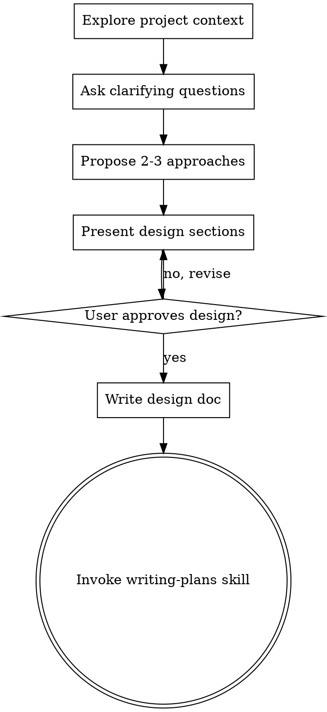

# Junior AI engineer skill development

## Metadata

- **Conversation ID:** 2bfc5a30-3761-4005-86be-7ffde7382657
- **Mode:** agent
- **Created:** 2026-03-12 18:19:46
- **Last Updated:** 2026-03-12 23:18:04
- **Branch:** main
- **Files Changed:** 2
- **Lines Added:** 1457
- **Lines Removed:** 0
- **Summary:** Edited 2026-03-12-pss-skills-implementation-plan.md, 2026-03-12-pss-skills-design.md

---

## Conversation

### 🧑 User

<manually_attached_skills>
The user has manually attached the following skills to their message.
These skills contain specific instructions or workflows that the user wants you to follow for this request.
You should read and follow the instructions in these skills carefully.

Skill Name: brainstorming
Path: /Users/a964286/.cursor/skills/brainstorming/SKILL.md
SKILL.md content:
# Brainstorming Ideas Into Designs

## Overview

Help turn ideas into fully formed designs and specs through natural collaborative dialogue.

Start by understanding the current project context, then ask questions one at a time to refine the idea. Once you understand what you're building, present the design and get user approval.

<HARD-GATE>
Do NOT invoke any implementation skill, write any code, scaffold any project, or take any implementation action until you have presented a design and the user has approved it. This applies to EVERY project regardless of perceived simplicity.
</HARD-GATE>

## Anti-Pattern: "This Is Too Simple To Need A Design"

Every project goes through this process. A todo list, a single-function utility, a config change — all of them. "Simple" projects are where unexamined assumptions cause the most wasted work. The design can be short (a few sentences for truly simple projects), but you MUST present it and get approval.

## Checklist

You MUST create a task for each of these items and complete them in order:

1. **Explore project context** — check files, docs, recent commits
2. **Ask clarifying questions** — one at a time, understand purpose/constraints/success criteria
3. **Propose 2-3 approaches** — with trade-offs and your recommendation
4. **Present design** — in sections scaled to their complexity, get user approval after each section
5. **Write design doc** — save to `docs/plans/YYYY-MM-DD-<topic>-design.md` and commit
6. **Transition to implementation** — invoke writing-plans skill to create implementation plan

## Process Flow



**The terminal state is invoking writing-plans.** Do NOT invoke frontend-design, mcp-builder, or any other implementation skill. The ONLY skill you invoke after brainstorming is writing-plans.

## The Process

**Understanding the idea:**
- Check out the current project state first (files, docs, recent commits)
- Ask questions one at a time to refine the idea
- Prefer multiple choice questions when possible, but open-ended is fine too
- Only one question per message - if a topic needs more exploration, break it into multiple questions
- Focus on understanding: purpose, constraints, success criteria

**Exploring approaches:**
- Propose 2-3 different approaches with trade-offs
- Present options conversationally with your recommendation and reasoning
- Lead with your recommended option and explain why

**Presenting the design:**
- Once you believe you understand what you're building, present the design
- Scale each section to its complexity: a few sentences if straightforward, up to 200-300 words if nuanced
- Ask after each section whether it looks right so far
- Cover: architecture, components, data flow, error handling, testing
- Be ready to go back and clarify if something doesn't make sense

## After the Design

**Documentation:**
- Write the validated design to `docs/plans/YYYY-MM-DD-<topic>-design.md`
- Use elements-of-style:writing-clearly-and-concisely skill if available
- Commit the design document to git

**Implementation:**
- Invoke the writing-plans skill to create a detailed implementation plan
- Do NOT invoke any other skill. writing-plans is the next step.

## Key Principles

- **One question at a time** - Don't overwhelm with multiple questions
- **Multiple choice preferred** - Easier to answer than open-ended when possible
- **YAGNI ruthlessly** - Remove unnecessary features from all designs
- **Explore alternatives** - Always propose 2-3 approaches before settling
- **Incremental validation** - Present design, get approval before moving on
- **Be flexible** - Go back and clarify when something doesn't make sense

---

Skill Name: writing-plans
Path: /Users/a964286/.cursor/skills/writing-plans/SKILL.md
SKILL.md content:
# Writing Plans

## Overview

Write comprehensive implementation plans assuming the engineer has zero context for our codebase and questionable taste. Document everything they need to know: which files to touch for each task, code, testing, docs they might need to check, how to test it. Give them the whole plan as bite-sized tasks. DRY. YAGNI. TDD. Frequent commits.

Assume they are a skilled developer, but know almost nothing about our toolset or problem domain. Assume they don't know good test design very well.

**Announce at start:** "I'm using the writing-plans skill to create the implementation plan."

**Context:** This should be run in a dedicated worktree (created by brainstorming skill).

**Save plans to:** `docs/plans/YYYY-MM-DD-<feature-name>.md`

## Bite-Sized Task Granularity

**Each step is one action (2-5 minutes):**
- "Write the failing test" - step
- "Run it to make sure it fails" - step
- "Implement the minimal code to make the test pass" - step
- "Run the tests and make sure they pass" - step
- "Commit" - step

## Plan Document Header

**Every plan MUST start with this header:**

```markdown
# [Feature Name] Implementation Plan

> **For Claude:** REQUIRED SUB-SKILL: Use superpowers:executing-plans to implement this plan task-by-task.

**Goal:** [One sentence describing what this builds]

**Architecture:** [2-3 sentences about approach]

**Tech Stack:** [Key technologies/libraries]

---
```

## Task Structure

````markdown
### Task N: [Component Name]

**Files:**
- Create: `exact/path/to/file.py`
- Modify: `exact/path/to/existing.py:123-145`
- Test: `tests/exact/path/to/test.py`

**Step 1: Write the failing test**

```python
def test_specific_behavior():
    result = function(input)
    assert result == expected
```

**Step 2: Run test to verify it fails**

Run: `pytest tests/path/test.py::test_name -v`
Expected: FAIL with "function not defined"

**Step 3: Write minimal implementation**

```python
def function(input):
    return expected
```

**Step 4: Run test to verify it passes**

Run: `pytest tests/path/test.py::test_name -v`
Expected: PASS

**Step 5: Commit**

```bash
git add tests/path/test.py src/path/file.py
git commit -m "feat: add specific feature"
```
````

## Remember
- Exact file paths always
- Complete code in plan (not "add validation")
- Exact commands with expected output
- Reference relevant skills with @ syntax
- DRY, YAGNI, TDD, frequent commits

## Execution Handoff

After saving the plan, offer execution choice:

**"Plan complete and saved to `docs/plans/<filename>.md`. Two execution options:**

**1. Subagent-Driven (this session)** - I dispatch fresh subagent per task, review between tasks, fast iteration

**2. Parallel Session (separate)** - Open new session with executing-plans, batch execution with checkpoints

**Which approach?"**

**If Subagent-Driven chosen:**
- **REQUIRED SUB-SKILL:** Use superpowers:subagent-driven-development
- Stay in this session
- Fresh subagent per task + code review

**If Parallel Session chosen:**
- Guide them to open new session in worktree
- **REQUIRED SUB-SKILL:** New session uses superpowers:executing-plans
</manually_attached_skills>
Now you wanted to act as another more senior and more distinguished LLM pretraining, evaluation and architecture desgin AI software engineer; Also you are translating user request to skills; Task 
1) indepth and closely review and interpret the @docs/pss/self-reflections/PSS_patterns_1.md and synthesize two experts analysis systematically
2) /brainstorming depending on both experts' observations and insights; think deeply and hard and comprehensively what types of patterns/strategies (both existing and expert's recommended) can be conceptualized as agentic skills/rules/commands to boost this junior engineer full-aspect capability and thinking level as a staff AI engineer when he copilot with LLM and cursor? the method or strategies here do not mean any specifci knowledge or techniques; but a problem solving framework/strategy or thinking mode that the junior engineer can use as a skill to enable agent to perform such practice, as extension and enhancemnet of user's capabiluty to solve the LLM training problem; Also consule external browser sources to be complementary sources; I believe this junior methodology or even the experts' recommendation is biased, narrow, and may miss a lot of important best practice and rule of thumb in LLM pretraining, otpimziation, training strategy, data enrichment, model architecture design; model diagnosis; LLM adaptation; So making sure you perform an exhaustive and comprehensive web search on reliable and credible sources (such as acadmic journal or conference papers, popular arxiv, big tech posts, papers; industry best practice or rule of thumb); the goal is to make sure the skills created should enable a junior AI engineer to think, practice, design, debug, problem sovling like a staff-level AI engineer. 
3) Exhaust the entire report and provide me with a proposal/plan what can be conceptaulized and why and how; provide a detailed /writing-plans Do not implement, until I approve the proposal and plan

---

### 🤖 Assistant

I'm using the **brainstorming skill** to design this systematically. Let me start by deeply understanding the project context and the PSS reflections document, while simultaneously conducting exhaustive web research on LLM pretraining best practices.

The user wants me to:

1. Review and interpret the PSS_patterns_1.md document deeply, synthesizing two expert analyses
2. Brainstorm what patterns/strategies can be conceptualized as agentic skills/rules/commands to boost a junior engineer's capability to staff-level when working with LLM and Cursor
3. Do exhaustive web research on LLM pretraining best practices, optimization, training strategy, etc.
4. Provide a comprehensive proposal/plan of what skills to create, why, and how
5. NOT implement until approved

Let me start by reading the brainstorming and writing-plans skills (already provided), then read the PSS_patterns_1.md document thoroughly.


I'll dive into the document and pull relevant research on LLM training methodologies simultaneously to build context for the skill synthesis.

---

### 🤖 Assistant

Now let me continue with more targeted web research to cover the full scope needed for comprehensive skill design.

Excellent, I've read the full PSS_patterns_1.md document. Now let me do additional web research to fill gaps on specific topics that are critical for creating comprehensive skills.

---

### 🤖 Assistant

Let me gather a few more critical sources to ensure comprehensive coverage.

Good, I'm getting a comprehensive picture. Let me do a few more targeted searches to cover additional important areas.

---

### 🤖 Assistant

Let me do a final round of targeted research to cover remaining gaps.

Now let me do a couple more focused searches on areas that are still insufficiently covered.

---

### 🤖 Assistant

Now let me examine existing skills to understand patterns and avoid duplication, and look at recent progress and experiment logs for additional context.

Now let me also look at the existing skills to understand the patterns and what's already there to avoid duplication.

---

### 🤖 Assistant

Now I have a comprehensive understanding of:

1. The PSS_patterns_1.md document (both Expert 1 and Expert 2 analyses)
2. Current LLM pretraining best practices from web research
3. Existing skills structure
4. The project's history and context

Let me now synthesize all of this into a comprehensive brainstorming proposal. Let me structure my thinking:

## Synthesized Expert Analysis

**Expert 1** identified:
- Strengths: Experimental design rigor, evidence-based analysis, cross-validation, logging infrastructure, persistence, intellectual humility
- Weaknesses: Outsourcing diagnosis, analysis paralysis, variable confounding, architecture-first thinking, insufficient loss function analysis, copy-paste dependency, insufficient baselines


- Patterns: Consultation cascade, symptom reporting, breadth-first instead of depth-first, growing sophistication

**Expert 2** pushed back on several of Expert 1's critiques, pointing out that the "zero hypotheses" claim was factually wrong since implicit hypotheses shaped the experimental choices, the time estimates were inflated by hindsight bias without accounting for learning value, and copy-paste engineering is pragmatic rather than a weakness. Expert 2 also noted that the baseline concern overlooked the existing production model and identified three systematic biases in Expert 1's analysis.

**Expert 2's core insight** is that the knowledge gap itself is the root cause, not just process issues. This means Karpathy's checklist needs domain-specific customization, and the 30/60/90 plan should prioritize knowledge acquisition before hypothesis practice, drawing from a composite playbook rather than a single source.

Now I'm identifying the concrete skills and frameworks that emerge from both analyses. I'm starting with problem-solving frameworks like a hypothesis-first protocol where I articulate what's known versus unknown before consulting experts, and a bottleneck hierarchy navigator that helps determine where to focus first.

Then there's the experimental methodology layer—enforcing proper ablation design, establishing simple baselines before complexity, and calculating optimal resource allocation. I'm also mapping out loss and objective analysis skills that check whether the loss function actually matches the evaluation metric, plus gradient budget estimation to predict class-level contributions upfront.

For the training phase itself, I need diagnostic tools that classify loss curve patterns and recommend next steps, interpret gradient health, and read loss trajectories. The data understanding layer covers comprehensive statistics and long-tail distribution quantification. Finally, there's the architectural decision-making tier that determines when to pivot architecture versus training strategy versus data, alongside compute-optimal scaling based on Chinchilla laws and inference costs.

Beyond that, I'm thinking about knowledge integration—finding relevant papers and synthesizing guidance from multiple sources. Then there's the meta-cognitive layer: forcing engineers to write hypotheses before consulting, capturing post-experiment reflections on what was expected versus what happened, and restructuring how they use AI experts. And I need skills for evaluating representation quality and assessing downstream task performance systematically.

Now I'm weighing which of these would have the most impact. Looking at what the web research uncovered that the experts overlooked—training stability metrics like QK-norm and z-loss, optimizer alternatives beyond AdamW like AdEMAMix and Muon, multi-stage data scheduling with late-stage high-quality injection, proper checkpoint management with optimizer state restoration, attention architecture variations like GQA and MLA, and deeper representation evaluation beyond just downstream metrics through probing and layer-wise analysis.

There's also the neural collapse framework for handling long-tail distributions, distribution-balanced loss functions that account for label co-occurrence, automatic error detection through TRAINCHECK, how curriculum learning interacts with learning rate decay, domain adaptation approaches like ICFT, and the broader principle that data quality matters more than model complexity.

Now I need to structure this into a coherent proposal, though I'm realizing the user wants me to ask focused questions rather than overwhelm them with everything at once—but they've given me such detailed requirements that I should present this comprehensively.

---

### 🤖 Assistant

Let me also check what existing skills and cursor rules structure looks like, and review recent session summaries for additional context.

---

### 🤖 Assistant

I've now completed a deep review of the 646-line PSS document (both Expert 1 and Expert 2 analyses), conducted 12 targeted web searches across LLM pretraining, training diagnostics, loss function design, scaling laws, data-centric AI, debugging frameworks, and staff-level engineering thinking, and reviewed the existing skills infrastructure. Let me present the comprehensive synthesis and proposal.

---

## Part 1: Synthesized Expert Analysis

### Where Both Experts Agree (High-Confidence Findings)

Both experts converge on these observations, which form the bedrock for skill design:

1. **The "Consultation Cascade" is real and consequential** — the engineer's dominant loop is `observe → consult N experts → adjudicate → act` instead of `observe → hypothesize → test → iterate`. This is the highest-leverage pattern to restructure.

2. **Growth trajectory is significant** — from confounded 7-experiment runs (Nov 2025) to clean factorial designs and Stage 1/Stage 2 decomposition (Mar 2026). The engineer learns and adapts. Skills should accelerate this trajectory, not prescribe from scratch.

3. **Architecture-before-data/loss sequencing was suboptimal** — while Expert 2 correctly flags hindsight bias, both agree the *general principle* of checking data/loss before architecture is sound and underutilized.

4. **Persistence and scientific instinct are genuine strengths** — the engineer's "no hallucination" rule, willingness to abandon disproven hypotheses, and 4-month sustained investigation are assets to build on.

### Where the Experts Diverge (Critical for Skill Design)

| Dimension | Expert 1 | Expert 2 | Implication for Skills |
|---|---|---|---|
| Hypothesis formation | Process problem — just write it down | Knowledge problem — can't hypothesize without understanding | Skills must BUILD knowledge context, not just enforce templates |
| "Wasted" architecture time | 2 months wasted | Infrastructure built, negative knowledge gained | Skills should GUIDE prioritization, not penalize exploration |
| Copy-paste dependency | Weakness (W6) | Pragmatic integration engineering | Skills should enhance implementation confidence, not enforce independence |
| Karpathy checklist | Prescriptive protocol | Starting principle needing domain adaptation | Skills must SYNTHESIZE multiple sources, not follow single authority |
| Rating calibration | First-principles 3/10, Implementation 4/10 | Under-justified; convergence on Kang et al. IS first-principles | Skills should recognize slow reasoning as reasoning, and accelerate it |

### What BOTH Experts Missed (From Web Research)

My web research across 12+ authoritative sources reveals significant gaps in both expert analyses:

1. **Modern optimizer landscape** — AdEMAMix and MARS outperform AdamW in recent benchmarks; Muon shows promise with careful infrastructure. Neither expert mentioned optimizer selection as a diagnostic lever.

2. **Training stability mechanisms** — QK-norm, z-loss, logit softcapping, and RMSNorm are standard frontier techniques. The engineer's loss curves may contain stability issues neither expert diagnosed.

3. **Loss curve collapse as a diagnostic** — Recent research shows that when normalized loss curves from different model sizes collapse onto a universal curve, deviations indicate training pathologies. This is a cheap, powerful diagnostic neither expert mentioned.

4. **Checkpoint optimizer state restoration** — A known failure mode: resuming training without restoring optimizer states causes loss spikes. With single-epoch training, this may not apply, but the principle of training infrastructure integrity is absent.

5. **Neural collapse framework for long-tail** (AAAI 2025) — ETF-structured label embeddings directly address the embedding homogenization problem the engineer discovered. Neither expert cited this.

6. **Distribution-balanced loss** — Label co-occurrence-aware reweighting that specifically addresses multi-label long-tail, directly relevant to the clinical code prediction task.

7. **Representation quality evaluation beyond downstream metrics** — Probing analysis, layer-wise quality assessment, and mechanistic interpretability tools (TransformerLens, Pattern-Lens) that would have accelerated the encoder representation diagnosis.

8. **TRAINCHECK** — Automatic inference of training invariants that detects silent errors. The engineer's training may have contained issues that went undetected for batches/epochs.

9. **Curriculum learning and LR interactions** — Aggressive LR decay wastes high-quality data in curriculum-based training. The engineer's single-epoch cosine decay may be interacting badly with data ordering.

10. **The NEPA Framework** (Notice → Explain → Prescribe → Action) — A structured debugging mental model specifically for ML systems that goes beyond Karpathy's recipe.

---

## Part 2: Brainstorming — Skills Architecture

I'm using the brainstorming skill to design the skills portfolio. Before proposing approaches, let me articulate the design constraints:

**What these skills ARE:**
- Problem-solving FRAMEWORKS and THINKING MODES
- Process protocols that guide the agent (and the engineer) through structured reasoning
- Informed by domain knowledge but not knowledge repositories themselves
- Extensions of the engineer's capability when co-piloting with LLM/Cursor

**What these skills are NOT:**
- Databases of specific techniques or hyperparameter recipes
- Replacements for domain expertise (they build it through guided practice)
- Rigid checklists that prevent exploration (they prioritize, not prohibit)

### Three Approaches

**Approach A: "Full Skill Suite" — 14 skills, 2 rules, 3 commands**
- One skill per framework, maximum granularity
- Pro: Each skill is focused, deep, easy to maintain
- Con: 19 total artifacts may overwhelm; invocation confusion ("which skill do I use?")

**Approach B: "Consolidated Portfolio" — 6 mega-skills, 1 rule, 1 command**
- Merge related frameworks into broader skills
- Pro: Fewer artifacts, always obvious which to invoke
- Con: Each skill becomes large and unwieldy; harder to evolve independently

**Approach C (RECOMMENDED): "Layered Architecture" — 4 foundation + 5 specialized skills, 2 rules, 2 commands**
- Foundation layer builds thinking habits; specialized layer addresses specific scenarios
- Maps to Expert 2's corrected growth plan: knowledge/process first, then domain application
- Pro: Clear hierarchy, each artifact has a clear trigger, manageable count (13 total)
- Con: Foundation skills must be invoked frequently; agent must learn the hierarchy

**I recommend Approach C** because it mirrors how staff engineers actually develop: they internalize general problem-solving frameworks first, then build domain-specific playbooks on top. The layered structure also means the foundation skills remain useful even if the engineer moves to a different ML domain.

---

## Part 3: Comprehensive Proposal — Layered Skill Architecture

### LAYER 1: Foundation Skills (4 skills — Process Frameworks)

These build the general thinking habits identified as the highest-leverage gaps.

---

#### Skill 1: `hypothesis-driven-investigation`

**What it addresses:** Expert 1's W1 (outsourcing diagnosis), Pattern 1 (consultation cascade), Pattern 2 (symptom reporting), Expert 2's reframing (articulate ignorance precisely)

**The framework:**
```
Observe unexpected result
  → STOP. Before consulting anyone, write:
    1. What I observe (specific numbers, not narrative)
    2. What I expected and why
    3. What I think might explain the gap (even if uncertain)
    4. What I DON'T understand that prevents a better hypothesis
    5. The cheapest experiment that would distinguish between my hypothesis and the null
  → If hypothesis confidence is LOW: share the uncertainty articulation with expert
  → If hypothesis confidence is HIGH: design and run the test FIRST
```

**Key innovation over Expert 1's template:** Expert 2 correctly identified that you can't form a mechanistic hypothesis without domain knowledge. This skill addresses that by making "articulating what you don't know" equally valued as "articulating what you think." The output is either a testable hypothesis OR a precise uncertainty statement that makes expert consultation dramatically more efficient.

**Informed by:** Scientific method, NEPA framework (Notice → Explain → Prescribe → Action), Google Tuning Playbook's scientific approach, PhD training methodology for literature reviews under incomplete knowledge.

**Trigger:** Before ANY investigation of unexpected results or before consulting any expert.

---

#### Skill 2: `bottleneck-priority-navigator`

**What it addresses:** Expert 1's W4 (architecture-first), W5 (loss function analysis delayed), Expert 2's point about needing a composite playbook, web research on systematic debugging

**The framework:**
```
Model underperforms or plateau detected
  → Level 1: DATA — Is the data distribution understood? Do I know the power-law exponent, 
    head/tail ratio, co-occurrence structure? Have I profiled class frequencies vs gradient 
    contribution? (If NO → data-first-profiler skill)
  → Level 2: LOSS/OBJECTIVE — Does the loss function optimize what my evaluation metric 
    measures? Is there loss-metric divergence? (If unknown → loss-objective-analyzer skill)
  → Level 3: TRAINING DYNAMICS — Are gradients healthy? Is the learning rate schedule 
    appropriate? Are there stability issues? (If unknown → training-diagnostic-dashboard skill)
  → Level 4: ARCHITECTURE — Only after eliminating L1-L3 as bottlenecks, consider 
    architecture changes. Even then: what does the scaling law predict?
```

**Key innovation:** This is NOT the Karpathy checklist (which Expert 2 correctly criticized as insufficient). It's a domain-adapted priority hierarchy synthesized from Karpathy + Google Tuning Playbook + long-tail classification literature + frontier model training practices. Each level has specific exit criteria (not just "did you check?").

**Trigger:** When the model underperforms expectations, a plateau is detected, or results are unexplained.

---

#### Skill 3: `rigorous-experiment-protocol`

**What it addresses:** Expert 1's W3 (variable confounding), W7 (insufficient baselines), Pattern 3 (breadth-first exploration), web research on ablation study design

**The framework:**
```
Pre-Experiment Phase:
  1. Write pre-registration doc (hypothesis, expected result, refutation criterion)
  2. Verify baseline exists (if not, establish simplest possible baseline FIRST)
  3. Verify ONE variable is changing (if multiple, split into sequential experiments)
  4. Estimate cost/time; if <4 GPU-hours, run before consulting

Execution Phase:
  5. Run experiment with full instrumentation (gradients, loss decomposition, logits)
  6. Save ALL artifacts (config, logs, trajectories, metrics) in standard format

Post-Experiment Phase:
  7. Compare actual vs expected from pre-registration
  8. Write post-mortem: what happened, why, what I learned, next experiment
  9. Update hypothesis (confirm, reject, or refine)
```

**Key innovation:** The pre-registration + post-mortem cycle creates a forced learning loop. Expert 1 recommended this but didn't structure it as a complete lifecycle. The "30-minute rule" is embedded: cheap diagnostics are required before expensive experiments.

**Informed by:** Google Tuning Playbook's incremental tuning strategy, ablation study design literature (2025 ABGEN benchmark), factorial design methodology, clinical trial pre-registration practices.

**Trigger:** Before designing any experiment.

---

#### Skill 4: `expert-consultation-protocol`

**What it addresses:** Pattern 1 (consultation cascade — 3-5 consultations where 0-1 would suffice), Expert 2's "articulate ignorance precisely" recommendation

**The framework:**
```
Before consulting:
  1. Complete hypothesis-driven-investigation output (required dependency)
  2. Frame the consultation as: "Here is what I observe, what I think, and 
     where my understanding breaks down. Challenge my reasoning."
  3. NOT: "Here is data, diagnose for me."

During consultation:
  4. Maximum 2 independent consultations per question (not 4-5)
  5. If experts agree → proceed with test
  6. If experts disagree → identify the specific factual claim they disagree on 
     → design experiment to resolve THAT claim

After consultation:
  7. Update hypothesis doc with expert input
  8. Run the experiment BEFORE consulting again
```

**Key innovation:** Caps the consultation cascade at 2 (not 4-5), and enforces that after consultation the NEXT step is always an experiment, never another consultation. This breaks the observe → consult → consult → consult loop.

**Trigger:** Before opening any AI chat session or consulting any expert.

---

### LAYER 2: Specialized Skills (5 skills — Domain-Specific Frameworks)

These address specific technical scenarios the engineer encounters in LLM pretraining.

---

#### Skill 5: `loss-objective-alignment-analyzer`

**What it addresses:** W5 (insufficient loss function analysis), gradient starvation discovery, loss-data misalignment

**The framework:**
```
For any loss function under consideration:
  1. What does this loss mathematically optimize? (Write the gradient formula)
  2. What does my evaluation metric reward? (Write the ranking criterion)
  3. Are these the same? If not, where do they diverge?
  4. Compute analytical gradient budget: for each class tier, what fraction 
     of total gradient does this loss produce? (BEFORE training)
  5. Does the gradient budget match my performance goals?
  6. If not: what loss modifications (pos_weight, focal, ASL, WDL, distribution-balanced) 
     would realign the gradient budget?
  7. Compare: does loss-metric divergence exist in training curves? 
     (loss improving but metric stalling = misalignment signal)
```

**Key knowledge embedded:** BCE gradient formula under class imbalance, Focal loss modulation, Asymmetric Loss for multi-label, Weighted Difference Loss (2025), Distribution-Balanced Loss for label co-occurrence, Neural Collapse framework (AAAI 2025) for long-tail representation learning. The engineer doesn't need to know all of this — the skill guides the agent to apply the right analysis at the right time.

**Trigger:** When selecting or evaluating a loss function, or when loss-metric divergence is detected.

---

#### Skill 6: `training-diagnostic-dashboard`

**What it addresses:** W2 (delayed diagnostics), web research on training failure classification, the gradient starvation that took 2 months to discover

**The framework:**
```
Step 1: CLASSIFY the loss curve pattern
  - Divergence (→ inf/NaN): Check LR, gradient clipping, data pipeline
  - Plateau (stalled): Check LR schedule, gradient budget, loss alignment
  - Instability (oscillating): Check batch size, LR warmup, optimizer
  - Slow convergence: Check initialization, architecture capacity

Step 2: RUN minimum-cost diagnostics (ALL of these, BEFORE consulting anyone):
  - Overfit single batch test (~5 min): Can model memorize? If not → capacity issue
  - Loss at initialization check (~1 min): Is initial loss at expected random baseline?
  - Per-tier gradient norms (~30 min added to training): Where do gradients concentrate?
  - Per-code logit histogram (~10 min on checkpoint): Are tail codes collapsed?
  - Loss decomposition by tier (~10 min): Which classes drive total loss?
  
Step 3: INTERPRET using decision tree
  [Flowchart mapping diagnostic results → root cause → recommended intervention]

Step 4: INSTRUMENT future runs with permanent monitoring
  - Gradient norm tracking per layer and per tier
  - Logit distribution snapshots every N steps
  - Attention entropy evolution
  - Loss decomposition by class tier
```

**Key knowledge embedded:** Loss curve classification framework (frontier model debugging), TRAINCHECK-style invariant checking, gradient health monitoring practices from W&B and PyTorch communities, TransformerLens-style mechanistic analysis, frontier model training stability practices (QK-norm, z-loss, logit softcapping).

**Trigger:** When training produces unexpected results, loss stalls, or divergence occurs.

---

#### Skill 7: `data-first-profiler`

**What it addresses:** W4 (Karpathy Step 1 — "become one with the data"), missing data understanding before modeling

**The framework:**
```
Before ANY modeling on a dataset:
  1. DISTRIBUTION PROFILE
     - Class frequency histogram (log scale)
     - Power-law exponent fit
     - Gini coefficient
     - Head/medium/tail tier boundaries and ratios
     - Top 1% classes cover what fraction of total events?
  
  2. STRUCTURE PROFILE
     - Co-occurrence matrix statistics (what predicts what?)
     - Sequence/record length distribution
     - Feature correlation analysis
     - Missing data patterns
  
  3. IMBALANCE IMPACT PREDICTION
     - Under proposed loss function, predict gradient contribution per tier (ANALYTICALLY)
     - Identify classes with <N examples (likely unlearnable)
     - Compute effective training signal per class
  
  4. BASELINE ESTIMATION
     - What does a trivial predictor (frequency-based) achieve?
     - What does a simple model (logistic regression, MLP) achieve?
     - What is the information-theoretic ceiling estimate?
  
  5. IMPLICATIONS DOCUMENT
     - "This data distribution implies: ___"
     - "The loss function should be: ___ because ___"
     - "Expected challenges: ___"
```

**Trigger:** Before any modeling work on a new dataset or task, or when revisiting a dataset after unexpected results.

---

#### Skill 8: `scaling-architecture-advisor`

**What it addresses:** W4 (when to change architecture), scaling law application, MoE applicability, architecture decision gaps

**The framework:**
```
Before ANY architecture change, answer:
  1. Have I eliminated data/loss/training as the bottleneck? 
     (Required: evidence from bottleneck-priority-navigator)
  2. What does the scaling law predict?
     - Chinchilla: C ≈ 6ND → compute-optimal allocation
     - Beyond-Chinchilla: account for inference cost
     - If 2x params gives <1% improvement → capacity is NOT the issue
  3. Architecture-specific decision trees:
     - MoE: Benefits emerge at >1B params with diverse data. Is my setting appropriate?
     - Attention: GQA > MHA at similar compute. Consider MLA for further efficiency.
     - Depth vs Width: What does the depth-width scaling ratio suggest?
     - Activation: SwiGLU > GELU in modern settings
     - Positional encoding: RoPE as default, extend with YaRN for long context
  4. Is this an architecture problem or a training strategy problem?
     - Can I solve this with staged training instead?
     - Can I solve this with a different optimizer (AdEMAMix, MARS)?
     - Can I solve this with curriculum scheduling?
```

**Trigger:** When considering architecture changes, scaling decisions, or when bottleneck-priority-navigator reaches Level 4.

---

#### Skill 9: `representation-quality-assessor`

**What it addresses:** The gap between pretraining metrics and downstream quality, the encoder representation diagnosis that was delayed for months

**The framework:**
```
To evaluate whether learned representations are sufficient:
  1. PROBING ANALYSIS
     - Train simple linear probes on frozen representations
     - Measure per-tier probing accuracy (head vs tail)
     - Compare: does the representation contain the information even if the decoder can't extract it?
  
  2. GEOMETRIC ANALYSIS
     - Embedding space visualization (t-SNE/UMAP by class tier)
     - Per-tier embedding std deviation (is there homogenization?)
     - Inter-class distance vs intra-class distance by tier
  
  3. LAYER-WISE ANALYSIS
     - Which layer's representations are most informative? (probe per layer)
     - Intermediate layers often outperform final layers by up to 16%
     - Attention entropy evolution across layers
  
  4. DOWNSTREAM ALIGNMENT
     - Gap between pretraining metrics and downstream task performance
     - Does improved pretraining loss translate to improved downstream?
     - If not → representation-metric misalignment
  
  5. COMPARATIVE ANALYSIS
     - Before vs after intervention: did representations actually change?
     - Per-tier: which tiers improved, which didn't?
```

**Trigger:** When evaluating model quality beyond training loss, or when pretraining metrics don't translate to downstream performance.

---

### LAYER 3: Rules (2 rules — Always-On Background Guidance)

---

#### Rule 10: `llm-training-first-principles`

**Type:** Always-on workspace rule (`.cursor/rules/`)

**Purpose:** Background guidance that encodes the priority hierarchy. Unlike skills (which are invoked), this rule is ALWAYS active and nudges the agent's default reasoning.

**Content:**
- Priority hierarchy: Data → Loss → Training Strategy → Architecture
- Quick-reference decision points: "Before suggesting an architecture change, verify that data distribution, loss alignment, and training dynamics have been examined"
- Red flags: "If the user reports loss-metric divergence, suggest loss-objective-alignment-analyzer before architecture changes"
- Common anti-patterns to watch for

---

#### Rule 11: `experiment-hygiene`

**Type:** Always-on workspace rule (`.cursor/rules/`)

**Purpose:** Ensures every experiment discussion includes hygiene checks.

**Content:**
- Every experiment must have: hypothesis (even if uncertain), single variable, expected outcome, refutation criterion
- The "30-minute rule": if a diagnostic costs <4 GPU-hours, run it before consulting
- Pre-registration reminder: "Has a pre-registration doc been written for this experiment?"
- Post-mortem reminder: "After results, write the post-mortem before starting the next experiment"

---

### LAYER 4: Commands (2 commands — User-Invokable Actions)

---

#### Command 12: `/pre-experiment`

**Purpose:** Generates a structured pre-registration document before any experiment.

**Output template:**
```markdown
## Pre-Registration: [Experiment Name]
Date: ___
Hypothesis: ___
Expected Result: ___
Refutation Criterion: If I see ___, my hypothesis is wrong
Variables: [Single variable being changed]
Controls: [What stays constant]
Diagnostics Instrumented: [Gradient tracking, logit histograms, etc.]
Estimated Cost: [GPU-hours, $]
```

---

#### Command 13: `/post-experiment`

**Purpose:** Generates a structured post-mortem document after any experiment.

**Output template:**
```markdown
## Post-Mortem: [Experiment Name]
Date: ___
Pre-Registration Reference: [link to pre-reg doc]
Expected vs Actual: ___
Hypothesis Status: [Confirmed / Rejected / Refined to ___]
Surprise: What I didn't expect: ___
Root Cause: ___
Lesson: ___
Next Experiment: ___
Knowledge Update: What I now know that I didn't before: ___
```

---

### Summary: Complete Artifact Inventory

| # | Type | Name | Addresses | Trigger |
|---|------|------|-----------|---------|
| 1 | Skill | `hypothesis-driven-investigation` | W1, Pattern 1, Pattern 2 | Before any investigation or consultation |
| 2 | Skill | `bottleneck-priority-navigator` | W4, W5, composite playbook gap | When model underperforms |
| 3 | Skill | `rigorous-experiment-protocol` | W3, W7, Pattern 3 | Before any experiment |
| 4 | Skill | `expert-consultation-protocol` | Pattern 1, consultation cascade | Before consulting any expert |
| 5 | Skill | `loss-objective-alignment-analyzer` | W5, gradient starvation, loss-data gap | When evaluating loss functions |
| 6 | Skill | `training-diagnostic-dashboard` | W2, delayed diagnostics | When training produces unexpected results |
| 7 | Skill | `data-first-profiler` | W4, Karpathy Step 1 | Before modeling on new data |
| 8 | Skill | `scaling-architecture-advisor` | W4, scaling gaps | Before architecture changes |
| 9 | Skill | `representation-quality-assessor` | Pretraining-downstream gap | When evaluating representation quality |
| 10 | Rule | `llm-training-first-principles` | W4, W5, priority hierarchy | Always-on |
| 11 | Rule | `experiment-hygiene` | W3, W7, 30-minute rule | Always-on |
| 12 | Command | `/pre-experiment` | W3, pre-registration gap | Before any experiment |
| 13 | Command | `/post-experiment` | Pattern 4, learning extraction | After any experiment |

### Coverage Mapping: All Identified Gaps

| Gap Source | Gap | Covered By |
|---|---|---|
| Expert 1: W1 | Outsourcing diagnosis | Skills 1, 4 |
| Expert 1: W2 | Analysis paralysis | Skills 3, 6 |
| Expert 1: W3 | Variable confounding | Skills 3, 12 |
| Expert 1: W4 | Architecture-first | Skills 2, 7, 8, Rule 10 |
| Expert 1: W5 | Loss function analysis | Skills 2, 5, Rule 10 |
| Expert 1: W6 | Copy-paste dependency | Expert 2 reclassified as pragmatic; Skill 1 builds implementation confidence gradually |
| Expert 1: W7 | Insufficient baselines | Skills 3, 7 |
| Expert 1: Pattern 1 | Consultation cascade | Skills 1, 4 |
| Expert 1: Pattern 2 | Symptom reporting | Skills 1, 4 |
| Expert 1: Pattern 3 | Breadth-first | Skills 2, 3 |
| Expert 2: Knowledge gap | Can't hypothesize without knowledge | Skills 1 (articulate ignorance), 5-9 (build domain knowledge through practice) |
| Expert 2: Single-source | Karpathy insufficient alone | Skill 2 (composite playbook), all specialized skills (multi-source synthesis) |
| Expert 2: Hindsight bias | Don't penalize exploration | Skills 2, 8 (guide but don't prohibit) |
| Web: Optimizer landscape | AdEMAMix, MARS, Muon | Skill 8 |
| Web: Training stability | QK-norm, z-loss, softcapping | Skill 6 |
| Web: Loss curve diagnostics | Classification + collapse | Skill 6 |
| Web: Neural collapse | ETF for long-tail | Skill 5 |
| Web: Distribution-balanced loss | Co-occurrence-aware | Skill 5 |
| Web: TRAINCHECK | Silent error detection | Skill 6 |
| Web: Representation evaluation | Probing, layer-wise | Skill 9 |
| Web: Data-centric AI | Quality > quantity | Skill 7 |
| Web: Scaling laws | Chinchilla + inference-aware | Skill 8 |
| Web: NEPA debugging | Systematic ML debugging | Skill 1, 6 |
| Web: Curriculum learning | LR-data interaction | Skill 6, Rule 11 |

---

Now, before I proceed to the detailed implementation plan, I want to ask you one clarifying question:

OK, now I have a comprehensive understanding of:

1. The PSS document with both expert analyses
2. Web research across 12+ searches covering LLM training best practices
3. Existing skills infrastructure (29 skills)
4. Project context and history
5. The engineer's current state

Now let me synthesize all of this into the comprehensive brainstorming proposal. 

Given the user's request, they want me to:
1. Present the synthesized expert analysis
2. Brainstorm skills/rules/commands
3. Write a detailed proposal/plan (but don't implement)

The brainstorming skill says to ask questions one at a time, but the user has already given an extremely detailed specification. 

I'm organizing the skills around problem-solving frameworks rather than domain-specific knowledge—the goal is to help a junior engineer develop the thinking patterns and debugging approaches that a staff-level AI engineer would use. I'll structure these into coherent categories that address the gaps identified across both expert analyses and the research, ensuring exhaustive coverage of the core competencies needed for LLM training work. Expert 1's W1 and Expert 2's reframing (knowledge gap → articulate ignorance precisely)

2. **bottleneck-hierarchy-navigator** - Decision tree: Data → Loss/Objective → Training Strategy → Architecture. Addresses Expert 1's W4 (architecture-first thinking) with a structured framework

3. **training-diagnostic-protocol** - Classifies loss curve patterns, recommends minimum-cost diagnostic experiments, instruments gradient/logit/attention monitoring. Addresses Expert 1's W2 (delayed hypothesis verification) and web research on debugging frameworks

### TIER 2: Experiment Design & Methodology Skills

4. **scientific-experiment-designer** - Pre-registration, one-variable-at-a-time, factorial design, baseline establishment. Addresses Expert 1's W3, W7 and web research on ablation study design

5. **scaling-law-advisor** - Compute-optimal allocation, model-size vs data-size tradeoffs, inference cost accounting. Addresses knowledge gap identified by both experts and Chinchilla scaling research

### TIER 3: Loss & Objective Analysis Skills

6. **loss-objective-alignment-analyzer** - Systematic analysis of whether loss function optimizes what the evaluation metric measures. Addresses Expert 1's W5 and web research on loss function selection

7. **class-imbalance-gradient-auditor** - Pre-training analytical computation of gradient budget per class tier. Addresses the specific gradient starvation discovery and web research on long-tail classification

### TIER 4: Training Execution & Monitoring Skills

8. **training-health-monitor** - Instruments training runs with gradient norms, logit histograms, attention entropy, loss decomposition. Addresses web research on training diagnostics and frontier model training practices

9. **training-instability-resolver** - Decision tree for divergence, plateau, oscillation with recommended fixes. Addresses web research on loss curve classification and debugging frameworks

### TIER 5: Data Understanding Skills

10. **data-distribution-profiler** - "Become one with the data" enforced: compute frequency histograms, co-occurrence statistics, Gini coefficients, information-theoretic measures. Addresses Karpathy Step 1 and Expert 1's W4

### TIER 6: Architecture Decision Skills

11. **architecture-decision-framework** - When to change architecture vs loss vs data vs training strategy. Includes MoE applicability guide, attention mechanism selection, scaling considerations. Addresses Expert 1's W4 and web research

### TIER 7: Post-Experiment Analysis Skills

12. **post-experiment-reflection** - Pre-registration vs actual results comparison, unexpected findings documentation, next experiment prioritization. Addresses Expert 1's W6 and scientific rigor in iterative development

### TIER 8: Knowledge Synthesis Skills

13. **expert-consultation-optimizer** - Reframes expert engagement toward hypothesis validation rather than open-ended troubleshooting. Addresses Expert 1's consultation cascade pattern

14. **composite-playbook-builder** - Integrates guidance from Karpathy, Google Tuning Playbook, and domain papers into domain-specific checklists. Addresses the need for multi-source synthesis

### Rules (Always-On Guidance)

15. **llm-training-first-principles** - An always-on rule encoding the hierarchy: data understanding → loss alignment → training strategy → architecture. Not a skill to invoke,

Still refining the framework. The user wants meta-cognitive problem-solving strategies informed by domain knowledge, not knowledge repositories themselves. So these skills need to teach thinking patterns and debugging approaches that a junior engineer can apply, grounded in enough domain understanding to make them actionable at a staff level. I'm laying out the remaining frameworks I rely on—expert consultation for hypothesis-driven guidance, architecture decisions for when to pivot the model design, compute allocation for scaling efficiently, training stability monitoring, representation quality assessment, and synthesis across multiple authoritative sources. Then there are the always-on rules that ground everything in first principles and experimental rigor, plus the command shortcuts I can invoke to run diagnostics and other protocols.

But I'm realizing I should step back and reorganize this by what the user actually asked for—they want skills, rules, and commands separated out clearly, and they want the full proposal before implementation. Let me re-read their request to make sure I'm giving them exactly what they need: the complete analysis, then a detailed proposal with reasoning for each component, all without building anything yet. I'm considering different organizational approaches for structuring these skills. Approach A would create a comprehensive suite with maximum coverage but risks overwhelming the user with too many artifacts, while Approach B consolidates related frameworks to reduce management overhead, and Approach C layers foundation skills with specialized extensions for flexibility. I should present these trade-offs and get approval on the structure before diving into the detailed proposal. skills, 2 rules, 2 commands)**
- Build a hierarchy: foundation skills + domain-specific specializations
- Risk: Dependencies between skills
- Benefit: Foundation skills build the thinking habits, specialized skills address specific scenarios

I think Approach C is best. It maps to the Expert 2's corrected 30/60/90 plan: build knowledge first (foundation), then practice (specialized skills). And it avoids overwhelming with too many independent skills.

Let me finalize my recommendation as Approach C and present the full proposal.

Here's my final skill taxonomy under Approach C:

**FOUNDATION SKILLS (4) - Build the thinking framework**

1. **hypothesis-driven-investigation** 
   - The core thinking protocol: observe → articulate what you know/don't know → hypothesize → design cheapest test → execute → update
   - Addresses: W1 (outsourcing diagnosis), Pattern 1 (consultation cascade), Pattern 2 (symptom reporting)
   - Sources: Scientific method, Google Tuning Playbook, NEPA framework, Expert 2's "articulate your ignorance precisely"
   - Trigger: Before ANY diagnostic investigation or expert consultation

2. **bottleneck-priority-navigator**
   - Decision framework for WHERE to look first: Data Distribution → Loss/Objective Alignment → Training Dynamics → Architecture
   - Addresses: W4 (architecture-first thinking), W5 (loss function analysis)
   - Sources: Karpathy Recipe (adapted), Google Tuning Playbook, long-tail classification literature, frontier model training practices
   - Trigger: When model underperforms or results are unexpected

3. **rigorous-experiment-protocol**
   - End-to-end experiment lifecycle: pre-registration → baseline establishment → controlled variable isolation → result documentation → iteration planning
   - Addresses: W2 (experiment rigor), W3 (reproducibility), Pattern 3 (incomplete experiment reporting)
   - Sources: Scientific method, ML systems design best practices, reproducibility literature
   - Trigger: When designing or executing any experiment

4. **evidence-based-reasoning**
   - Framework for distinguishing signal from noise: quantify uncertainty → weight evidence by source reliability → avoid confirmation bias → update beliefs proportionally
   - Addresses: W6 (overconfidence in intuition), Pattern 4 (anecdotal reasoning)
   - Sources: Bayesian thinking, Expert 1's calibration emphasis, forecasting literature
   - Trigger: When interpreting results or making model decisions establishment → single-variable design → execution → post-mortem → knowledge extraction
   - Addresses: W3 (variable confounding), W7 (insufficient baselines), Pattern 3 (breadth-first exploration)
   - Sources: Ablation study design literature, factorial design methodology, Google Tuning Playbook scientific approach
   - Trigger: Before designing any experiment

4. **expert-consultation-protocol**
   - How to use AI/human experts efficiently: prepare hypothesis doc → share hypothesis → ask experts to challenge → synthesize across experts → update beliefs
   - Addresses: Pattern 1 (consultation cascade), W1 (outsourcing diagnosis), Expert 2's "articulate ignorance"
   - Sources: PhD training methodology, scientific collaboration frameworks
   - Trigger: Before consulting any expert (AI or human)

**SPECIALIZED SKILLS (5) - Domain-specific frameworks**

5. **loss-objective-alignment-analyzer**
   - Framework for checking whether your loss function actually optimizes what you're measuring in evaluation, including gradient contribution analysis per class and detecting when loss and metrics diverge
   - Addresses: W5, gradient starvation, loss-data misalignment
   - Sources: BCE/Focal/ASL/WDL literature, Kang et al. 2020, Menon et al. 2020, distribution-balanced loss
   - Trigger: When selecting or evaluating a loss function

6. **training-diagnostic-dashboard**
   - Systematic protocol for diagnosing training issues: classify the loss curve pattern, instrument gradients and logits and attention, run targeted diagnostics, then interpret what's happening
   - Addresses: W2 and related training dynamics issues
   - Trigger: When investigating training behavior

7. **data-first-profiler**
   - Enforcing deep data understanding before modeling: computing distribution statistics, quantifying class imbalance, analyzing co-occurrences, and measuring information-theoretic properties like power-law distributions and Gini coefficients
   - Addresses: W4 (jumping to architecture before understanding data), Karpathy Step 1
   - Sources: Data-centric AI research, clinical domain analysis, PPMI/SVD literature
   - Trigger: Before starting any modeling work on a new dataset

8. **scaling-architecture-advisor**
   - Framework for...

Now I'm thinking through when to shift architecture versus training strategy, how to allocate compute optimally, whether mixture-of-experts makes sense, and which attention mechanisms fit the problem—drawing on scaling laws and inference-aware considerations to avoid architecture changes without proper justification. This also covers representation quality assessment through probing analysis, layer-wise evaluation, and downstream task performance to bridge the gap between pretraining metrics and actual model capability.

I'm also establishing two foundational rules that stay active: one that enforces a priority hierarchy starting with data understanding, loss alignment, and training strategy before touching architecture, with quick checklists for common decision points; and another that ensures every experiment has a clear hypothesis, single variable, expected outcome, and refutation criterion, plus a quick diagnostic approach for cheap validation. There's also a command structure starting to form for pre-experiment setup.

Now I'm thinking about what gaps might exist beyond what the experts covered, based on the broader web research.

Looking at the research findings, I can see that optimizer selection, training stability techniques, data scheduling strategies, checkpoint management, neural collapse patterns, curriculum learning, domain adaptation, and mechanistic interpretability are all already addressed across the different skills and commands I've outlined.

I should refocus on the core constraint the user emphasized: skills need to be problem-solving frameworks or thinking modes, not just specific techniques or knowledge areas. Let me make sure each skill I'm proposing actually teaches a way of thinking rather than just applying a particular method.

---

### 🤖 Assistant

Understood. You want to discuss changes before I proceed. What revisions do you have in mind? I'm listening for any scope adjustments, missing gaps you've identified, skills that should be merged or split, priority reordering, or fundamental framing changes.

---

### 🧑 User

<external_links>
### Potentially Relevant Websearch Results

You should respond as if these information are known to you. Refrain from saying "I am unable to browse the internet" or "I don't have access to the internet" or "I'm unable to provide real-time news updates". This is your internet search results. Please always cite any links you referenced from the above search results in your response in markdown format.

-------
Website URL: https://github.com/google-research/tuning_playbook
Website Title: GitHub - google-research/tuning_playbook: A playbook for systematically maximizing the performance of deep learning models. · GitHub
Website Content:
Skip to content 

## Navigation Menu

Toggle navigation 

 Sign in 

Appearance settings 

* Platform  
   * AI CODE CREATION  
         * GitHub CopilotWrite better code with AI  
         * GitHub SparkBuild and deploy intelligent apps  
         * GitHub ModelsManage and compare prompts  
         * MCP RegistryNewIntegrate external tools  
   * DEVELOPER WORKFLOWS  
         * ActionsAutomate any workflow  
         * CodespacesInstant dev environments  
         * IssuesPlan and track work  
         * Code ReviewManage code changes  
   * APPLICATION SECURITY  
         * GitHub Advanced SecurityFind and fix vulnerabilities  
         * Code securitySecure your code as you build  
         * Secret protectionStop leaks before they start  
   * EXPLORE  
         * Why GitHub  
         * Documentation  
         * Blog  
         * Changelog  
         * Marketplace  
View all features
* Solutions  
   * BY COMPANY SIZE  
         * Enterprises  
         * Small and medium teams  
         * Startups  
         * Nonprofits  
   * BY USE CASE  
         * App Modernization  
         * DevSecOps  
         * DevOps  
         * CI/CD  
         * View all use cases  
   * BY INDUSTRY  
         * Healthcare  
         * Financial services  
         * Manufacturing  
         * Government  
         * View all industries  
View all solutions
* Resources  
   * EXPLORE BY TOPIC  
         * AI  
         * Software Development  
         * DevOps  
         * Security  
         * View all topics  
   * EXPLORE BY TYPE  
         * Customer stories  
         * Events & webinars  
         * Ebooks & reports  
         * Business insights  
         * GitHub Skills  
   * SUPPORT & SERVICES  
         * Documentation  
         * Customer support  
         * Community forum  
         * Trust center  
         * Partners  
View all resources
* Open Source  
   * COMMUNITY  
         * GitHub SponsorsFund open source developers  
   * PROGRAMS  
         * Security Lab  
         * Maintainer Community  
         * Accelerator  
         * Archive Program  
   * REPOSITORIES  
         * Topics  
         * Trending  
         * Collections
* Enterprise  
   * ENTERPRISE SOLUTIONS  
         * Enterprise platformAI-powered developer platform  
   * AVAILABLE ADD-ONS  
         * GitHub Advanced SecurityEnterprise-grade security features  
         * Copilot for BusinessEnterprise-grade AI features  
         * Premium SupportEnterprise-grade 24/7 support
* Pricing

Search or jump to... 

# Search code, repositories, users, issues, pull requests...

 Search 

Clear 

Search syntax tips 

#  Provide feedback

We read every piece of feedback, and take your input very seriously.

Include my email address so I can be contacted 

 Cancel  Submit feedback 

#  Saved searches

## Use saved searches to filter your results more quickly

Name 

Query 

 To see all available qualifiers, see our documentation.

 Cancel  Create saved search 

 Sign in 

 Sign up 

Appearance settings 

Resetting focus 

You signed in with another tab or window. Reload to refresh your session. You signed out in another tab or window. Reload to refresh your session. You switched accounts on another tab or window. Reload to refresh your session. Dismiss alert 

{{ message }}

 google-research / **tuning\_playbook** Public 

* Notifications You must be signed in to change notification settings
* Fork2.4k
* Star 29.9k

* Code
* Issues 11
* Pull requests 3
* Discussions
* Actions
* Security 0
* Insights

Additional navigation options 

* Code
* Issues
* Pull requests
* Discussions
* Actions
* Security
* Insights

# google-research/tuning\_playbook

main

BranchesTags

Go to file

Code

Open more actions menu

## Folders and files

| Name                                                                                              | Name                                                                                              | Last commit message | Last commit date |
| ------------------------------------------------------------------------------------------------- | ------------------------------------------------------------------------------------------------- | ------------------- | ---------------- |
| Latest commit History[41 Commits](/google-research/tuning%5Fplaybook/commits/main/)41 Commits     |                                                                                                   |                     |                  |
| [assets](/google-research/tuning%5Fplaybook/tree/main/assets "assets")                            | [assets](/google-research/tuning%5Fplaybook/tree/main/assets "assets")                            |                     |                  |
| [CITATION.bib](/google-research/tuning%5Fplaybook/blob/main/CITATION.bib "CITATION.bib")          | [CITATION.bib](/google-research/tuning%5Fplaybook/blob/main/CITATION.bib "CITATION.bib")          |                     |                  |
| [CONTRIBUTING.md](/google-research/tuning%5Fplaybook/blob/main/CONTRIBUTING.md "CONTRIBUTING.md") | [CONTRIBUTING.md](/google-research/tuning%5Fplaybook/blob/main/CONTRIBUTING.md "CONTRIBUTING.md") |                     |                  |
| [LICENSE](/google-research/tuning%5Fplaybook/blob/main/LICENSE "LICENSE")                         | [LICENSE](/google-research/tuning%5Fplaybook/blob/main/LICENSE "LICENSE")                         |                     |                  |
| [README.md](/google-research/tuning%5Fplaybook/blob/main/README.md "README.md")                   | [README.md](/google-research/tuning%5Fplaybook/blob/main/README.md "README.md")                   |                     |                  |
| View all files                                                                                    |                                                                                                   |                     |                  |

## Repository files navigation

* README
* Contributing
* License

# Deep Learning Tuning Playbook

_This is not an officially supported Google product._

**Varun Godbole†, George E. Dahl†, Justin Gilmer†, Christopher J. Shallue‡, Zachary Nado†**

† Google Research, Brain Team

‡ Harvard University

## Table of Contents

* Who is this document for?
* Why a tuning playbook?
* Guide for starting a new project  
   * Choosing the model architecture  
   * Choosing the optimizer  
   * Choosing the batch size  
   * Choosing the initial configuration
* A scientific approach to improving model performance  
   * The incremental tuning strategy  
   * Exploration vs exploitation  
   * Choosing the goal for the next round of experiments  
   * Designing the next round of experiments  
   * Determining whether to adopt a training pipeline change or hyperparameter configuration  
   * After exploration concludes
* Determining the number of steps for each training run  
   * Deciding how long to train when training is not compute-bound  
   * Deciding how long to train when training is compute-bound
* Additional guidance for the training pipeline  
   * Optimizing the input pipeline  
   * Evaluating model performance  
   * Saving checkpoints and retrospectively selecting the best checkpoint  
   * Setting up experiment tracking  
   * Batch normalization implementation details  
   * Considerations for multi-host pipelines
* FAQs
* Acknowledgments
* Citing
* Contributing

## Who is this document for?

This document is for engineers and researchers (both individuals and teams) interested in **maximizing the performance of deep learning models**. We assume basic knowledge of machine learning and deep learning concepts.

Our emphasis is on the **process of hyperparameter tuning**. We touch on other aspects of deep learning training, such as pipeline implementation and optimization, but our treatment of those aspects is not intended to be complete.

We assume the machine learning problem is a supervised learning problem or something that looks a lot like one (e.g. self-supervised). That said, some of the prescriptions in this document may also apply to other types of problems.

## Why a tuning playbook?

Currently, there is an astonishing amount of toil and guesswork involved in actually getting deep neural networks to work well in practice. Even worse, the actual recipes people use to get good results with deep learning are rarely documented. Papers gloss over the process that led to their final results in order to present a cleaner story, and machine learning engineers working on commercial problems rarely have time to take a step back and generalize their process. Textbooks tend to eschew practical guidance and prioritize fundamental principles, even if their authors have the necessary experience in applied work to provide useful advice. When preparing to create this document, we couldn't find any comprehensive attempt to actually explain _how to get good results with deep learning_. Instead, we found snippets of advice in blog posts and on social media, tricks peeking out of the appendix of research papers, occasional case studies about one particular project or pipeline, and a lot of confusion. There is a vast gulf between the results achieved by deep learning experts and less skilled practitioners using superficially similar methods. At the same time, these very experts readily admit some of what they do might not be well-justified. As deep learning matures and has a larger impact on the world, the community needs more resources covering useful recipes, including all the practical details that can be so critical for obtaining good results.

We are a team of five researchers and engineers who have worked in deep learning for many years, some of us since as early as 2006\. We have applied deep learning to problems in everything from speech recognition to astronomy, and learned a lot along the way. This document grew out of our own experience training neural networks, teaching new machine learning engineers, and advising our colleagues on the practice of deep learning. Although it has been gratifying to see deep learning go from a machine learning approach practiced by a handful of academic labs to a technology powering products used by billions of people, deep learning is still in its infancy as an engineering discipline and we hope this document encourages others to help systematize the field's experimental protocols.

This document came about as we tried to crystalize our own approach to deep learning and thus it represents the opinions of the authors at the time of writing, not any sort of objective truth. Our own struggles with hyperparameter tuning made it a particular focus of our guidance, but we also cover other important issues we have encountered in our work (or seen go wrong). Our intention is for this work to be a living document that grows and evolves as our beliefs change. For example, the material on debugging and mitigating training failures would not have been possible for us to write two years ago since it is based on recent results and ongoing investigations. Inevitably, some of our advice will need to be updated to account for new results and improved workflows. We do not know the _optimal_ deep learning recipe, but until the community starts writing down and debating different procedures, we cannot hope to find it. To that end, we would encourage readers who find issues with our advice to produce alternative recommendations, along with convincing evidence, so we can update the playbook. We would also love to see alternative guides and playbooks that might have different recommendations so we can work towards best practices as a community. Finally, any sections marked with a 🤖 emoji are places we would like to do more research. Only after trying to write this playbook did it become completely clear how many interesting and neglected research questions can be found in the deep learning practitioner's workflow.

## Guide for starting a new project

Many of the decisions we make over the course of tuning can be made once at the beginning of a project and only occasionally revisited when circumstances change.

Our guidance below makes the following assumptions:

* Enough of the essential work of problem formulation, data cleaning, etc. has already been done that spending time on the model architecture and training configuration makes sense.
* There is already a pipeline set up that does training and evaluation, and it is easy to execute training and prediction jobs for various models of interest.
* The appropriate metrics have been selected and implemented. These should be as representative as possible of what would be measured in the deployed environment.

### Choosing the model architecture

_**Summary:**_ _When starting a new project, try to reuse a model that already works._

* Choose a well established, commonly used model architecture to get working first. It is always possible to build a custom model later.
* Model architectures typically have various hyperparameters that determine the model's size and other details (e.g. number of layers, layer width, type of activation function).  
   * Thus, choosing the architecture really means choosing a family of different models (one for each setting of the model hyperparameters).  
   * We will consider the problem of choosing the model hyperparameters inChoosing the initial configurationandA scientific approach to improving model performance.
* When possible, try to find a paper that tackles something as close as possible to the problem at hand and reproduce that model as a starting point.

### Choosing the optimizer

_**Summary:**_ _Start with the most popular optimizer for the type of problem at hand._

* No optimizer is the "best" across all types of machine learning problems and model architectures. Even justcomparing the performance of optimizers is a difficult task. 🤖
* We recommend sticking with well-established, popular optimizers, especially when starting a new project.  
   * Ideally, choose the most popular optimizer used for the same type of problem.
* Be prepared to give attention to **\*all\*** hyperparameters of the chosen optimizer.  
   * Optimizers with more hyperparameters may require more tuning effort to find the best configuration.  
   * This is particularly relevant in the beginning stages of a project when we are trying to find the best values of various other hyperparameters (e.g. architecture hyperparameters) while treating optimizer hyperparameters asnuisance parameters.  
   * It may be preferable to start with a simpler optimizer (e.g. SGD with fixed momentum or Adam with fixed $\\epsilon$, $\\beta\_{1}$, and$\\beta\_{2}$) in the initial stages of the project and switch to a more general optimizer later.
* Well-established optimizers that we like include (but are not limited to):  
   * SGD with momentum(we like the Nesterov variant)  
   * Adam and NAdam, which are more general than SGD with momentum. Note that Adam has 4 tunable hyperparametersand they can all matter!  
         * SeeHow should Adam's hyperparameters be tuned?

### Choosing the batch size

_**Summary:**_ _The batch size governs the training speed and shouldn't be used to directly tune the validation set performance. Often, the ideal batch size will be the largest batch size supported by the available hardware._

* The batch size is a key factor in determining the _training time_ and_computing resource consumption_.
* Increasing the batch size will often reduce the training time. This can be highly beneficial because it, e.g.:  
   * Allows hyperparameters to be tuned more thoroughly within a fixed time interval, potentially resulting in a better final model.  
   * Reduces the latency of the development cycle, allowing new ideas to be tested more frequently.
* Increasing the batch size may either decrease, increase, or not change the resource consumption.
* The batch size should _not be_ treated as a tunable hyperparameter for validation set performance.  
   * As long as all hyperparameters are well-tuned (especially the learning rate and regularization hyperparameters) and the number of training steps is sufficient, the same final performance should be attainable using any batch size (seeShallue et al. 2018).  
   * Please see Why shouldn't the batch size be tuned to directly improve validation set performance?

#### Determining the feasible batch sizes and estimating training throughput

_\[Click to expand\]_   
* For a given model and optimizer, there will typically be a range of batch sizes supported by the available hardware. The limiting factor is usually accelerator memory.
* Unfortunately, it can be difficult to calculate which batch sizes will fit in memory without running, or at least compiling, the full training program.
* The easiest solution is usually to run training jobs at different batch sizes (e.g. increasing powers of 2) for a small number of steps until one of the jobs exceeds the available memory.
* For each batch size, we should train for long enough to get a reliable estimate of the _training throughput_

training throughput = (# examples processed per second)

or, equivalently, the _time per step_.

time per step = (batch size) / (training throughput)

* When the accelerators aren't yet saturated, if the batch size doubles, the training throughput should also double (or at least nearly double). Equivalently, the time per step should be constant (or at least nearly constant) as the batch size increases.
* If this is not the case then the training pipeline has a bottleneck such as I/O or synchronization between compute nodes. This may be worth diagnosing and correcting before proceeding.
* If the training throughput increases only up to some maximum batch size, then we should only consider batch sizes up to that maximum batch size, even if a larger batch size is supported by the hardware.  
   * All benefits of using a larger batch size assume the training throughput increases. If it doesn't, fix the bottleneck or use the smaller batch size.  
   * **Gradient accumulation** simulates a larger batch size than the hardware can support and therefore does not provide any throughput benefits. It should generally be avoided in applied work.
* These steps may need to be repeated every time the model or optimizer is changed (e.g. a different model architecture may allow a larger batch size to fit in memory).

#### Choosing the batch size to minimize training time

_\[Click to expand\]_   

Training time = (time per step) x (total number of steps)

* We can often consider the time per step to be approximately constant for all feasible batch sizes. This is true when there is no overhead from parallel computations and all training bottlenecks have been diagnosed and corrected (see theprevious sectionfor how to identify training bottlenecks). In practice, there is usually at least some overhead from increasing the batch size.
* As the batch size increases, the total number of steps needed to reach a fixed performance goal typically decreases (provided all relevant hyperparameters are re-tuned when the batch size is changed;Shallue et al. 2018).  
   * E.g. Doubling the batch size might halve the total number of steps required. This is called **perfect scaling**.  
   * Perfect scaling holds for all batch sizes up to a critical batch size, beyond which one achieves diminishing returns.  
   * Eventually, increasing the batch size no longer reduces the number of training steps (but never increases it).
* Therefore, the batch size that minimizes training time is usually the largest batch size that still provides a reduction in the number of training steps required.  
   * This batch size depends on the dataset, model, and optimizer, and it is an open problem how to calculate it other than finding it experimentally for every new problem. 🤖  
   * When comparing batch sizes, beware the distinction between an example budget/epochbudget (running all experiments while fixing the number of training example presentations) and a step budget (running all experiments with the number of training steps fixed).  
         * Comparing batch sizes with an epoch budget only probes the perfect scaling regime, even when larger batch sizes might still provide a meaningful speedup by reducing the number of training steps required.  
   * Often, the largest batch size supported by the available hardware will be smaller than the critical batch size. Therefore, a good rule of thumb (without running any experiments) is to use the largest batch size possible.
* There is no point in using a larger batch size if it ends up increasing the training time.

#### Choosing the batch size to minimize resource consumption

_\[Click to expand\]_   
* There are two types of resource costs associated with increasing the batch size:  
   1. _Upfront costs_, e.g. purchasing new hardware or rewriting the training pipeline to implement multi-GPU / multi-TPU training.  
   2. _Usage costs_, e.g. billing against the team's resource budgets, billing from a cloud provider, electricity / maintenance costs.
* If there are significant upfront costs to increasing the batch size, it might be better to defer increasing the batch size until the project has matured and it is easier to assess the cost-benefit tradeoff. Implementing multi-host parallel training programs can introducebugs andsubtle issues so it is probably better to start off with a simpler pipeline anyway. (On the other hand, a large speedup in training time might be very beneficial early in the process when a lot of tuning experiments are needed).
* We refer to the total usage cost (which may include multiple different kinds of costs) as the "resource consumption". We can break down the resource consumption into the following components:

Resource consumption = (resource consumption per step) x (total number of steps)

* Increasing the batch size usually allows us toreduce the total number of steps. Whether the resource consumption increases or decreases will depend on how the consumption per step changes.  
   * Increasing the batch size might _decrease_ the resource consumption. For example, if each step with the larger batch size can be run on the same hardware as the smaller batch size (with only a small increase in time per step), then any increase in the resource consumption per step might be outweighed by the decrease in the number of steps.  
   * Increasing the batch size might _not change_ the resource consumption. For example, if doubling the batch size halves the number of steps required and doubles the number of GPUs used, the total consumption (in terms of GPU-hours) will not change.  
   * Increasing the batch size might _increase_ the resource consumption. For example, if increasing the batch size requires upgraded hardware, the increase in consumption per step might outweigh the reduction in the number of steps.

#### Changing the batch size requires re-tuning most hyperparameters

_\[Click to expand\]_   
* The optimal values of most hyperparameters are sensitive to the batch size. Therefore, changing the batch size typically requires starting the tuning process all over again.
* The hyperparameters that interact most strongly with the batch size, and therefore are most important to tune separately for each batch size, are the optimizer hyperparameters (e.g. learning rate, momentum) and the regularization hyperparameters.
* Keep this in mind when choosing the batch size at the start of a project. If you need to switch to a different batch size later on, it might be difficult, time consuming, and expensive to re-tune everything for the new batch size.

#### How batch norm interacts with the batch size

_\[Click to expand\]_   
* Batch norm is complicated and, in general, should use a different batch size than the gradient computation to compute statistics. See thebatch norm section for a detailed discussion.

### Choosing the initial configuration

* Before beginning hyperparameter tuning we must determine the starting point. This includes specifying (1) the model configuration (e.g. number of layers), (2) the optimizer hyperparameters (e.g. learning rate), and (3) the number of training steps.
* Determining this initial configuration will require some manually configured training runs and trial-and-error.
* Our guiding principle is to find a simple, relatively fast, relatively low-resource-consumption configuration that obtains a "reasonable" result.  
   * "Simple" means avoiding bells and whistles wherever possible; these can always be added later. Even if bells and whistles prove helpful down the road, adding them in the initial configuration risks wasting time tuning unhelpful features and/or baking in unnecessary complications.  
         * For example, start with a constant learning rate before adding fancy decay schedules.  
   * Choosing an initial configuration that is fast and consumes minimal resources will make hyperparameter tuning much more efficient.  
         * For example, start with a smaller model.  
   * "Reasonable" performance depends on the problem, but at minimum means that the trained model performs much better than random chance on the validation set (although it might be bad enough to not be worth deploying).
* Choosing the number of training steps involves balancing the following tension:  
   * On the one hand, training for more steps can improve performance and makes hyperparameter tuning easier (seeShallue et al. 2018).  
   * On the other hand, training for fewer steps means that each training run is faster and uses fewer resources, boosting tuning efficiency by reducing the time between cycles and allowing more experiments to be run in parallel. Moreover, if an unnecessarily large step budget is chosen initially, it might be hard to change it down the road, e.g. once the learning rate schedule is tuned for that number of steps.

## A scientific approach to improving model performance

For the purposes of this document, the ultimate goal of machine learning development is to maximize the utility of the deployed model. Even though many aspects of the development process differ between applications (e.g. length of time, available computing resources, type of model), we can typically use the same basic steps and principles on any problem.

Our guidance below makes the following assumptions:

* There is already a fully-running training pipeline along with a configuration that obtains a reasonable result.
* There are enough computational resources available to conduct meaningful tuning experiments and run at least several training jobs in parallel.

### The incremental tuning strategy

_**Summary:**_ _Start with a simple configuration and incrementally make improvements while building up insight into the problem. Make sure that any improvement is based on strong evidence to avoid adding unnecessary complexity._

* Our ultimate goal is to find a configuration that maximizes the performance of our model.  
   * In some cases, our goal will be to maximize how much we can improve the model by a fixed deadline (e.g. submitting to a competition).  
   * In other cases, we want to keep improving the model indefinitely (e.g. continually improving a model used in production).
* In principle, we could maximize performance by using an algorithm to automatically search the entire space of possible configurations, but this is not a practical option.  
   * The space of possible configurations is extremely large and there are not yet any algorithms sophisticated enough to efficiently search this space without human guidance.
* Most automated search algorithms rely on a hand-designed _search space_ that defines the set of configurations to search in, and these search spaces can matter quite a bit.
* The most effective way to maximize performance is to start with a simple configuration and incrementally add features and make improvements while building up insight into the problem.  
   * We use automated search algorithms in each round of tuning and continually update our search spaces as our understanding grows.
* As we explore, we will naturally find better and better configurations and therefore our "best" model will continually improve.  
   * We call it a _launch_ when we update our best configuration (which may or may not correspond to an actual launch of a production model).  
   * For each launch, we must make sure that the change is based on strong evidence – not just random chance based on a lucky configuration – so that we don't add unnecessary complexity to the training pipeline.

At a high level, our incremental tuning strategy involves repeating the following four steps:

1. Identify an appropriately-scoped goal for the next round of experiments.
2. Design and run a set of experiments that makes progress towards this goal.
3. Learn what we can from the results.
4. Consider whether to launch the new best configuration.

The remainder of this section will consider this strategy in much greater detail.

### Exploration vs exploitation

_**Summary:**_ _Most of the time, our primary goal is to gain insight into the problem._

* Although one might think we would spend most of our time trying to maximize performance on the validation set, in practice we spend the majority of our time trying to gain insight into the problem, and comparatively little time greedily focused on the validation error.  
   * In other words, we spend most of our time on "exploration" and only a small amount on "exploitation".
* In the long run, understanding the problem is critical if we want to maximize our final performance. Prioritizing insight over short term gains can help us:  
   * Avoid launching unnecessary changes that happened to be present in well-performing runs merely through historical accident.  
   * Identify which hyperparameters the validation error is most sensitive to, which hyperparameters interact the most and therefore need to be re-tuned together, and which hyperparameters are relatively insensitive to other changes and can therefore be fixed in future experiments.  
   * Suggest potential new features to try, such as new regularizers if overfitting is an issue.  
   * Identify features that don't help and therefore can be removed, reducing the complexity of future experiments.  
   * Recognize when improvements from hyperparameter tuning have likely saturated.  
   * Narrow our search spaces around the optimal value to improve tuning efficiency.
* When we are eventually ready to be greedy, we can focus purely on the validation error even if the experiments aren't maximally informative about the structure of the tuning problem.

### Choosing the goal for the next round of experiments

_**Summary:**_ _Each round of experiments should have a clear goal and be sufficiently narrow in scope that the experiments can actually make progress towards the goal._

* Each round of experiments should have a clear goal and be sufficiently narrow in scope that the experiments can actually make progress towards the goal: if we try to add multiple features or answer multiple questions at once, we may not be able to disentangle the separate effects on the results.
* Example goals include:  
   * Try a potential improvement to the pipeline (e.g. a new regularizer, preprocessing choice, etc.).  
   * Understand the impact of a particular model hyperparameter (e.g. the activation function)  
   * Greedily minimize validation error.

### Designing the next round of experiments

_**Summary:**_ _Identify which hyperparameters are scientific, nuisance, and fixed hyperparameters for the experimental goal. Create a sequence of studies to compare different values of the scientific hyperparameters while optimizing over the nuisance hyperparameters. Choose the search space of nuisance hyperparameters to balance resource costs with scientific value._

#### Identifying scientific, nuisance, and fixed hyperparameters

_\[Click to expand\]_   
* For a given goal, all hyperparameters will be either **scientific hyperparameters**, **nuisance hyperparameters**, or **fixed hyperparameters**.  
   * Scientific hyperparameters are those whose effect on the model's performance we're trying to measure.  
   * Nuisance hyperparameters are those that need to be optimized over in order to fairly compare different values of the scientific hyperparameters. This is similar to the statistical concept ofnuisance parameters.  
   * Fixed hyperparameters will have their values fixed in the current round of experiments. These are hyperparameters whose values do not need to (or we do not want them to) change when comparing different values of the scientific hyperparameters.  
         * By fixing certain hyperparameters for a set of experiments, we must accept that conclusions derived from the experiments might not be valid for other settings of the fixed hyperparameters. In other words, fixed hyperparameters create caveats for any conclusions we draw from the experiments.
* For example, if our goal is to "determine whether a model with more hidden layers will reduce validation error", then the number of hidden layers is a scientific hyperparameter.  
   * The learning rate is a nuisance hyperparameter because we can only fairly compare models with different numbers of hidden layers if the learning rate is tuned separately for each number of layers (the optimal learning rate generally depends on the model architecture).  
   * The activation function could be a fixed hyperparameter if we have determined in prior experiments that the best choice of activation function is not sensitive to model depth, or if we are willing to limit our conclusions about the number of hidden layers to only cover this specific choice of activation function. Alternatively, it could be a nuisance parameter if we are prepared to tune it separately for each number of hidden layers.
* Whether a particular hyperparameter is a scientific hyperparameter, nuisance hyperparameter, or fixed hyperparameter is not inherent to that hyperparameter, but changes depending on the experimental goal.  
   * For example, the choice of activation function could be a scientific hyperparameter (is ReLU or tanh a better choice for our problem?), a nuisance hyperparameter (is the best 5-layer model better than the best 6-layer model when we allow several different possible activation functions?), or a fixed hyperparameter (for ReLU nets, does adding batch normalization in a particular position help?).
* When designing a new round of experiments, we first identify the scientific hyperparameters for our experimental goal.  
   * At this stage, we consider all other hyperparameters to be nuisance hyperparameters.
* Next, we convert some of the nuisance hyperparameters into fixed hyperparameters.  
   * With limitless resources, we would leave all non-scientific hyperparameters as nuisance hyperparameters so that the conclusions we draw from our experiments are free from caveats about fixed hyperparameter values.  
   * However, the more nuisance hyperparameters we attempt to tune, the greater the risk we fail to tune them sufficiently well for each setting of the scientific hyperparameters and end up reaching the wrong conclusions from our experiments.  
         * As describedbelow, we could counter this risk by increasing the computational budget, but often our maximum resource budget is less than would be needed to tune over all non-scientific hyperparameters.  
   * We choose to convert a nuisance hyperparameter into a fixed hyperparameter when, in our judgment, the caveats introduced by fixing it are less burdensome than the cost of including it as a nuisance hyperparameter.  
         * The more a given nuisance hyperparameter interacts with the scientific hyperparameters, the more damaging it is to fix its value. For example, the best value of the weight decay strength typically depends on the model size, so comparing different model sizes assuming a single specific value of the weight decay would not be very insightful.
* Although the type we assign to each hyperparameter depends on the experimental goal, we have the following rules of thumb for certain categories of hyperparameters:  
   * Of the various optimizer hyperparameters (e.g. the learning rate, momentum, learning rate schedule parameters, Adam betas etc.), at least some of them will be nuisance hyperparameters because they tend to interact the most with other changes.  
         * They are rarely scientific hyperparameters because a goal like "what is the best learning rate for the current pipeline?" doesn't give much insight – the best setting could easily change with the next pipeline change anyway.  
         * Although we might fix some of them occasionally due to resource constraints or when we have particularly strong evidence that they don't interact with the scientific parameters, we should generally assume that optimizer hyperparameters must be tuned separately to make fair comparisons between different settings of the scientific hyperparameters, and thus shouldn't be fixed.  
                  * Furthermore, we have no _a priori_ reason to prefer one optimizer hyperparameter value over another (e.g. they don't usually affect the computational cost of forward passes or gradients in any way).  
   * In contrast, the _choice_ of optimizer is typically a scientific hyperparameter or fixed hyperparameter.  
         * It is a scientific hyperparameter if our experimental goal involves making fair comparisons between two or more different optimizers (e.g. "determine which optimizer produces the lowest validation error in a given number of steps").  
         * Alternatively, we might make it a fixed hyperparameter for a variety of reasons, including (1) prior experiments make us believe that the best optimizer for our problem is not sensitive to current scientific hyperparameters; and/or (2) we prefer to compare values of the scientific hyperparameters using this optimizer because its training curves are easier to reason about; and/or (3) we prefer to use this optimizer because it uses less memory than the alternatives.  
   * Hyperparameters introduced by a regularization technique are typically nuisance hyperparameters, but whether or not we include the regularization technique at all is a scientific or fixed hyperparameter.  
         * For example, dropout adds code complexity, so when deciding whether to include it we would make "no dropout" vs "dropout" a scientific hyperparameter and the dropout rate a nuisance hyperparameter.  
                  * If we decide to add dropout to our pipeline based on this experiment, then the dropout rate would be a nuisance hyperparameter in future experiments.  
   * Architectural hyperparameters are often scientific or fixed hyperparameters because architecture changes can affect serving and training costs, latency, and memory requirements.  
         * For example, the number of layers is typically a scientific or fixed hyperparameter since it tends to have dramatic consequences for training speed and memory usage.
* In some cases, the sets of nuisance and fixed hyperparameters will depend on the values of the scientific hyperparameters.  
   * For example, suppose we are trying to determine which optimizer out of Nesterov momentum and Adam results in the lowest validation error. The scientific hyperparameter is the `optimizer`, which takes values`{"Nesterov_momentum", "Adam"}`. The value`optimizer="Nesterov_momentum"` introduces the nuisance/fixed hyperparameters `{learning_rate, momentum}`, but the value`optimizer="Adam"` introduces the nuisance/fixed hyperparameters`{learning_rate, beta1, beta2, epsilon}`.  
   * Hyperparameters that are only present for certain values of the scientific hyperparameters are called **conditional hyperparameters**.  
   * We should not assume two conditional hyperparameters are the same just because they have the same name! In the above example, the conditional hyperparameter called `learning_rate` is a _different_ hyperparameter for `optimizer="Nesterov_momentum"` versus `optimizer="Adam"`. Its role is similar (although not identical) in the two algorithms, but the range of values that work well in each of the optimizers is typically different by several orders of magnitude.

#### Creating a set of studies

_\[Click to expand\]_   
* Once we have identified the scientific and nuisance hyperparameters, we design a "study" or sequence of studies to make progress towards the experimental goal.  
   * A study specifies a set of hyperparameter configurations to be run for subsequent analysis. Each configuration is called a "trial".  
   * Creating a study typically involves choosing the hyperparameters that will vary across trials, choosing what values those hyperparameters can take on (the "search space"), choosing the number of trials, and choosing an automated search algorithm to sample that many trials from the search space. Alternatively, we could create a study by specifying the set of hyperparameter configurations manually.
* The purpose of the studies is to run the pipeline with different values of the scientific hyperparameters, while at the same time **"optimizing away"**(or "optimizing over") the nuisance hyperparameters so that comparisons between different values of the scientific hyperparameters are as fair as possible.
* In the simplest case, we would make a separate study for each configuration of the scientific parameters, where each study tunes over the nuisance hyperparameters.  
   * For example, if our goal is to select the best optimizer out of Nesterov momentum and Adam, we could create one study in which`optimizer="Nesterov_momentum"` and the nuisance hyperparameters are`{learning_rate, momentum}`, and another study in which`optimizer="Adam"` and the nuisance hyperparameters are `{learning_rate, beta1, beta2, epsilon}`. We would compare the two optimizers by selecting the best performing trial from each study.  
   * We can use any gradient-free optimization algorithm, including methods such as Bayesian optimization or evolutionary algorithms, to optimize over the nuisance hyperparameters, althoughwe preferto use quasi-random search in theexploration phase of tuning because of a variety of advantages it has in this setting.After exploration concludes, if state-of-the-art Bayesian optimization software is available, that is our preferred choice.
* In the more complicated case where we want to compare a large number of values of the scientific hyperparameters and it is impractical to make that many independent studies, we can include the scientific parameters in the same search space as the nuisance hyperparameters and use a search algorithm to sample values of _both_ the scientific and nuisance hyperparameters in a single study.  
   * When taking this approach, conditional hyperparameters can cause problems since it is hard to specify a search space unless the set of nuisance hyperparameters is the same for all values of the scientific hyperparameters.  
   * In this case,our preferencefor using quasi-random search over fancier black-box optimization tools is even stronger, since it ensures that we obtain a relatively uniform sampling of values of the scientific hyperparameters. Regardless of the search algorithm, we need to make sure somehow that it searches the scientific parameters uniformly.

#### Striking a balance between informative and affordable experiments

_\[Click to expand\]_   
* When designing a study or sequence of studies, we need to allocate a limited budget in order to adequately achieve the following three desiderata:  
   1. Comparing enough different values of the scientific hyperparameters.  
   2. Tuning the nuisance hyperparameters over a large enough search space.  
   3. Sampling the search space of nuisance hyperparameters densely enough.
* The better we can achieve these three desiderata, the more insight we can extract from our experiment.  
   * Comparing as many values of the scientific hyperparameters as possible broadens the scope of the insights we gain from the experiment.  
   * Including as many nuisance hyperparameters as possible and allowing each nuisance hyperparameter to vary over as wide a range as possible increases our confidence that a "good" value of the nuisance hyperparameters **exists** in the search space for each configuration of the scientific hyperparameters.  
         * Otherwise, we might make unfair comparisons between values of the scientific hyperparameters by not searching possible regions of the nuisance parameter space where better values might lie for some values of the scientific parameters.  
   * Sampling the search space of nuisance hyperparameters as densely as possible increases our confidence that any good settings for the nuisance hyperparameters that happen to exist in our search space will be found by the search procedure.  
         * Otherwise, we might make unfair comparisons between values of the scientific parameters due to some values getting luckier with the sampling of the nuisance hyperparameters.
* Unfortunately, improvements in _any_ of these three dimensions require either increasing the number of trials, and therefore increasing the resource cost, or finding a way to save resources in one of the other dimensions.  
   * Every problem has its own idiosyncrasies and computational constraints, so how to allocate resources across these three desiderata requires some level of domain knowledge.  
   * After running a study, we always try to get a sense of whether the study tuned the nuisance hyperparameters well enough (i.e. searched a large enough space extensively enough) to fairly compare the scientific hyperparameters (as described in greater detailbelow).

### Extracting insight from experimental results

_**Summary:**_ _In addition to trying to achieve the original scientific goal of each group of experiments, go through a checklist of additional questions and, if issues are discovered, revise the experiments and rerun them._

* Ultimately, each group of experiments has a specific goal and we want to evaluate the evidence the experiments provide toward that goal.  
   * However, if we ask the right questions, we will often find issues that need to be corrected before a given set of experiments can make much progress towards their original goal.  
         * If we don’t ask these questions, we may draw incorrect conclusions.  
   * Since running experiments can be expensive, we also want to take the opportunity to extract other useful insights from each group of experiments, even if these insights are not immediately relevant to the current goal.
* Before analyzing a given set of experiments to make progress toward their original goal, we should ask ourselves the following additional questions:  
   * Is the search space large enough?  
         * If the optimal point from a study is near the boundary of the search space in one or more dimensions, the search is probably not wide enough. In this case, we should run another study with an expanded search space.  
   * Have we sampled enough points from the search space?  
         * If not, run more points or be less ambitious in the tuning goals.  
   * What fraction of the trials in each study are **infeasible** (i.e. trials that diverge, get really bad loss values, or fail to run at all because they violate some implicit constraint)?  
         * When a very large fraction of points in a study are **infeasible**we should try to adjust the search space to avoid sampling such points, which sometimes requires reparameterizing the search space.  
         * In some cases, a large number of infeasible points can indicate a bug in the training code.  
   * Does the model exhibit optimization issues?  
   * What can we learn from the training curves of the best trials?  
         * For example, do the best trials have training curves consistent with problematic overfitting?
* If necessary, based on the answers to the questions above, refine the most recent study (or group of studies) to improve the search space and/or sample more trials, or take some other corrective action.
* Once we have answered the above questions, we can move on to evaluating the evidence the experiments provide towards our original goal (for example,evaluating whether a change is useful).

#### Identifying bad search space boundaries

_\[Click to expand\]_   
* A search space is suspicious if the best point sampled from it is close to its boundary. We might find an even better point if we expanded the search range in that direction.
* To check search space boundaries, we like to plot completed trials on what we call **basic hyperparameter axis plots** where we plot the validation objective value versus one of the hyperparameters (e.g. learning rate). Each point on the plot corresponds to a single trial.  
   * The validation objective value for each trial should usually be the best value it achieved over the course of training.

Example of bad search space boundaries Example of good search space boundaries 

**Figure 1:** Examples of bad search space boundaries and acceptable search space boundaries.

* The plots in Figure 1 show the error rate (lower is better) against the initial learning rate.
* If the best points cluster towards the edge of a search space (in some dimension), then the search space boundaries might need to be expanded until the best observed point is no longer close to the boundary.
* Often, a study will include "infeasible" trials that diverge or get very bad results (marked with red Xs in the above plots).  
   * If all trials are infeasible for learning rates greater than some threshold value, and if the best performing trials have learning rates at the edge of that region, the model may suffer from stability issues preventing it from accessing higher learning rates.

#### Not sampling enough points in the search space

_\[Click to expand\]_   
* In general,it can be very difficult to knowif the search space has been sampled densely enough. 🤖
* Running more trials is of course better, but comes at an obvious cost.
* Since it is so hard to know when we have sampled enough, we usually sample what we can afford and try to calibrate our intuitive confidence from repeatedly looking at various hyperparameter axis plots and trying to get a sense of how many points are in the "good" region of the search space.

#### Examining the training curves

_\[Click to expand\]_   

_**Summary:**_ _Examining the training curves is an easy way to identify common failure modes and can help us prioritize what actions to take next._

* Although in many cases the primary objective of our experiments only requires considering the validation error of each trial, we must be careful when reducing each trial to a single number because it can hide important details about what’s going on below the surface.
* For every study, we always look at the **training curves** (training error and validation error plotted versus training step over the duration of training) of at least the best few trials.
* Even if this is not necessary for addressing the primary experimental objective, examining the training curves is an easy way to identify common failure modes and can help us prioritize what actions to take next.
* When examining the training curves, we are interested in the following questions.
* Are any of the trials exhibiting **problematic overfitting?**  
   * Problematic overfitting occurs when the validation error starts_increasing_ at some point during training.  
   * In experimental settings where we optimize away nuisance hyperparameters by selecting the "best" trial for each setting of the scientific hyperparameters, we should check for problematic overfitting in _at least_ each of the best trials corresponding to the settings of the scientific hyperparameters that we’re comparing.  
         * If any of the best trials exhibits problematic overfitting, we usually want to re-run the experiment with additional regularization techniques and/or better tune the existing regularization parameters before comparing the values of the scientific hyperparameters.  
                  * This may not apply if the scientific hyperparameters include regularization parameters, since then it would not be surprising if low-strength settings of those regularization parameters resulted in problematic overfitting.  
         * Reducing overfitting is often straightforward using common regularization techniques that add minimal code complexity or extra computation (e.g. dropout, label smoothing, weight decay), so it’s usually no big deal to add one or more of these to the next round of experiments.  
         * For example, if the scientific hyperparameter is "number of hidden layers" and the best trial that uses the largest number of hidden layers exhibited problematic overfitting, then we would usually prefer to try it again with additional regularization instead of immediately selecting the smaller number of hidden layers.  
         * Even if none of the "best" trials are exhibiting problematic overfitting, there might still be a problem if it occurs in _any_ of the trials.  
                  * Selecting the best trial suppresses configurations exhibiting problematic overfitting and favors those that do not. In other words, it will favor configurations with more regularization.  
                  * However, anything that makes training worse can act as a regularizer, even if it wasn't intended that way. For example, choosing a smaller learning rate can regularize training by hobbling the optimization process, but we typically don't want to choose the learning rate this way.  
                  * So we must be aware that the "best" trial for each setting of the scientific hyperparameters might be selected in such a way that favors "bad" values of some of the scientific or nuisance hyperparameters.
* Is there high step-to-step variance in the training or validation error late in training?  
   * If so, this could interfere with our ability to compare different values of the scientific hyperparameters (since each trial randomly ends on a "lucky" or "unlucky" step) and our ability to reproduce the result of the best trial in production (since the production model might not end on the same "lucky" step as in the study).  
   * The most likely causes of step-to-step variance are batch variance (from randomly sampling examples from the training set for each batch), small validation sets, and using a learning rate that’s too high late in training.  
   * Possible remedies include increasing the batch size, obtaining more validation data, using learning rate decay, or using Polyak averaging.
* Are the trials still improving at the end of training?  
   * If so, this indicates that we are in the"compute bound" regimeand we may benefit fromincreasing the number of training stepsor changing the learning rate schedule.
* Has performance on the training and validation sets saturated long before the final training step?  
   * If so, this indicates that we are in the"not compute-bound"regime and that we may be able todecrease the number of training steps.
* Although we cannot enumerate them all, there are many other additional behaviors that can become evident from examining the training curves (e.g. training loss _increasing_ during training usually indicates a bug in the training pipeline).

#### Detecting whether a change is useful with isolation plots

_\[Click to expand\]_   

Isolation plot that investigates the best value of weight decay for ResNet-50 trained on ImageNet. 

**Figure 2:** Isolation plot that investigates the best value of weight decay for ResNet-50 trained on ImageNet.

* Often, the goal of a set of experiments is to compare different values of a scientific hyperparameter.  
   * For example, we may want to determine the value of weight decay that results in the best validation error.
* An **isolation plot** is a special case of the basic hyperparameter axis plot. Each point on an isolation plot corresponds to the performance of the_best_ trial across some (or all) of the nuisance hyperparameters.  
   * In other words, we plot the model performance after "optimizing away" the nuisance hyperparameters.
* An isolation plot makes it easier to perform an apples-to-apples comparison between different values of the scientific hyperparameter.
* For example, Figure 2 reveals the value of weight decay that produces the best validation performance for a particular configuration of ResNet-50 trained on ImageNet.  
   * If our goal is to determine whether to include weight decay at all, then we would compare the best point from this plot against the baseline of no weight decay. For a fair comparison, the baseline should also have its learning rate equally well tuned.
* When we have data generated by (quasi)random search and are considering a continuous hyperparameter for an isolation plot, we can approximate the isolation plot by bucketing the x-axis values of the basic hyperparameter axis plot and taking the best trial in each vertical slice defined by the buckets.

#### Automate generically useful plots

_\[Click to expand\]_   
* The more effort it is to generate plots, the less likely we are to look at them as much as we should, so it behooves us to set up our infrastructure to automatically produce as many of them as possible.
* At a minimum, we automatically generate basic hyperparameter axis plots for all hyperparameters that we vary in an experiment.
* Additionally, we automatically produce training curves for all trials and make it as easy as possible to find the best few trials of each study and examine their training curves.
* There are many other potential plots and visualizations we can add that can be useful. Although the ones described above are a good starting point, to paraphrase Geoffrey Hinton, "Every time you plot something new, you learn something new."

### Determining whether to adopt a training pipeline change or hyperparameter configuration

_**Summary:**_ _When deciding whether to make a change to our model or training procedure or adopt a new hyperparameter configuration going forward, we need to be aware of the different sources of variation in our results._

* When we are trying to improve our model, we might observe that a particular candidate change initially achieves a better validation error compared to our incumbent configuration, but find that after repeating the experiment there is no consistent advantage. Informally, we can group the most important sources of variation that might cause such an inconsistent result into the following broad categories:  
   * **Training procedure variance**, **retrain variance**, or **trial variance**: the variation we see between training runs that use the same hyperparameters, but different random seeds.  
         * For example, different random initializations, training data shuffles, dropout masks, patterns of data augmentation operations, and orderings of parallel arithmetic operations, are all potential sources of trial variance.  
   * **Hyperparameter search variance**, or **study variance**: the variation in results caused by our procedure to select the hyperparameters.  
         * For example, we might run the same experiment with a particular search space, but with two different seeds for quasi-random search and end up selecting different hyperparameter values.  
   * **Data collection and sampling variance**: the variance from any sort of random split into training, validation, and test data or variance due to the training data generation process more generally.
* It is all well and good to make comparisons of validation error rates estimated on a finite validation set using fastidious statistical tests, but often the trial variance alone can produce statistically significant differences between two different trained models that use the same hyperparameter settings.
* We are most concerned about study variance when trying to make conclusions that go beyond the level of an individual point in hyperparameters space.  
   * The study variance depends on the number of trials and the search space and we have seen cases where it is larger than the trial variance as well as cases where it is much smaller.
* Therefore, before adopting a candidate change, consider running the best trial N times to characterize the run-to-run trial variance.  
   * Usually, we can get away with only recharacterizing the trial variance after major changes to the pipeline, but in some applications we might need fresher estimates.  
   * In other applications, characterizing the trial variance is too costly to be worth it.
* At the end of the day, although we only want to adopt changes (including new hyperparameter configurations) that produce real improvements, demanding complete certainty that something helps isn't the right answer either.
* Therefore, if a new hyperparameter point (or other change) gets a better result than the baseline (taking into account the retrain variance of both the new point and the baseline as best we can), then we probably should adopt it as the new baseline for future comparisons.  
   * However, we should only adopt changes that produce improvements that outweigh any complexity they add.

### After exploration concludes

_**Summary:**_ _Bayesian optimization tools are a compelling option once we’re done exploring for good search spaces and have decided what hyperparameters even should be tuned at all._

* At some point, our priorities will shift from learning more about the tuning problem to producing a single best configuration to launch or otherwise use.
* At this point, there should be a refined search space that comfortably contains the local region around the best observed trial and has been adequately sampled.
* Our exploration work should have revealed the most essential hyperparameters to tune (as well as sensible ranges for them) that we can use to construct a search space for a final automated tuning study using as large a tuning budget as possible.
* Since we no longer care about maximizing our insight into the tuning problem, many ofthe advantages of quasi-random searchno longer apply and Bayesian optimization tools should be used to automatically find the best hyperparameter configuration.  
   * Open-Source Vizier implements a variety of sophisticated algorithms for tuning ML models, including Bayesian Optimization algorithms.  
   * If the search space contains a non-trivial volume of divergent points (points that get NaN training loss or even training loss many standard deviations worse than the mean), it is important to use black box optimization tools that properly handle trials that diverge (seeBayesian Optimization with Unknown Constraintsfor an excellent way to deal with this issue). Open-Source Vizierhas support for divergent points by marking trials as infeasible, although it may not use our preferred approach from Gelbart et al., depending on how it is configured.
* At this point, we should also consider checking the performance on the test set.  
   * In principle, we could even fold the validation set into the training set and retraining the best configuration found with Bayesian optimization. However, this is only appropriate if there won't be future launches with this specific workload (e.g. a one-time Kaggle competition).

## Determining the number of steps for each training run

* There are two types of workloads: those that are compute-bound and those that are not.
* When training is **compute-bound**, training is limited by how long we are willing to wait and not by how much training data we have or some other factor.  
   * In this case, if we can somehow train longer or more efficiently, we should see a lower training loss and, with proper tuning, an improved validation loss.  
   * In other words, _speeding up_ training is equivalent to _improving_training and the "optimal" training time is always "as long as we can afford."  
   * That said, just because a workload is compute-limited doesn't mean training longer/faster is the only way to improve results.
* When training is **not compute-bound**, we can afford to train as long as we would like to, and, at some point, training longer doesn't help much (or even causes problematic overfitting).  
   * In this case, we should expect to be able to train to very low training loss, to the point where training longer might slightly reduce the training loss, but will not meaningfully reduce the validation loss.  
   * Particularly when training is not compute-bound, a more generous training time budget can make tuning easier, especially when tuning learning rate decay schedules, since they have a particularly strong interaction with the training budget.  
         * In other words, very stingy training time budgets might require a learning rate decay schedule tuned to perfection in order to achieve a good error rate.
* Regardless of whether a given workload is compute-bound or not, methods that increase the variance of the gradients (across batches) will usually result in slower training progress, and thus may increase the number of training steps required to reach a particular validation loss. High gradient variance can be caused by:  
   * Using a smaller batch size  
   * Adding data augmentation  
   * Adding some types of regularization (e.g. dropout)

### Deciding how long to train when training is _not_ compute-bound

* Our main goal is to ensure we are training long enough for the model to reach the best possible result, while avoiding being overly wasteful in the number of training steps.
* When in doubt, err on the side of training longer. Performance should never degrade when training longer, assuming retrospective (optimal) checkpoint selection is used properly and checkpoints are frequent enough.
* Never tune the `max_train_steps` number in a study. Pick a value and use it for all trials. From these trials, plot the training step that retrospective checkpoint selection finds in order to refine the choice of`max_train_steps`.  
   * For example, if the best step is always during the first 10% of training, then the maximum number of steps is way too high.  
   * Alternatively, if the best step is consistently in the last 25% of training we might benefit from training longer and re-tuning the decay schedule.
* The ideal number of training steps can change when the architecture or data changes (e.g. adding data augmentation).
* Below we describe how to pick an initial candidate value for`max_train_steps` based on the number of steps necessary to "perfectly fit" the training set using a constant learning rate.  
   * Note, we are not using the phrase "perfectly fit the training set" in a precise or mathematically well-defined way. It is merely meant as an informal descriptor to indicate a very low training loss.  
         * For example, when training with the log loss, absent regularization terms, we might see the training loss keep slowly improving until we reach floating point limits as the network weights grow without bound and the predictions of the model on the training set become increasingly confident. In this case, we might say the model "perfectly fit" the training set around the time the misclassification error reached zero on the training set.  
   * The starting value for `max_train_steps` we find may need to be increased if the amount of gradient noise in the training procedure increases.  
         * For example, if data augmentation or regularizers like dropout are introduced to the model.  
   * It may be possible to decrease `max_train_steps` if the training process improves somehow.  
         * For example, with a better tuned optimizer or a better tuned learning rate schedule.

#### Algorithm for picking an initial candidate for max\_train\_steps using a learning rate sweep

_\[Click to expand\]_   
* This procedure assumes it is possible to not only "perfectly" fit the training set, but to do so using a constant learning rate schedule.
* If it is possible to perfectly fit the entire training set, then there must exist a configuration (with some value of `max_train_steps`) that perfectly fits the training set; find any such configuration and use its value of`max_train_steps` as a starting point `N`.
* Run a constant learning rate sweep (i.e. grid search the learning rate) without data augmentation and without regularization where each trial trains for `N` steps.
* The number of steps required for the fastest trial in the sweep to reach perfect training performance is our initial guess for `max_train_steps`.
* **NOTE:** Bad search spaces can make it possible to engage in self-deception.  
   * For example, if all the learning rates in a study are too small, we might incorrectly conclude that a very large value of `max_train_steps`is necessary.  
   * At a minimum, we should check that the optimal learning rate in the study is not at the boundary of the search space.

### Deciding how long to train when training is compute-bound

* In some cases, training loss keeps improving indefinitely and our patience and computational resources become the limiting factors.
* If training loss (or even validation loss) keeps improving indefinitely, should we always train as long as we can afford? Not necessarily.  
   * We might be able to tune more effectively by running a larger number of shorter experiments and reserving the longest "production length" runs for the models we hope to launch.  
   * As the training time for trials approaches our patience limit, tuning experiments become more relevant for our potential launch candidates, but we can complete fewer of them.  
   * There are probably many questions we can answer while only training for \~10% of the production length, but there is always a risk that our conclusions at this time limit will not apply to experiments at 20% of the production length, let alone 100%.
* Tuning in multiple rounds with increasing, per-trial training step limits is a sensible approach.  
   * We can do as many rounds as we want, but usually 1-3 are the most practical.  
   * Essentially, try to obtain as much understanding of the problem as possible using trials with a very quick turnaround time, trading off tuning thoroughness with relevance to the final, longest runs.  
   * Once a given per-trial time limit has generated useful insights, we can increase the training time and continue tuning, double-checking our conclusions from the shorter runs as needed.
* As a starting point, we recommend two rounds of tuning:  
   * Round 1: Shorter runs to find good model and optimizer hyperparameters.  
   * Round 2: Very few long runs on good hyperparameter points to get the final model.
* The biggest question going from `Round i` → `Round i+1` is how to adjust learning rate decay schedules.  
   * One common pitfall when adjusting learning rate schedules between rounds is using all the extra training steps with too small of a learning rate.

#### Round 1

_\[Click to expand\]_   
* Unfortunately, there is no guarantee that good hyperparameters found in short, incomplete training are still good choices when training length is significantly increased. However, for some kinds of hyperparameters, they are often correlated enough for Round 1 to be useful.
* What hyperparameter values found in shorter runs do we expect to transfer to longer training runs? For all of this, we need more research. But based on what we know so far, here are the authors’ suspicions in order of decreasing probability of transferring:  
   * Very likely to transfer  
         * Early training instability can be resolved in the first round of tuning using a smaller number of training steps. Perhaps these hyperparameters are the closest thing to a sure bet for transfer that we have.  
                  * Warmup length  
                  * Initialization  
   * Likely to transfer  
         * Model architecture - A dramatic win in the model architecture will usually transfer, but there are probably many counterexamples.  
   * Might transfer  
         * Optimization algorithm/optimizer hyperparameters - We think this would "loosely" transfer. It’s definitely weaker than the things above it.  
         * Data augmentation  
         * Regularization  
                  * If it isn't possible to perfectly fit the training set, the model might be in a regime where regularization is unlikely to help very much.  
   * Unlikely to transfer  
         * Learning rate schedule: unlikely to transfer perfectly.  
                  * This paper suggests that even decay schedule transfers, but we don't believe this is true in general. Example: Tuning sqrt decay on small # of training steps then extending to large # will result in the majority of training occurring at overly small steps.  
                              * One can likely do "good enough" with most schedules in the limit of extreme training budget, but noticeable performance improvements can likely be seen if it is tuned.  
                  * Understanding Short-Horizon Bias in Stochastic Meta-Optimization describes the dangers of trying to pick learning rates myopically.

#### Round 2

_\[Click to expand\]_   
* Run the best hyperparameter configuration from Round 1.
* **(Speculation)** 🤖 Use the extra steps to extend the period of training at a high learning rate.  
   * E.g. if linear schedule then keep the length of the decay fixed from Round 1 and extend the period of constant lr in the beginning.  
   * For cosine decay, just keep the base lr from Round 1 and extend`max_train_steps` as inChinchilla paper.
* More rounds might make sense for teams with very mature modeling and tuning pipelines and very long and expensive production training runs, but they will often be overkill.  
   * We've described how to transfer from Step 1 → Step 2\. If we didn't care about analysis time and if making efficient use of compute was the overriding concern, then the ideal would be to exponentially increase the length of training runs (and thus the end-to-end time to complete a study) over many different rounds of tuning.  
         * At each round we systematically ensure our choices continue to hold up.  
         * New ideas go through a pipeline that progressively derisks them using increasingly long-running experiments from Step i to Step i+1.

## Additional guidance for the training pipeline

### Optimizing the input pipeline

_**Summary:**_ _The causes and interventions of input-bound pipelines are highly task-dependent; use a profiler and look out for common issues._

* Use an appropriate profiler to diagnose input-bound pipelines. For example,Perfetto for JAX orTensorFlow profiler for TensorFlow.
* Ultimately, the specific causes and interventions will be highly task-dependent. Broader engineering considerations (e.g. minimizing disk footprint) may warrant worse input pipeline performance.
* Common causes:  
   * Data are not colocated with the training process, causing I/O latency (this might happen when reading training data over a network).  
   * Expensive online data preprocessing (consider doing this once offline and saving).  
   * Unintentional synchronization barriers that interfere with data pipeline prefetching. For example, when synchronizing metrics between the device and host in CommonLoopUtils (link).
* Common tips:  
   * Instrument input pipeline to prefetch examples (e.g.tf.data.Dataset.prefetch)  
   * Remove unused features/metadata from each as early in the pipeline as possible.  
   * Increase the replication of the number of jobs generating examples for the input pipeline. For example, by using thetf.data service.

### Evaluating model performance

_**Summary:**_ _Run evaluation at larger batch sizes than training. Run evaluations at regular step intervals, not regular time intervals._

#### Evaluation settings

_\[Click to expand\]_   
* There are several settings in which we can evaluate the performance of our models.  
   * **Online evaluation** \- metrics are collected when the model is serving predictions in a production environment.  
   * **Offline evaluation** \- metrics are collected when the model is run on offline train/validation/test sets that are representative of the production environment.  
   * **Periodic evaluations** \- metrics are collected during model training that might either be a proxy for the offline evaluation, and/or on a subset of the data used in offline evaluation.
* Online evaluation is the gold standard, but is often impractical during the model development phase.
* Depending on the problem, offline evaluation can be fairly involved and computationally expensive.
* Periodic evaluations are the most practical and economical choice, but may not fully represent the production environment.  
   * Our goal during periodic evaluation is to use an expedient proxy of the offline evaluation, without sacrificing the reliability of the signal we get during training.

#### Setting up periodic evaluations

_\[Click to expand\]_   
* We run periodic evaluations during training to monitor its progress in real time, tofacilitate retrospective model checkpoint selection, and so that we canexamine the training curves at the end of training.
* The simplest configuration is to perform both training and periodic evaluations within the same compute instance, periodically alternating between training and evaluation.  
   * In this case, the batch size used to perform evaluations should be _at least_ as large as the batch size used for training because model activations don't need to be maintained during evaluation, lowering the computational requirements per example.
* Periodic evaluations should be done at regular step intervals, not time intervals.  
   * Evaluating based on time intervals can make it harder to interpret the training curves, especially when training may suffer from preemptions of the training jobs, network latency issues, etc.
* Periodicity in valid/test metrics (when using a shuffled train/validation/test split) can indicate implementation bugs such as test data having overlap with training data, or training data not being properly shuffled. Evaluating at regular step intervals can make these issues easier to catch.
* Partial batches can occur when the evaluation sets are not divisible by the batch size. Ensure that the padded examples are correctly weighted to prevent the loss function from being biased by them. Often, these padded examples can be given a weight of zero.
* Save sufficient information per evaluation to support offline analysis. Ideally, we would save predictions on a selection of individual examples since they can be invaluable for debugging.  
   * Generating artifacts likeSavedModels make it easy to do ad-hoc model inspection after evaluation jobs finish.

#### Choosing a sample for periodic evaluation

_\[Click to expand\]_   
* The periodic evaluation job might not run fast enough to compute metrics on the full offline evaluation set in a reasonable amount of time. This often necessitates sampling data for periodic evaluation.
* We consider the following factors when constructing a sampled dataset:  
   * Sample size  
         * Check that the performance computed on the sampled dataset used by the periodic job matches the performance on the whole offline evaluation set, i.e. there is no skew between the sampled set and the full dataset.  
         * The dataset used for periodic evaluation should be small enough that it’s easy to generate model predictions over its entirety, but large enough that improvements to the model can be accurately measured (i.e. not overwhelmed by label noise).  
         * It should be large enough to accommodate multiple such evaluations across trials in sequence, and still produce accurate estimates. That is, to avoid adaptively "fitting" to the validation set over time, in a way that doesn't generalize to a held-out test set. However, this consideration is rarely a practical concern.  
   * Imbalanced datasets  
         * For imbalanced datasets, performance on rare classes of examples will often be noisy.  
         * For datasets with a small number of examples in a class label, log the number of examples predicted correctly to get more insight into accuracy improvements (.05 sensitivity improvement sounds exciting, but was it just one more example correct?).

### Saving checkpoints and retrospectively selecting the best checkpoint

_**Summary:**_ _Run training for a fixed number of steps and retrospectively choose the best checkpoint from the run._

* Most deep learning frameworks supportmodel checkpointing. That is, the current state of the model is periodically preserved on disk. This allows the training job to be resilient to compute instance interruptions.
* The best checkpoint is often not the last checkpoint, particularly when the validation set performance does not continue to increase over time but rather fluctuates about a particular value.
* Set up the pipeline to keep track of the N best checkpoints seen so far during training. At the end of training, model selection is then a matter of choosing the best checkpoint seen during training. We call this**retrospective optimal checkpoint selection**.
* Supporting prospective early stopping is usually not necessary, since we’re pre-specifying a trial budget and are preserving the N best checkpoints seen so far.

### Setting up experiment tracking

_**Summary:**_ _When tracking different experiments, make sure to note a number of essentials like the best performance of a checkpoint in the study, and a short description of the study._

* We've found that keeping track of experiment results in a spreadsheet has been helpful for the sorts of modeling problems we've worked on. It often has the following columns:  
   * Study name  
   * A link to wherever the config for the study is stored.  
   * Notes or a short description of the study.  
   * Number of trials run  
   * Performance on the validation set of the best checkpoint in the study.  
   * Specific reproduction commands or notes on what unsubmitted changes were necessary to launch training.
* Find a tracking system that captures at least the information listed above and is convenient for the people doing it. Untracked experiments might as well not exist.

### Batch normalization implementation details

_**Summary:**_ _Nowadays batch norm can often be replaced with LayerNorm, but in cases where it cannot, there are tricky details when changing the batch size or number of hosts._

* Batch norm normalizes activations using their mean and variance over the current batch, but in the multi-device setting these statistics are different on each device unless explicitly synchronized.
* Anecdotal reports (mostly on ImageNet) say calculating these normalizing statistics using only \~64 examples actually works better in practice (see Ghost Batch Norm from this paper).
* Decoupling the total batch size and the number of examples used to calculate batch norm statistics is particularly useful for batch size comparisons.
* Ghost batch norm implementations do not always correctly handle the case where the per-device batch size > virtual batch size. In this case we'd actually need to subsample the batch on each device in order to get the proper number of batch norm statistic examples.
* Exponential moving averages used in test mode batch norm are just a linear combination of training statistics, so these EMAs only need to be synchronized before saving them in checkpoints. However, some common implementations of batch norm do not synchronize these EMAs and only save the EMA from the first device.

### Considerations for multi-host pipelines

_**Summary:**_ _for logging, evals, RNGs, checkpointing, and data sharding, multi-host training can make it very easy to introduce bugs!_

* Ensure the pipeline is only logging and checkpointing on one host.
* Make sure before evaluation or checkpointing is run, the batch norm statistics are synchronized across hosts.
* It is critical to have RNG seeds that are the same across hosts (for model initialization), and seeds that are different across hosts (for data shuffling/preprocessing), so make sure to mark them appropriately.
* Sharding data files across hosts is usually recommended for improved performance.

## FAQs

### What is the best learning rate decay schedule family?

_\[Click to expand\]_   
* It’s an open problem. It’s not clear how to construct a set of rigorous experiments to confidently answer what the "best" LR decay schedule is.
* Although we don't know the best schedule family, we're confident that it’s important to have some (non-constant) schedule and that tuning it matters.
* Different learning rates work best at different times during the optimization process. Having some sort of schedule makes it more likely for the model to hit a good learning rate.

### Which learning rate decay should I use as a default?

_\[Click to expand\]_   
* Our preference is either linear decay or cosine decay, and a bunch of other schedule families are probably good too.

### Why do some papers have complicated learning rate schedules?

_\[Click to expand\]_   
* It’s not uncommon to see papers with complicated piecewise learning rate (LR) decay schedules.
* Readers often wonder how the authors arrived at such a complicated schedule.
* Many complicated LR decay schedules are the result of tuning the schedule as a function of the validation set performance in an ad hoc way:  
   1. Start a single training run with some simple LR decay (or a constant learning rate).  
   2. Keep training running until the performance seems to stagnate. If this happens, pause training. Resume it with a perhaps steeper LR decay schedule (or smaller constant learning rate) from this point. Repeat this process until the conference/launch deadline.
* Blithely copying the resulting _schedule_ is generally not a good idea since the best particular schedule will be sensitive to a host of other hyperparameter choices.  
   * Better to copy the _algorithm_ that produced the schedule, although this is rarely possible when arbitrary human judgment produced the schedule.
* This type of validation-error-sensitive schedule is fine to use if it can be fully automated, but human-in-the-loop schedules that are a function of validation error are brittle and not easily reproducible, so we recommend avoiding them.  
   * Before publishing results that used such a schedule, please try to make it fully reproducible.

### How should Adam’s hyperparameters be tuned?

_\[Click to expand\]_   
* As discussed above, making general statements about search spaces and how many points one should sample from the search space is very difficult. Note that not all the hyperparameters in Adam are equally important. The following rules of thumb correspond to different "budgets" for the number of trials in a study.  
   * If < 10 trials in a study, only tune the (base) learning rate.  
   * If 10-25 trials, tune learning rate and $\\beta\_1$.  
   * If 25+ trials, tune the learning rate, $\\beta\_1$ and $\\epsilon$.  
   * If one can run substantially more than 25 trials, additionally tune$\\beta\_2$.

### Why use quasi-random search instead of more sophisticated black box optimization algorithms during the exploration phase of tuning?

_\[Click to expand\]_ 
* Quasi-random search (based onlow-discrepancy sequences) is our preference over fancier black box optimization tools when used as part of an iterative tuning process intended to maximize insight into the tuning problem (what we refer to as the "exploration phase"). Bayesian optimization and similar tools are more appropriate for the exploitation phase.
* Quasi-random search based on randomly shifted low-discrepancy sequences can be thought of as "jittered, shuffled grid search", since it uniformly, but randomly, explores a given search space and spreads out the search points more than random search.
* The advantages of quasi-random search over more sophisticated black box optimization tools (e.g. Bayesian optimization, evolutionary algorithms) include:  
   1. Sampling the search space non-adaptively makes it possible to change the tuning objective in post hoc analysis without rerunning experiments.  
         * For example, we usually want to find the best trial in terms of validation error achieved at any point in training. But the non-adaptive nature of quasi-random search makes it possible to find the best trial based on final validation error, training error, or some alternative evaluation metric without rerunning any experiments.  
   2. Quasi-random search behaves in a consistent and statistically reproducible way.  
         * It should be possible to reproduce a study from six months ago even if the implementation of the search algorithm changes, as long as it maintains the same uniformity properties. If using sophisticated Bayesian optimization software, the implementation might change in an important way between versions, making it much harder to reproduce an old search. It isn’t always possible to roll back to an old implementation (e.g. if the optimization tool is run as a service).  
   3. Its uniform exploration of the search space makes it easier to reason about the results and what they might suggest about the search space.  
         * For example, if the best point in the traversal of quasi-random search is at the boundary of the search space, this is a good (but not foolproof) signal that the search space bounds should be changed. This sectiongoes into more depth. However, an adaptive black box optimization algorithm might have neglected the middle of the search space because of some unlucky early trials even if it happens to contain equally good points, since it is this exact sort of non-uniformity that a good optimization algorithm needs to employ to speed up the search.  
   4. Running different numbers of trials in parallel versus sequentially will not produce statistically different results when using quasi-random search (or other non-adaptive search algorithms), unlike with adaptive algorithms.  
   5. More sophisticated search algorithms may not always handle infeasible points correctly, especially if they aren't designed with neural network hyperparameter tuning in mind.  
   6. Quasi-random search is simple and works especially well when many tuning trials will be running in parallel.  
         * Anecdotally1, it is very hard for an adaptive algorithm to beat a quasi-random search that has 2X its budget, especially when many trials need to be run in parallel (and thus there are very few chances to make use of previous trial results when launching new trials).  
         * Without expertise in Bayesian optimization and other advanced black box optimization methods, we might not achieve the benefits they are, in principle, capable of providing. It is hard to benchmark advanced black box optimization algorithms in realistic deep learning tuning conditions. They are a very active area of current research, and the more sophisticated algorithms come with their own pitfalls for inexperienced users. Experts in these methods are able to get good results, but in high-parallelism conditions the search space and budget tend to matter a lot more.
* That said, if our computational resources only allow a small number of trials to run in parallel and we can afford to run many trials in sequence, Bayesian optimization becomes much more attractive despite making our tuning results harder to interpret.

### Where can I find an implementation of quasi-random search?

_\[Click to expand\]_   
* Open-Source Vizier has an implementation of quasi-random search. Set `algorithm="QUASI_RANDOM_SEARCH"` in this usage example.
* An alternative implementation existshere.
* Both implementations above generate a Halton sequence for a given search space (intended to implement a shifted, scrambled Halton sequence as recommended in<https://arxiv.org/abs/1706.03200>).
* If a quasi-random search algorithm based on a low-discrepancy sequence is not available, it is possible to substitute pseudo random uniform search instead, although this is likely to be slightly less efficient.  
   * In 1-2 dimensions, grid search is also acceptable, although not in higher dimensions (seeBergstra & Bengio, 2012).

### How many trials are needed to get good results with quasi-random search?

_\[Click to expand\]_   

A box plot showing the importance of sampling enough 

**Figure 3:** A ResNet-50 was tuned on ImageNet with 100 trials. Via bootstrapping, different amounts of tuning budget were simulated. Box plots of the best performances for each trial budget are plotted above.

* There is no way to answer this question in general, but we can look at specific examples.
* As the Figure 3 shows, the number of trials in a study can have a substantial impact on the results.  
   * Notice how large the interquartile ranges are when 6 trials were sampled, versus when 20 trials were sampled.  
   * Even with 20 trials, it is likely that the difference between especially lucky and unlucky studies will be larger than the typical variation between re-trains of this model on different random seeds, with fixed hyperparameters, which for this workload might be around +/- 0.1% on a validation error rate of \~23%.

### How can optimization failures be debugged and mitigated?

_\[Click to expand\]_   

_**Summary:**_ _If the model is experiencing optimization difficulties, it’s important to fix them before trying other things. Diagnosing and correcting training failures is an active area of research._

Changing the strides in a single residual block in a WideResnet results in training instability. 

**Figure 4:** Changing the strides in a single residual block (2x2 -> 1x1) in a WideResnet results in training instability. This does not degrade performance at low learning rates, but high learning rates no longer train well due to the instability. Applying 1000 steps of learning rate warmup resolves this particular instance of instability, allowing stable training at max learning rate of .1.

#### Identifying unstable workloads

* Any workload will become unstable if the learning rate is too large. Instability is only an issue when it forces us to use a learning rate that’s too small.
* There are at least two types of training instability worth distinguishing:  
   1. Instability at initialization/early in training.  
   2. Sudden instability in the middle of training.
* We can take a systematic approach to identifying stability issues in our workload.  
   1. Do a learning rate sweep and find the best learning rate lr\*.  
   2. Plot training loss curves for learning rates just above lr\*.  
   3. If the learning rates > lr\* show loss instability (loss goes up not down during periods of training), then it is likely that fixing the instability will result in better training.
* Log the L2 norm of the full loss gradient during training, outlier values can result in spurious instability in the middle of training. This can inform how to pick gradient/update clipping.

**NOTE:** Some models show very early instability followed by a recovery that results in slow but stable training. **Common evaluation schedules can miss these issues by not evaluating frequently enough!**

To check for this, we can train for an abbreviated run of just \~500 steps using`lr = 2 * current best`, but evaluate every step.

Illustration of the value of more frequent evaluations at the start of training. 

**Figure 5:** Illustration of the value of more frequent evaluations at the start of training. Useful if there’s a suspicion that the model suffers from early training instability.

#### Potential fixes for common instability patterns

* Apply learning rate warmup  
   * Best for early training instability.
* Apply gradient clipping  
   * Good for both early and mid training instability, may fix some bad inits that warmup cannot.
* Try a new optimizer  
   * Sometimes Adam can handle instabilities that Momentum can’t. This is an active area of research.
* We can ensure that we’re using best practices/initializations for our model architecture (examples below).  
   * Add residual connections and normalization if the model doesn't contain it already.
* Normalization should be inside the residual. E.g. x + f(Norm(x)).
* Norm(x + f(x)) known to cause issues.
* Try initializing residual branches to 0 (e.g.ReZero init).
* Lower the learning rate  
   * This is a last resort.

#### Learning rate warmup

An example of instability during a warmup period (note the horizontal axis log scale). 

**Figure 6:** An example of instability during a warmup period (note the horizontal axis log scale). 40k steps of warmup was needed for successful training in this case.

##### When to apply learning rate warmup

Axis plot for model with instability 

**Figure 7a:** An example of a hyperparameter axis plot for a model exhibiting training instability. The best learning rate is at the edge of what is feasible. An "infeasible" trial is defined as one that either produces NaNs or uncharacteristically high values of the loss.

Loss curve for model with instability 

**Figure 7b:** The training loss of a model trained with a learning rate where we see instability.

* Figure 7a shows a hyperparameter axis plot that indicates a model experiencing optimization instabilities, because the best learning rate is right at the edge of instability.
* Figure 7b shows how this can be double-checked by examining the training loss of a model trained with a learning rate either 5x or 10x larger than this peak. If that plot shows a sudden rise in the loss after a steady decline (e.g. at step \~10k in the figure above), then the model likely suffers from optimization instability.

##### How to apply learning rate warmup

Beneficial effect of warmup on training instabilities 

**Figure 8:** Beneficial effect of learning rate warmup on addressing training instabilities.

* Using the section immediately above, we assume that the practitioner has already identified the learning rate at which the model becomes unstable. This is the `unstable_base_learning_rate`.
* Warmup involves prepending a learning rate schedule that ramps up the learning rate from 0 to some stable `base_learning_rate`, that is at least one order of magnitude larger than `unstable_base_learning_rate`. The default would be to try a `base_learning_rate` that’s 10x`unstable_base_learning_rate`. Although note that it’d be possible to run this entire procedure again for something like 100x`unstable_base_learning_rate`. The specific schedule is:  
   * Ramp up from 0 to `base_learning_rate` over `warmup_steps`.  
   * Train at a constant rate for `post_warmup_steps`.
* Our goal is to find the shortest number of `warmup_steps` that allows us to access peak learning rates that are much higher than`unstable_base_learning_rate`.
* So for each `base_learning_rate`, we need to tune `warmup_steps` and`post_warmup_steps`. It’s usually fine to set `post_warmup_steps` to be`2*warmup_steps`.
* Warmup can be tuned independently of an existing decay schedule.`warmup_steps` should be swept at a few different orders of magnitude. For example, an example study could try \[10, 103, 104, 105\]. The largest feasible point shouldn't be more than 10% of`max_train_steps`.
* Once a `warmup_steps` that doesn't blow up training at `base_learning_rate`has been established, it should be applied to the baseline model. Essentially, we prepend this schedule onto the existing schedule, and use the optimal checkpoint selection discussed above to compare this experiment to the baseline. For example, if we originally had 10,000 `max_train_steps`and did `warmup_steps` for 1000 steps, the new training procedure should run for 11,000 steps total.
* If long `warmup_steps` are required for stable training (>5% of`max_train_steps`), `max_train_steps` may need to be increased to account for this.
* There isn't really a "typical" value across the full range of workloads. Some models only need 100 steps, while others (particularly transformers) may need 40k+.

#### Gradient clipping

Gradient clipping on early training instabilities 

**Figure 9:** Illustration of gradient clipping correcting early training instability.

* Gradient clipping is most useful when large or outlier gradient issues occur.
* Clipping can fix either early training instability (large gradient norm early), or mid training instabilities (sudden gradient spikes mid training).
* Sometimes longer warmup periods can correct instabilities that clipping does not: see this section above.  
   * 🤖 What about clipping during warmup?
* The ideal clip thresholds are just above the "typical" gradient norm.
* Here’s an example of how gradient clipping could be done:  
   * If the norm of the gradient $\\left | g \\right |$ is greater than the gradient clipping threshold $\\lambda$, then do ${g}'= \\lambda \\times \\frac{g}{\\left | g \\right |}$ where ${g}'$ is the new gradient.
* Log the unclipped gradient norm during training. By default, generate:  
   * A plot of gradient norm vs step  
   * A histogram of gradient norms aggregated over all steps
* Choose a gradient clipping threshold based on the 90th percentile of gradient norms.  
   * The threshold will be workload dependent, but 90% is a good starting point. If it doesn't work, this threshold can be tuned.  
   * 🤖 What about some sort of adaptive strategy?
* If we try gradient clipping and the instability issues remain, we can try it harder (i.e. make the threshold smaller).
* Extremely aggressive gradient clipping is in essence a strange way of reducing the learning rate. If we find ourselves using extremely aggressive clipping, we probably should just cut the learning rate instead.
* We would usually consider having >50% of the updates getting clipped somehow as "extremely aggressive".
* If we need to do extremely aggressive gradient clipping to deal with our instability issues, then we might as well reduce the learning rate.

### Why do you call the learning rate and other optimization parameters hyperparameters? They are not parameters of any prior distribution.

_\[Click to expand\]_   
* It is true that the term "hyperparameter" has a precisemeaning in Bayesian machine learning and referring to the learning rate and most of the other parameters we tune in deep learning as "hyperparameters" is an abuse of terminology.
* We would prefer to use the term "metaparameter" for learning rates, architectural parameters, and all the other things we tune in deep learning, since it avoids the potential for confusion that comes from misusing the word "hyperparameter" (confusion that is especially likely when discussing Bayesian optimization where the probabilistic response surface models have their own true hyperparameters).
* Unfortunately, although potentially confusing, the term hyperparameter has become extremely common in the deep learning community.
* Therefore, for a document, such as this one, intended for a wide audience that includes many people who are unlikely to be aware of this technicality, we made the choice to contribute to one source of confusion in the field in hopes of avoiding another.
* That said, we might make a different choice when publishing a research paper, and we would encourage others to use "metaparameter" instead in most contexts.

### Why shouldn't the batch size be tuned to directly improve validation set performance?

_\[Click to expand\]_   
* Changing the batch size _without changing any other details of the training pipeline_ will often affect the validation set performance.
* However, the difference in validation set performance between two batch sizes typically goes away if the training pipeline is optimized independently for each batch size.
* The hyperparameters that interact most strongly with the batch size, and therefore are most important to tune separately for each batch size, are the optimizer hyperparameters (e.g. learning rate, momentum) and the regularization hyperparameters.  
   * Smaller batch sizes introduce more noise into the training algorithm due to sample variance, and this noise can have a regularizing effect. Thus, larger batch sizes can be more prone to overfitting and may require stronger regularization and/or additional regularization techniques.
* In addition, the number of training steps may need to be adjusted when changing the batch size.
* Once all these effects are taken into account, there is currently no convincing evidence that the batch size affects the maximum achievable validation performance (see Shallue et al. 2018).

### What are the update rules for all the popular optimization algorithms?

_\[Click to expand\]_   

#### Stochastic gradient descent (SGD)

$$\\theta\_{t+1} = \\theta\_{t} - \\eta\_t \\nabla \\mathcal{l}(\\theta\_t)$$

#### Momentum

$$v\_0 = 0$$

$$v\_{t+1} = \\gamma v\_{t} + \\nabla \\mathcal{l}(\\theta\_t)$$

$$\\theta\_{t+1} = \\theta\_{t} - \\eta\_t v\_{t+1}$$

#### Nesterov

$$v\_0 = 0$$

$$v\_{t+1} = \\gamma v\_{t} + \\nabla \\mathcal{l}(\\theta\_t)$$

$$\\theta\_{t+1} = \\theta\_{t} - \\eta\_t( \\gamma v\_{t+1} + \\nabla \\mathcal{l}(\\theta\_{t}))$$

#### RMSProp

$$v\_0 = 1 \\text{,} m\_0 = 0$$

$$v\_{t+1} = \\rho v\_{t} + (1 - \\rho) \\nabla \\mathcal{l}(\\theta\_t)^2$$

$$m\_{t+1} = \\gamma m\_{t} + \\frac{\\eta\_t}{\\sqrt{v\_{t+1} + \\epsilon}}\\nabla \\mathcal{l}(\\theta\_t)$$

$$\\theta\_{t+1} = \\theta\_{t} - m\_{t+1}$$

#### ADAM

$$m\_0 = 0 \\text{,} v\_0 = 0$$

$$m\_{t+1} = \\beta\_1 m\_{t} + (1 - \\beta\_1) \\nabla \\mathcal{l} (\\theta\_t)$$

$$v\_{t+1} = \\beta\_2 v\_{t} + (1 - \\beta\_2) \\nabla \\mathcal{l}(\\theta\_t)^2$$

$$b\_{t+1} = \\frac{\\sqrt{1 - \\beta\_2^{t+1}}}{1 - \\beta\_1^{t+1}}$$

$$\\theta\_{t+1} = \\theta\_{t} - \\alpha\_t \\frac{m\_{t+1}}{\\sqrt{v\_{t+1}} + \\epsilon} b\_{t+1}$$

#### NADAM

$$m\_0 = 0 \\text{,} v\_0 = 0$$

$$m\_{t+1} = \\beta\_1 m\_{t} + (1 - \\beta\_1) \\nabla \\mathcal{l} (\\theta\_t)$$

$$v\_{t+1} = \\beta\_2 v\_{t} + (1 - \\beta\_2) \\nabla \\mathcal{l} (\\theta\_t)^2$$

$$b\_{t+1} = \\frac{\\sqrt{1 - \\beta\_2^{t+1}}}{1 - \\beta\_1^{t+1}}$$

$$\\theta\_{t+1} = \\theta\_{t} - \\alpha\_t \\frac{\\beta\_1 m\_{t+1} + (1 - \\beta\_1) \\nabla \\mathcal{l} (\\theta\_t)}{\\sqrt{v\_{t+1}} + \\epsilon} b\_{t+1}$$

## Acknowledgments

* We owe a debt of gratitude to Max Bileschi, Roy Frostig, Zelda Mariet, Stan Bileschi, Mohammad Norouzi, Chris DuBois and Charles Sutton for reading the manuscript and providing valuable feedback.
* We reused some experimental data for several plots that were originally produced by Naman Agarwal for other joint research.
* We would like to thank Will Chen for invaluable advice on the presentation of the document.
* We would also like to thank Rohan Anil for useful discussions.

## Citing

```
@misc{tuningplaybookgithub,
  author = {Varun Godbole and George E. Dahl and Justin Gilmer and Christopher J. Shallue and Zachary Nado},
  title = {Deep Learning Tuning Playbook},
  url = {http://github.com/google-research/tuning_playbook},
  year = {2023},
  note = {Version 1.0}
}

```

## Contributing

* This is not an officially supported Google product.
* We'd love to hear your feedback!  
   * If you like the playbook, please leave a star! Or email deep-learning-tuning-playbook \[at\] googlegroups.com. Testimonials help us justify creating more resources like this.  
   * If anything seems incorrect, please file an issue to start a discussion. For questions or other messages where an issue isn't appropriate, please open a new discussion topic on GitHub.
* As discussed in the preamble, this is a living document. We anticipate making periodic improvements, both small and large. If you’d like to be notified, please watch our repository (see instructions).
* Please don't file a pull request without first coordinating with the authors via the issue tracking system.

### Contributor License Agreement

Contributions to this project must be accompanied by a Contributor License Agreement (CLA). You (or your employer) retain the copyright to your contribution; this simply gives us permission to use and redistribute your contributions as part of the project. Head over to<https://cla.developers.google.com/> to see your current agreements on file or to sign a new one.

You generally only need to submit a CLA once, so if you've already submitted one (even if it was for a different project), you probably don't need to do it again.

### Code Reviews

All submissions, including submissions by project members, require review. We use GitHub pull requests for this purpose. ConsultGitHub Help for more information on using pull requests.

### Community Guidelines

This project followsGoogle's Open Source Community Guidelines.

## Footnotes

1. Ben Recht and Kevin Jamiesonpointed out how strong 2X-budget random search is as a baseline (theHyperband papermakes similar arguments), but it is certainly possible to find search spaces and problems where state-of-the-art Bayesian optimization techniques crush random search that has 2X the budget. However, in our experience beating 2X-budget random search gets much harder in the high-parallelism regime since Bayesian optimization has no opportunity to observe the results of previous trials. ↩

## About

 A playbook for systematically maximizing the performance of deep learning models.

### Resources

 Readme 

### License

 View license 

### Contributing

 Contributing 

###  Uh oh!

There was an error while loading. Please reload this page.

Activity 

Custom properties 

### Stars

**29.9k** stars 

### Watchers

**304** watching 

### Forks

**2.4k** forks 

 Report repository 

## Releases

No releases published

## Packages0

###  Uh oh!

There was an error while loading. Please reload this page.

###  Uh oh!

There was an error while loading. Please reload this page.

## Contributors14

* @varungodbole
* @AhmedOmran0
* @znado
* @georgedahl
* @JatinKumar001
* @w568w
* @fzyzcjy
* @rasbt
* @oscmansan
* @cshallue
* @Michaelgathara
* @ValerianRey
* @jameshball
* @AminMohamed-3

## Footer

 © 2026 GitHub, Inc. 

### Footer navigation

* Terms
* Privacy
* Security
* Status
* Community
* Docs
* Contact
* Manage cookies
* Do not share my personal information

 You can’t perform that action at this time.
____

Website URL: https://huggingface.co/spaces/nanotron/ultrascale-playbook
Website Title: The Ultra-Scale Playbook - a Hugging Face Space by nanotron
Website Content:
nanotron 

/

ultrascale-playbook

like 3.74k

Refreshing
____

</external_links>
<manually_attached_skills>
The user has manually attached the following skills to their message.
These skills contain specific instructions or workflows that the user wants you to follow for this request.
You should read and follow the instructions in these skills carefully.

Skill Name: writing-plans
Path: /Users/a964286/.cursor/skills/writing-plans/SKILL.md
SKILL.md content:
# Writing Plans

## Overview

Write comprehensive implementation plans assuming the engineer has zero context for our codebase and questionable taste. Document everything they need to know: which files to touch for each task, code, testing, docs they might need to check, how to test it. Give them the whole plan as bite-sized tasks. DRY. YAGNI. TDD. Frequent commits.

Assume they are a skilled developer, but know almost nothing about our toolset or problem domain. Assume they don't know good test design very well.

**Announce at start:** "I'm using the writing-plans skill to create the implementation plan."

**Context:** This should be run in a dedicated worktree (created by brainstorming skill).

**Save plans to:** `docs/plans/YYYY-MM-DD-<feature-name>.md`

## Bite-Sized Task Granularity

**Each step is one action (2-5 minutes):**
- "Write the failing test" - step
- "Run it to make sure it fails" - step
- "Implement the minimal code to make the test pass" - step
- "Run the tests and make sure they pass" - step
- "Commit" - step

## Plan Document Header

**Every plan MUST start with this header:**

```markdown
# [Feature Name] Implementation Plan

> **For Claude:** REQUIRED SUB-SKILL: Use superpowers:executing-plans to implement this plan task-by-task.

**Goal:** [One sentence describing what this builds]

**Architecture:** [2-3 sentences about approach]

**Tech Stack:** [Key technologies/libraries]

---
```

## Task Structure

````markdown
### Task N: [Component Name]

**Files:**
- Create: `exact/path/to/file.py`
- Modify: `exact/path/to/existing.py:123-145`
- Test: `tests/exact/path/to/test.py`

**Step 1: Write the failing test**

```python
def test_specific_behavior():
    result = function(input)
    assert result == expected
```

**Step 2: Run test to verify it fails**

Run: `pytest tests/path/test.py::test_name -v`
Expected: FAIL with "function not defined"

**Step 3: Write minimal implementation**

```python
def function(input):
    return expected
```

**Step 4: Run test to verify it passes**

Run: `pytest tests/path/test.py::test_name -v`
Expected: PASS

**Step 5: Commit**

```bash
git add tests/path/test.py src/path/file.py
git commit -m "feat: add specific feature"
```
````

## Remember
- Exact file paths always
- Complete code in plan (not "add validation")
- Exact commands with expected output
- Reference relevant skills with @ syntax
- DRY, YAGNI, TDD, frequent commits

## Execution Handoff

After saving the plan, offer execution choice:

**"Plan complete and saved to `docs/plans/<filename>.md`. Two execution options:**

**1. Subagent-Driven (this session)** - I dispatch fresh subagent per task, review between tasks, fast iteration

**2. Parallel Session (separate)** - Open new session with executing-plans, batch execution with checkpoints

**Which approach?"**

**If Subagent-Driven chosen:**
- **REQUIRED SUB-SKILL:** Use superpowers:subagent-driven-development
- Stay in this session
- Fresh subagent per task + code review

**If Parallel Session chosen:**
- Guide them to open new session in worktree
- **REQUIRED SUB-SKILL:** New session uses superpowers:executing-plans

---

Skill Name: brainstorming
Path: /Users/a964286/.cursor/skills/brainstorming/SKILL.md
SKILL.md content:
# Brainstorming Ideas Into Designs

## Overview

Help turn ideas into fully formed designs and specs through natural collaborative dialogue.

Start by understanding the current project context, then ask questions one at a time to refine the idea. Once you understand what you're building, present the design and get user approval.

<HARD-GATE>
Do NOT invoke any implementation skill, write any code, scaffold any project, or take any implementation action until you have presented a design and the user has approved it. This applies to EVERY project regardless of perceived simplicity.
</HARD-GATE>

## Anti-Pattern: "This Is Too Simple To Need A Design"

Every project goes through this process. A todo list, a single-function utility, a config change — all of them. "Simple" projects are where unexamined assumptions cause the most wasted work. The design can be short (a few sentences for truly simple projects), but you MUST present it and get approval.

## Checklist

You MUST create a task for each of these items and complete them in order:

1. **Explore project context** — check files, docs, recent commits
2. **Ask clarifying questions** — one at a time, understand purpose/constraints/success criteria
3. **Propose 2-3 approaches** — with trade-offs and your recommendation
4. **Present design** — in sections scaled to their complexity, get user approval after each section
5. **Write design doc** — save to `docs/plans/YYYY-MM-DD-<topic>-design.md` and commit
6. **Transition to implementation** — invoke writing-plans skill to create implementation plan

## Process Flow


**The terminal state is invoking writing-plans.** Do NOT invoke frontend-design, mcp-builder, or any other implementation skill. The ONLY skill you invoke after brainstorming is writing-plans.

## The Process

**Understanding the idea:**
- Check out the current project state first (files, docs, recent commits)
- Ask questions one at a time to refine the idea
- Prefer multiple choice questions when possible, but open-ended is fine too
- Only one question per message - if a topic needs more exploration, break it into multiple questions
- Focus on understanding: purpose, constraints, success criteria

**Exploring approaches:**
- Propose 2-3 different approaches with trade-offs
- Present options conversationally with your recommendation and reasoning
- Lead with your recommended option and explain why

**Presenting the design:**
- Once you believe you understand what you're building, present the design
- Scale each section to its complexity: a few sentences if straightforward, up to 200-300 words if nuanced
- Ask after each section whether it looks right so far
- Cover: architecture, components, data flow, error handling, testing
- Be ready to go back and clarify if something doesn't make sense

## After the Design

**Documentation:**
- Write the validated design to `docs/plans/YYYY-MM-DD-<topic>-design.md`
- Use elements-of-style:writing-clearly-and-concisely skill if available
- Commit the design document to git

**Implementation:**
- Invoke the writing-plans skill to create a detailed implementation plan
- Do NOT invoke any other skill. writing-plans is the next step.

## Key Principles

- **One question at a time** - Don't overwhelm with multiple questions
- **Multiple choice preferred** - Easier to answer than open-ended when possible
- **YAGNI ruthlessly** - Remove unnecessary features from all designs
- **Explore alternatives** - Always propose 2-3 approaches before settling
- **Incremental validation** - Present design, get approval before moving on
- **Be flexible** - Go back and clarify when something doesn't make sense
</manually_attached_skills>
I like the four foundational skills; but I found the triggers to skill 1 and skill 2 are similar; both are when the results are under expectations and for model diagnosis; and the content are diagonal to each other; that is the bottleneck priority can be applied when hypothesis is being generated? also for all four foundation skills; there should be high requirements on evidence search and cross-validation; the thinking and it should be highlighed that the method, problem solving, strategies should be aligne with best practice and rule of thumb in reseach and also in industry productions (LLM); this is super important because I would expect this skills to help junior AI engineer to retrieve the right knowlegde and information to construct the hypothesis; also when choosing method, algorithms, tools and techniques; the popular, most commonly, widely-accepted, widely-validated methods in productions should be prioritized, instead of preliminary, emerging, researched, lab-oriented, exploratory; also for the expert consultation protol, I would like to enable the junior Ai engiener to specify how many experts (subagent) to conduct the analysis and consultations; and after the subagents completed the consultation, the primary agent get the response from each subagnet and synthesize them and also analyze the agreemtns, disagreement, what are the reasons for each, what experiemntation should be taken to test; 

for the five specialized skills; can you rationalize and tell if they are too specialized; for the skill 5 and skill 6, I like to have such knowledge/norms/experiences-driven handbook for the agent because this is what the junior Ai engineer lacks (the knowledge and practice experience) but I suspect if they are too specicifc for this project and not generalized enough to resolve additional potentail training and performance issues out of the scope; it is very easy to restrain the cursor to the small problem space and potentailly miss the real problems; correct me if I am wrong; you do not have to baised for my preference; I would like the correct answer not liked answer; for the skill 6 if they are already comprehensive, then preserve them. I would like to include common failure modes and inspection/debugging strategies and framework following https://github.com/google-research/tuning_playbook 
also for memory and inference issues following https://huggingface.co/spaces/nanotron/ultrascale-playbook; 
For skill 7; do you htink it is too specialzied? cannot be generalizable to other data issues? for skill 8 are these bullet points comprehensive and thorough? also for optimizers; I would like to use popular nad commonly used and widely validated ones in industry (proof to be useful), not research emerging ones (the same principle to other methods tools or algorithms) 
I am good with the rule and commands; 
Now /brainstorming  and  /writing-plans

---

### 🤖 Assistant

Thank you for the detailed and thoughtful feedback. Let me address each concern honestly, then present the revised design and implementation plan.

The user has provided detailed feedback on the proposal. Let me synthesize their key points:

1. **Skills 1 & 2 (Foundation)**: Triggers overlap - both triggered by unexpected results/diagnosis. Content is diagonal - bottleneck priority can guide hypothesis generation. They should be merged or have clearer delineation.

2. **All Foundation Skills**: Need high requirements on evidence search and cross-validation. Methods should align with best practices and rule of thumb in research AND industry production. Skills should help retrieve the RIGHT knowledge. Prioritize popular, widely-validated, production-proven methods over preliminary/emerging/lab-oriented ones.

3. **Skill 4 (Expert Consultation)**: Enable specifying number of expert subagents. After subagents complete, primary agent synthesizes responses, analyzes agreements/disagreements, reasons for each, and proposes experimentation.
   
4. **Specialized Skills 5 & 6**: The user appreciates having knowledge-driven handbooks but worries they're too narrowly tailored to this specific project, potentially constraining the approach to a limited problem space and overlooking broader issues. They've asked me to prioritize correctness over what seems appealing.

5. **Skill 6**: Should incorporate common failure modes and debugging techniques from Google's Tuning Playbook, plus memory and inference considerations from HuggingFace's ultrascale playbook.

6. **Skills 7 & 8**: Need to evaluate whether the Data Profiler and Architecture Advisor are too specialized or lack sufficient generalizability, and whether the Architecture Advisor's bullet points are comprehensive enough.

7. **Optimizer Selection**: Should focus on widely-adopted, industry-validated approaches rather than cutting-edge research methods.

8. **Rules and Commands**: Confirmed as acceptable.

Now I'm working through the core issues. Merging Skills 1 & 2 makes sense because the triggers genuinely overlap—when unexpected results appear, you need both a diagnostic hierarchy and hypothesis generation working together. The hierarchy itself guides where to focus hypotheses first, so combining them into a single skill that moves from priority assessment through hypothesis generation to designing the cheapest validation experiment creates a more coherent workflow. On the methods side, there's a critical principle emerging: the skills need to embed a strong bias toward production-validated techniques rather than experimental approaches.

For the Expert Consultation Protocol, using subagents as the expert panel is elegant operationally. The user specifies N experts, each analyzes independently, and the primary agent synthesizes their agreements, disagreements, and evidence—this mirrors the engineer's existing methodology but makes it more systematic and scalable.

Looking at Skills 5 and 6, I'm questioning whether they're too narrowly scoped. The Loss-Objective Analyzer does feel specialized, but the underlying principle—ensuring your loss function actually optimizes what you're measuring—is universal. I should reframe it as a general alignment framework that covers class imbalance as one scenario but also addresses other common misalignments like optimizing cross-entropy when ranking matters, or MSE when tail accuracy is critical. Training Diagnostics is already fairly general with loss curves and gradient monitoring, but I should expand it to include failure modes from the Google Tuning Playbook and memory/inference issues from the HuggingFace ultrascale guide.

For Data Profiler, the core insight—deeply understanding your data before modeling—is fundamental and universal. Rather than staying focused on class imbalance in multi-label settings, I should broaden it to cover general profiling: distribution analysis, quality assessment like missing data and outliers, feature relationships, whether the data actually fits the task, and computational implications. The "become one with your data" principle is what matters; the long-tail analysis is just one specific application of that broader mindset.

Now looking at Skill 8 on Architecture Advisor—the user's asking if the bullet points are thorough. I'm checking what's covered: MoE applicability, attention mechanisms like GQA and MLA, activation functions, positional encoding with RoPE. But there are some significant gaps: normalization strategies like RMSNorm and pre-norm versus post-norm, residual connection patterns, vocabulary and tokenizer design, memory-compute tradeoffs, parallelism approaches, precision choices across fp32 and mixed precision, and KV cache optimization for inference. The optimizer section also needs work—those emerging methods should probably be replaced with more established choices.

For the optimizer guidance, I should pivot toward production-proven standards like AdamW as the baseline, with SGD+momentum and NAdam as solid alternatives, drawing from established references like Google's Tuning Playbook rather than experimental approaches.

The foundation skills are being consolidated and refined too. I'm merging the first two skills into a single hypothesis-driven-diagnosis approach that embeds a clear priority hierarchy starting with data, then loss, then training, then architecture—each level involves generating a hypothesis and designing the cheapest possible test. The experiment protocol is being tightened around pre-registration, single-variable testing, and baseline establishment with strong evidence requirements. The expert consultation protocol is being enhanced as well.

For the specialized skills, I'm broadening the loss-objective-alignment handbook to handle any loss-metric misalignment scenario, not just long-tail or imbalance issues, covering things like ranking versus classification and calibration versus discrimination. The training-health handbook is expanding to include loss curve classification, gradient monitoring, common failure modes from established playbooks, and stability mechanisms.

I'm also adding a data-understanding protocol that provides a general profiling framework with distribution and quality assessment, plus an architecture-scaling advisor that covers production-proven decisions around optimizers, normalization, and parallelism strategies. There's also a representation-quality assessor for probing and layer-wise analysis.

Now I'm reconsidering whether these five skills are too specialized. The loss-objective skill addresses the universal question of whether my loss optimizes what I care about, though the gradient budget computation for class imbalance is quite specific and should be broadened. Training diagnostics is already general, and expanding it with industry playbooks makes it even more comprehensive. Data profiling is fundamentally about understanding your data, which is universal, but I've been tilting the metrics toward this particular project. The architecture advisor's core framework of eliminating data and loss issues first is broadly applicable, and the specific choices around transformer training are reasonably general. The representation assessor is the one I'm still evaluating.

The user's point lands—if these skills are too narrow, they'll box Cursor into solving only this specific problem rather than providing general frameworks that happen to apply here. I need to think about this differently: the skills should be universal problem-solving approaches, not project-specific handbooks.

Looking back at the feedback, the user likes the four foundational skills but flagged that the triggers for skills 1 and 2 are too similar—both activate when results underperform and diagnosis is needed. They're suggesting I merge them since the bottleneck priority navigator naturally guides hypothesis generation anyway. They're sequential steps within the same diagnostic process, not separate skills. The user also wants high requirements across all four foundational skills, which I should revisit.

The bigger insight is that these skills need to emphasize evidence rigor and cross-validation throughout. Beyond that, there's a production-alignment principle: the methods, problem-solving strategies, and approaches should reflect best practices from both research and industry LLM production, not just academic theory. The skills should help junior engineers retrieve the right knowledge and construct sound hypotheses, which means prioritizing production-validated, widely-accepted methods over preliminary or exploratory techniques.

For the expert consultation protocol, the user wants to give junior engineers control over how many subagents participate in the analysis, then have the primary agent synthesize their responses and analyze where they agree or disagree.

Looking at the five specialized skills themselves, I should give an honest assessment of whether they're too narrow. Skills 5 and 6 especially need knowledge-driven handbooks since that's what junior engineers lack, but there's a real risk they're too project-specific and won't generalize to other training and performance issues. The user is right that it's easy to get trapped in a small problem space and miss the actual root causes—they want the correct answer, not a biased one.

For Skill 6 specifically, if it's already comprehensive, keep it intact but expand it with failure modes and debugging strategies from the Google tuning playbook and HuggingFace ultrascale playbook, especially around memory and inference issues.

On Skill 7, I need to assess whether it's too specialized or if it can actually transfer to other data problems. For Skill 8, the bullet points need to be genuinely thorough and complete. On the optimizer side, the preference is clear—use proven, widely-adopted industry standards, not emerging research approaches. The rules and commands are locked in, so now it's time to move forward with the brainstorming and writing-plans phases.

Looking at Skill 5 more carefully, the loss-objective alignment framework is universally applicable, but my initial implementation was too heavily weighted toward multi-label classification scenarios.  I was focusing too narrowly on class imbalance issues like BCE gradient analysis and long-tail solutions, when loss problems actually stem from many different sources—misalignment between what you're optimizing and what you actually care about, loss landscape geometry, label quality, task feasibility, multi-task balancing, and how regularization interacts with your objectives. The right move is to reframe Skill 5 as a comprehensive loss and objective analysis guide that treats class imbalance as just one section within a much broader landscape. Skill 6 on training diagnostics is already general enough—loss curve patterns, gradient behavior, and stability monitoring apply across different problem types.

For Skill 6, the user wants to expand it further with failure modes from Google's Playbook and Hugging Face's ultrascale memory and inference challenges, which would make it even more comprehensive. That's a good direction. Now looking at Skill 7 on data profiling—I originally weighted it heavily toward class frequency analysis, power-law distributions, and Gini coefficients for label imbalance in multi-label classification. But a truly general data understanding protocol needs to cover feature quality and informativeness, data leakage detection, distribution alignment across train/val/test splits, temporal and spatial patterns, missing data handling, augmentation opportunities, tokenization choices for text and sequences, and whether the dataset is actually large enough for the model you're using.

I should broaden Skill 7 into a comprehensive "data understanding and readiness assessment" that treats class imbalance profiling as just one section rather than the core focus. For Skill 8 on architecture decisions, I'm checking what's covered—MoE applicability, attention mechanisms like GQA and MLA, depth versus width tradeoffs, activation functions, positional encoding, and optimizer suggestions are all there, but I'm missing normalization choices like RMSNorm versus LayerNorm and pre-norm versus post-norm placement, plus residual connection patterns.

I also need to add vocabulary and tokenizer design, precision choices across fp32, bf16, fp16, and mixed precision, parallelism strategies like data, tensor, and pipeline parallelism with ZeRO stages, KV cache optimization, memory-compute tradeoffs, initialization strategies, context length considerations, and inference optimization. For the optimizer recommendations, I should replace the emerging ones with proven defaults—AdamW as the standard choice that major labs use, SGD with momentum or Nesterov for simpler cases, and NAdam as a proven variant, aligned with Google's tuning guidance to start with the most popular optimizer for the problem type.

I have the web search results already, so I'll skip fetching the full HuggingFace ultrascale playbook and just note the key areas it covers—memory management, distributed training, and throughput optimization. Now I need to synthesize the revised design incorporating all this feedback, then structure the output as the design doc followed by the implementation plan, which is what the user is asking for with the brainstorming and writing-plans commands. I'm laying out the core skill definitions with their triggers and validation requirements, starting with the foundation skills that merge and enhance the original concepts. I need to finalize the skill portfolio structure, then document both the revised design and the implementation plan before stopping for user approval. registration, single-variable design, baseline establishment
   - Evidence requirements: methods must be production-validated
   - Cross-validation of experimental design against published methodology
   - Trigger: Before designing any experiment

3. **multi-expert-consultation-protocol** (Skill 4, enhanced with subagent orchestration)
   - User specifies N expert subagents (default 3)
   - Each subagent independently analyzes with full context
   - Primary agent synthesis: agreements, disagreements, evidence quality, proposed experiments
   - Hypothesis-first requirement (must complete hypothesis-driven-diagnosis first)
   - Trigger: After initial hypothesis formation, when expert input is needed

**SPECIALIZED SKILLS (5, revised):**

4. **loss-and-objective-handbook** (Skill 5, broadened)
   - General framework: Does your loss align with what you care about?
   - Covers objective-metric misalignment, gradient distribution analysis, class imbalance, multi-task balancing, regularization interactions, and label noise as interconnected topics
   - Long-tail and imbalance handled as one section within the broader framework
   - Prioritizes production-proven losses like BCE, focal, cross-entropy, and ranking losses with established track records

5. **training-health-and-debugging-handbook** (Skill 6, expanded)
   - Addresses loss curve patterns (divergence, plateau, instability), gradient monitoring, and common failure modes from established tuning playbooks
   - Covers memory optimization, distributed training strategies, training stability mechanisms, and optimizer selection (AdamW, SGD with momentum, NAdam)
   - Includes checkpoint management, learning rate scheduling, and batch size selection guidance
   - Comprehensive and general-purpose

6. **data-understanding-protocol** (Skill 7, broadened)
   - Applies a general data profiling framework covering distribution analysis, quality assessment, and feature informativeness
   - Evaluates data-model alignment, detects data leakage, and ensures train/val/test consistency
   - Analyzes scale and compute requirements with class imbalance as one component
   - Triggered before modeling or when investigating unexpected results

7. **architecture-and-scaling-advisor** (Skill 8, expanded)
   - Guides comprehensive architecture decisions across attention mechanisms (MHA, GQA, MLA), normalization strategies (RMSNorm vs LayerNorm), activation functions (SwiGLU, GELU), positional encodings (RoPE with extension strategies), and precision choices (bf16/fp16/mixed precision)
   - Provides optimizer guidance with production-proven defaults and applies scaling laws based on established principles
   - Assesses MoE applicability, determines parallelism strategies (DP, TP, PP, ZeRO), and balances memory-compute tradeoffs while considering context length constraints

8. **representation-quality-assessor** (Skill 9)
   - Analyzes representations through probing, geometric, and layer-wise analysis to assess downstream alignment

I've finalized the skill set at 8 core skills plus 2 rules and 2 commands. Now I need to document this properly and create the implementation plan, though I should note that the writing-plans skill requires its own dedicated worktree.

I'm realizing the TDD approach from writing-plans doesn't directly translate to skill creation since these are markdown files rather than code. I'll adapt the task structure so each skill gets created with complete content and then verified through scenario testing rather than traditional unit tests.

Since the user wants approval before implementation, I should present the revised design and create a comprehensive implementation plan in the writing-plans format that breaks down exactly what will be created—including file paths and full SKILL.md content—but hold off on actually executing it until they give the go-ahead.

For the plan itself, I'll structure each artifact task with the complete file path, full structure and key content sections, and placeholder descriptions for less critical parts that can be filled in during actual implementation. This keeps it detailed enough to be actionable without becoming unwieldy.

Now I need to organize my response: first the honest assessments about the specialization concerns, then the revised design incorporating the feedback, and finally save both the design doc and implementation plan. I should also verify whether to include Skill 9 as a representation quality assessor—it seems general enough to keep. For the implementation plan itself, I'll use a test-driven approach where each skill creation task includes a verification step to ensure it meets the requirements.

---

### 🤖 Assistant

The ultrascale playbook page didn't render its full content (it's likely a static site that needs JS). Let me search for its content.

---

### 🤖 Assistant

## Honest Assessments First

Before presenting the revised design, let me answer your direct questions candidly:

**On Skills 1 & 2 overlap**: You're correct. The triggers are nearly identical ("results are unexpected") and the content naturally sequences: the priority hierarchy tells you WHERE to hypothesize, then you hypothesize AT that level. Separating them creates artificial seams in what should be one continuous thinking flow. **Merging them is the right call.**

**On Skill 5 (Loss-Objective Analyzer) — too specialized?** **Partially yes.** The core question "does your loss optimize what your evaluation metric measures?" is universal. But my original framing was heavily tilted toward multi-label class imbalance — gradient budgets per tier, BCE vs focal vs ASL, power-law distributions. This would train the agent to ALWAYS look for class imbalance when loss issues can stem from many other causes: objective-metric misalignment (optimizing cross-entropy but caring about ranking), loss landscape issues (sharp vs flat minima), label noise, multi-task loss balancing, or regularization-objective interactions. **You're right to worry it would constrain Cursor's problem space.** I'll broaden it to a general loss/objective analysis handbook where class imbalance is ONE section, not the whole skill.

**On Skill 6 (Training Diagnostics) — already comprehensive?** **Mostly yes, but gaps remain.** The loss curve classification and gradient monitoring framework is general. But it was missing: (a) memory optimization and distributed training issues (OOM, throughput bottlenecks, parallelism strategy), (b) the systematic failure mode catalog from Google Tuning Playbook (search space boundary issues, infeasible trial handling, overfitting detection), and (c) checkpoint/optimizer state management. Expanding with both sources makes this the most comprehensive and broadly useful skill in the set.

**On Skill 7 (Data Profiler) — too specialized?** **Yes, honestly.** My original version was essentially a "class imbalance quantifier." A general data understanding protocol should also cover: feature quality/informativeness, data leakage detection, train/val/test distribution alignment, temporal/spatial patterns, missing data, noise estimation, tokenization choices, and scale-compute analysis. Class imbalance profiling should be one subsection, not the dominant framing. Without broadening, the agent would reflexively look for class imbalance on every data problem and potentially miss the actual issue.

**On Skill 8 — comprehensive enough?** **No.** Missing: normalization choices (RMSNorm vs LayerNorm, pre-norm vs post-norm), residual connection patterns, vocabulary/tokenizer design, precision choices (bf16/fp16/mixed), parallelism strategy (DP/TP/PP/ZeRO), memory-compute tradeoff analysis, initialization strategies, and context length considerations. For optimizers: I'll replace the emerging ones (AdEMAMix, MARS, Muon) with production-proven standards following Google Tuning Playbook guidance: AdamW as default, SGD+momentum/Nesterov for applicable cases, NAdam as a variant.

---

## Revised Final Design

Now let me present the complete revised design incorporating all your feedback, then save both the design doc and the implementation plan.

---

### 🤖 Assistant

Design doc saved. Now let me create the detailed implementation plan using the writing-plans skill.

I'm using the **writing-plans skill** to create the implementation plan.

---

### 🤖 Assistant

Now let me write the comprehensive implementation plan.

Now I have a complete understanding of the skill creation methodology. Let me write the comprehensive implementation plan. The plan needs to adapt the TDD structure from writing-skills - but since these are skills (markdown docs), the "tests" are pressure scenarios, and the "implementation" is writing the SKILL.md files.

Let me create a practical implementation plan that follows the writing-plans format but adapted for skill creation. Since there are 12 artifacts and each skill needs RED-GREEN-REFACTOR testing, I'll organize tasks efficiently.

Key adaptation:
- "Test" = pressure scenario (described, not coded)
- "Implementation" = writing the SKILL.md


- "Verification" = running the skill with a representative scenario
- Commits after each artifact

I'll structure this by priority: infrastructure setup first, then the three foundation skills that unlock everything else, followed by specialized skills, and finally the lightweight rules and commands. For each skill, I'm working through the RED phase by defining the pressure scenario, GREEN by drafting the SKILL.md content, and REFACTOR by testing it against real situations. Rather than embedding the full skill content in the plan itself, I'll outline what each skill needs to accomplish and the verification approach. enormous. The writing-plans skill says "Complete code in plan (not 'add validation')." So I need to include the full content. But for 8 skills that's potentially thousands of lines.

Let me be practical: I'll include the complete structure and key sections for each skill, with enough content that the implementing agent can create the full skill. For the most critical sections, I'll include complete content. For reference sections (like tables of failure modes), I'll include enough to be unambiguous.

Actually, these are documentation files, not code. The "complete code" principle means I should write out actual sections rather than saying "add a section about gradient monitoring." Each skill is substantial, so I'll include the complete framework and most critical sections verbatim, while giving clear enough guidance for the rest that an implementing agent can fill them in. Now I'll write this plan—it'll be long but comprehensive.

---

### 🤖 Assistant

Both documents have been saved. Let me verify they're in place.

---

### 🤖 Assistant

---

## Summary of What Was Done

**Design document** saved to `docs/plans/2026-03-12-pss-skills-design.md` (534 lines) — contains the complete revised architecture with all your feedback incorporated:

- **Skills 1 & 2 merged** into `hypothesis-driven-diagnosis` — bottleneck priority hierarchy guides hypothesis generation in a single continuous flow
- **All foundation skills** now require evidence search, cross-validation, and production-proven method prioritization (maturity filter embedded)
- **Expert consultation** enhanced with subagent orchestration — user specifies N experts, primary agent synthesizes agreements/disagreements/evidence quality
- **Skill 5 (loss)** broadened — class imbalance is ONE section, not the whole skill; covers objective-metric misalignment, gradient distribution, multi-task balancing, loss-metric divergence detection across all task types
- **Skill 6 (training health)** expanded — includes Google Tuning Playbook failure modes, HF Ultra-Scale Playbook memory/parallelism, production-proven optimizer guidance (AdamW/SGD/NAdam only)
- **Skill 7 (data)** broadened — general data understanding protocol (quality, leakage, alignment, features), not just class imbalance
- **Skill 8 (architecture)** expanded with: normalization, residual patterns, precision, parallelism strategy, tokenizer design, context length; all optimizer recommendations production-proven only
- **Rules and commands** preserved as approved

**Implementation plan** saved to `docs/plans/2026-03-12-pss-skills-implementation-plan.md` (921 lines) — contains 14 tasks with exact file paths, complete SKILL.md content for the most critical skill (Task 2), structural templates for all others, verification steps, and parallelized execution ordering.

**Final inventory: 12 artifacts** (3 foundation skills + 5 specialized skills + 2 rules + 2 commands)

---

Plan complete and saved. **Two execution options:**

**1. Subagent-Driven (this session)** — I dispatch fresh subagent per task, review between tasks, fast iteration. Best for: iterating on skill quality, catching issues early.

**2. Parallel Session (separate)** — Open new session with executing-plans, batch execution with checkpoints. Best for: batch throughput, parallel skill creation.

**Which approach?** (Or if you want to review/revise the plan first, let me know what changes you'd like.)

