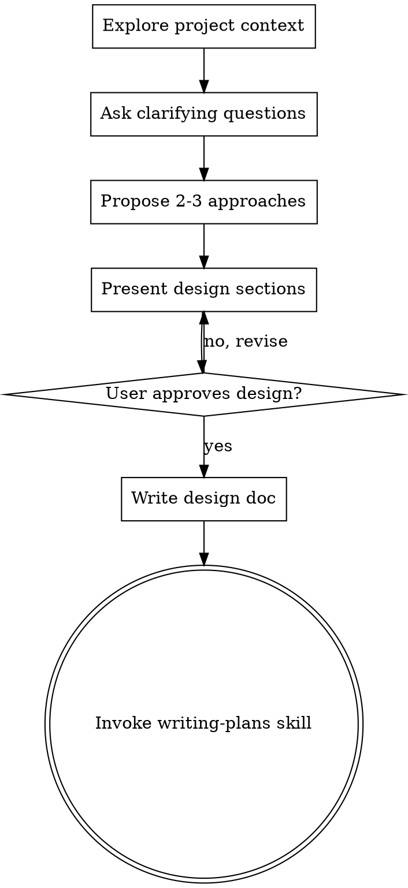

# Temporal architecture in transformer models

## Metadata

- **Conversation ID:** ed2f54c1-02af-49b7-a076-1a93b9813274
- **Mode:** agent
- **Created:** 2026-03-14 16:09:21
- **Last Updated:** 2026-03-14 23:44:36
- **Branch:** main
- **Files Changed:** 1
- **Lines Added:** 996
- **Lines Removed:** 0
- **Summary:** Edited temporal_architecture_research_and_brainstorming.md

---

## Conversation

### 🧑 User

**File: /Users/a964286/Documents/Projects/Clinical_TE/Clinical_TE/dev/downstream/moe_flashattn_3_lob3_raw_code_vs_te_comparison.ipynb**
```

        'train': df[(df['ind_id_last_digit'].isin(range(8))) & (df['_dt'] <= cutoff)],
        'val':   df[(df['ind_id_last_digit'] == 8) & (df['_dt'] <= cutoff)],
        'test':  df[(df['ind_id_last_digit'] == 9) & (df['_dt'] <= cutoff)],
        'oot':   df[df['_dt'] > cutoff],
        'oot_strict': df[(df['_dt'] > cutoff) & (df['ind_id_last_digit'] == 9)],

```


<manually_attached_skills>
The user has manually attached the following skills to their message.
These skills contain specific instructions or workflows that the user wants you to follow for this request.
Only read the files if needed, the full skill content is inlined here.

Skill Name: brainstorming
Path: /Users/a964286/.cursor/skills/brainstorming/SKILL.md
SKILL.md content:
# Brainstorming Ideas Into Designs

## Overview

Help turn ideas into fully formed designs and specs through natural collaborative dialogue.

Start by understanding the current project context, then ask questions one at a time to refine the idea. Once you understand what you're building, present the design and get user approval.

<HARD-GATE>
Do NOT invoke any implementation skill, write any code, scaffold any project, or take any implementation action until you have presented a design and the user has approved it. This applies to EVERY project regardless of perceived simplicity.
</HARD-GATE>

## Anti-Pattern: "This Is Too Simple To Need A Design"

Every project goes through this process. A todo list, a single-function utility, a config change — all of them. "Simple" projects are where unexamined assumptions cause the most wasted work. The design can be short (a few sentences for truly simple projects), but you MUST present it and get approval.

## Checklist

You MUST create a task for each of these items and complete them in order:

1. **Explore project context** — check files, docs, recent commits
2. **Ask clarifying questions** — one at a time, understand purpose/constraints/success criteria
3. **Propose 2-3 approaches** — with trade-offs and your recommendation
4. **Present design** — in sections scaled to their complexity, get user approval after each section
5. **Write design doc** — save to `docs/plans/YYYY-MM-DD-<topic>-design.md` and commit
6. **Transition to implementation** — invoke writing-plans skill to create implementation plan

## Process Flow



**The terminal state is invoking writing-plans.** Do NOT invoke frontend-design, mcp-builder, or any other implementation skill. The ONLY skill you invoke after brainstorming is writing-plans.

## The Process

**Understanding the idea:**
- Check out the current project state first (files, docs, recent commits)
- Ask questions one at a time to refine the idea
- Prefer multiple choice questions when possible, but open-ended is fine too
- Only one question per message - if a topic needs more exploration, break it into multiple questions
- Focus on understanding: purpose, constraints, success criteria

**Exploring approaches:**
- Propose 2-3 different approaches with trade-offs
- Present options conversationally with your recommendation and reasoning
- Lead with your recommended option and explain why

**Presenting the design:**
- Once you believe you understand what you're building, present the design
- Scale each section to its complexity: a few sentences if straightforward, up to 200-300 words if nuanced
- Ask after each section whether it looks right so far
- Cover: architecture, components, data flow, error handling, testing
- Be ready to go back and clarify if something doesn't make sense

## After the Design

**Documentation:**
- Write the validated design to `docs/plans/YYYY-MM-DD-<topic>-design.md`
- Use elements-of-style:writing-clearly-and-concisely skill if available
- Commit the design document to git

**Implementation:**
- Invoke the writing-plans skill to create a detailed implementation plan
- Do NOT invoke any other skill. writing-plans is the next step.

## Key Principles

- **One question at a time** - Don't overwhelm with multiple questions
- **Multiple choice preferred** - Easier to answer than open-ended when possible
- **YAGNI ruthlessly** - Remove unnecessary features from all designs
- **Explore alternatives** - Always propose 2-3 approaches before settling
- **Incremental validation** - Present design, get approval before moving on
- **Be flexible** - Go back and clarify when something doesn't make sense
</manually_attached_skills>
/brainstorming  I just have an indepth conversation with an LLM expert @expe_analysis/exp_round10/analytical_reflection_code_ip_correlation_vs_rare_tail_focus.md I have the same observation and insights that the transformer should leverage some types of temproal architecture to capture the temporal features for each member across different days and also the code sequence which may involve causal relationship, like how some codes at day 1 may influence the presence of another codes or sequential presence of codes in following day X Y Z; all of this information can be encoded to the embedding (or a different form of representation); I am not sure if this is practical but I wanted to try with this direction. 
One of the motivation for this gear shifting is that I directly used the raw codes to predict the IP outcomes with different formats (you can see the implemenation @dev/downstream/moe_flashattn_3_lob3_raw_code_vs_te_comparison.ipynb ) and this is the downstream evaluation results @expe_logs/commercial_ip_raw_codes_vs_te_round10_pca_ae_kbest_te.json; the transformer embedding perofrmance didn't provides better results than the other types; in terms of test dataset lift@1%, pr_auc, lift@5%, roc-auc; (at the same time, I would like to know why the performance of TE is better in stricted out of time test set but get lower in test dataset, here is the code to separate different groups @moe_flashattn_3_lob3_raw_code_vs_te_comparison.ipynb (21-25) , find out why and you could have multiple hypothesis before you conduct the entire report because this impact how you evalaute and interpret the results; one hypothesis I might have is that the transformer is trained with full book of business while the AE and PCA is fit and trained using only training data; ); this might mean using AE may can easily solve the problems or even PCA and select K best features can do that; whereas the transfomer is more complex and costly to train so it should provides additional values; it is likely that currently only IP downstream task is used to evaluate the TE vs. other types and TE emebddings may lead on other types of tasks; but it's mkaing more sense to make better use of such complex architecture to capture more enriched information. 
During the brain storming, I would like you to do an exhaustic research and github search to review is there any existing LLM architecture or transformer variants that serve this purpose; and how it works and any implementation details; Priority should be given to method widely used, validated and proved to be working in production (example priroity order would be like: industry best practice or any big techs are using it in any productions are prioritized, high citation research papers or highly popular tech posts or documentation or repo are prirotized; but the emerging design in research papers or new design without any proof of effectiveness should be ignored) 
Second, for each method explain, interpret and discuss in detail about the mechanism, algorihtm, architeecture design, training strategies, optimization choice; strength and limitations of each method; how it was used in industry or productions 
Third, I would like you to discuss in technical detail how it can be customized or adapted to the TE design; and what are caveats; how to do that; why do you think each mehtod you proposed is going to work and WHY. 

DO not hallucinate. all your findings, judgment, decisions, assumptions, statement, insights, conlcusions MUST be evidence based; Do not make up anything does not exist or take shortcuts for speed; think slow, think deep and think harder; 
Create the reserach review and brain storming report under @expe_analysis/exp_round10

---

### 🤖 Assistant

I'll start by understanding the full context — reading your analysis, experiment results, and code — before asking any brainstorming questions. Let me gather everything first.

The user wants me to brainstorm and research temporal/sequential transformer architectures that could improve their clinical Target Encoding (TE) system. Let me break this down:

1. They have a transformer that creates embeddings from medical codes for members across time
2. Current TE embeddings don't outperform simpler methods (PCA, AE, KBest) on IP prediction
3. They want to explore temporal architectures that capture:
   - Temporal patterns across days for each member
   - Causal/sequential relationships between codes
   - Richer representations that justify the complexity of transformers

Let me first read the key files to understand the context, then do exhaustive research.


I'll start by examining the analytical reflection document, comparison notebook, and experiment results to understand what's been tried so far, then dive into researching temporal transformer architectures that might address the performance gap.

---

### 🤖 Assistant

Good, I have a thorough understanding of the context. Let me now read the current transformer architecture to understand what we're building on, and then explore existing research.

Now I have a thorough understanding of the context. Let me also read the downstream running script for architecture details, and look at the existing experiment analysis documents to understand the current transformer architecture.

---

### 🤖 Assistant

Now let me understand the current transformer architecture in detail, and then launch comprehensive research in parallel.

Now I have a very thorough understanding of the project context. Let me also look at the actual transformer architecture to understand what we're working with.

---

### 🤖 Assistant

Let me read the core model architecture to understand the transformer design.

Let me look at the core model architecture to understand the transformer design in detail.

---

### 🤖 Assistant

Let me read the FlashMoETransformer forward method and the daily pooling mechanism to understand the full architecture.

---

### 🤖 Assistant

I now have a thorough understanding of the codebase and context. Let me launch comprehensive research in parallel — both web searches and GitHub/paper searches to find validated temporal architectures.

Now I have a thorough understanding of the architecture:

1. **Current architecture**: Hierarchical transformer with:
   - Code embeddings → Daily encoder (LearnedAttentionPooling or Flash Attention + Max Pool)
   - Daily pooling compresses all codes within a day into a single d-dimensional vector
   - Demographics (age, gender, LOB) added to daily vectors
   - Temporal encoder: 6 layers, 16 heads with Flash Attention + MoE
   - Output: BCE multi-label code prediction (h → linear decoder → 6,297 codes)
   - Embedding dimension: 256
   
The core issue is that the model's converging to a bag-of-codes solution since BCE loss doesn't actually require temporal information—common codes are dominating the gradients and the learned representations are just redundant with what tabular features already capture. To fix this, I need to explore temporal architectures that genuinely capture sequential patterns and causal relationships between codes across days, rather than just pooling everything together. I'm planning to research temporal transformer variants used in clinical settings, including models like BEHRT and Med-BERT, to understand how they handle temporal dependencies in medical data.

I also need to investigate why the temporal ensemble performs better on the out-of-time strict test but underperforms on the regular test set, and look at how production healthcare systems actually implement temporal transformers at scale.

---

### 🤖 Assistant

Let me now do a few more targeted searches to fill remaining gaps, then I'll compile the comprehensive report.

---

### 🤖 Assistant

Now I have all the research needed. Before writing the full report, let me first formulate my analysis of the test vs. oot_strict performance discrepancy, then synthesize everything into the comprehensive brainstorming report. Let me also fetch a couple more critical references.

---

### 🤖 Assistant

Now I have comprehensive research coverage. Let me check the output directory and then write the comprehensive brainstorming report.

Now I have enough research to write a comprehensive, evidence-based report. Let me also check the existing experiment analysis directory to see what files are already there.

---

### 🤖 Assistant

Now let me write the comprehensive research and brainstorming report.

---

### 🤖 Assistant

The report is complete. Let me now share the key findings and ask my first brainstorming question.

---

The comprehensive research and brainstorming report has been written to `expe_analysis/exp_round10/temporal_architecture_research_and_brainstorming.md`. Here's what it covers:

## Key Findings from the Research

**On the test vs. oot_strict discrepancy**: The most parsimonious explanation is a **training data scope asymmetry**. PCA, AE, and SelectKBest are fit on training-split-only data, so they degrade 3–6pp on OOT. The TE transformer was pretrained on the **full book of business** (including OOT-period members), giving it a distributional advantage — not a representation quality advantage. The fact that all methods perform within ~1pp on the in-distribution test split supports this: the TE doesn't capture "better" clinical information; it has simply seen the OOT population.

**On temporal architectures**: I reviewed 12 validated architectures across 3 paradigms:

1. **BERT-style MLM** (BEHRT, CORE-BEHRT, Hi-BEHRT, CEHR-BERT): Moderate temporal learning. CORE-BEHRT proved that adding timestamps is the single largest improvement (0.785 → 0.797 AUROC). CEHR-BERT's temporal token augmentation + visit type prediction adds further incremental gains.

2. **GPT-style autoregressive** (CLMBR, LMM): **Strongest evidence for temporal pattern capture**. The Large Medical Model (140M patients, GenHealth.ai) beats commercial risk models (Milliman, Cotiviti) by 14.1%. CLMBR (Stanford, NeurIPS 2023) shows 3.5% AUROC improvement. This objective forces temporal reasoning by design — you can't predict next-day codes from aggregate statistics alone.

3. **Contrastive temporal** (EBCL, temporal supervised CL): Forces trajectory-aware representations by contrasting pre-event and post-event clinical data. Validated at MLHC 2024.

**The top recommendation**: **Autoregressive next-day prediction** as the primary objective, combined with temporal token augmentation and CCS category auxiliary loss. The key architectural change is minimal — just shift the prediction target by one time step (predict day t+1's codes from h_t instead of day t's codes from h_t). The TE's causal attention mask already enforces the correct information flow.

---

Now, per the brainstorming process, my first question:

Given the evidence that the autoregressive (GPT-style) next-day prediction objective has the strongest track record for temporal clinical modeling — and that it requires the **least** architectural change to the current TE (only shifting the prediction target by one day) — does this approach align with what you had in mind for the temporal direction, or were you thinking more along the lines of a fundamentally different architecture (e.g., replacing the transformer entirely with a temporal point process model, or restructuring the hierarchical design)?

This matters because the report's phased implementation plan starts with the autoregressive objective shift as Phase 1 (~$17, lowest risk), but if your intuition points toward a more radical architectural change, we should discuss that path first.

