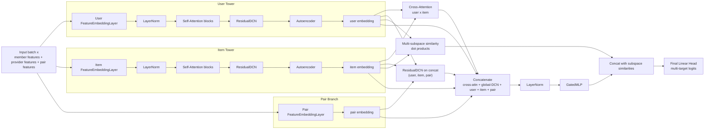

# Provider Recommender System Technical Anatomy Report

## 1) Executive Summary

This repository implements a healthcare member-to-provider recommendation platform built around three tightly coupled planes: (1) Airflow-orchestrated Dataproc infrastructure, (2) GPU-heavy data preparation via Dask/NVTabular, and (3) model training/inference pipelines spanning TorchRec DLRM and a custom dual-tower SmartRec architecture.

The strongest engineering choice is the orchestration pattern: DAGs package and ship the full repo to Dataproc, then execute model workflows in controlled GPU clusters with repeatable environment bootstrap. The weakest area is runtime integrity of the SmartRec path: several codepaths appear stale or inconsistent (undefined symbols, architecture drift in embedding extraction utilities, commented-but-imported config constants), which materially raises failure risk outside the primary happy path.

Bottom line: the system design is ambitious and production-oriented at the infra layer, but model-serving and embedding-generation scripts need a reliability hardening pass to match the maturity of orchestration.

---

## 2) First Impressions (Experience First)

### What I tried

1. Read repository docs and setup metadata.
2. Attempted to run training entry points:
   - `python3 dags/src/train_smartrec.py --help`
   - `python3 dags/src/train_dlrm.py --help`
3. Verified minimal Python environment baseline.

### Observations

- The repository presents as an internal ML platform codebase rather than an end-user application.
- Runtime is highly environment-bound (GPU stack, TorchRec, NVTabular/Merlin, distributed runtime, GCP credentials).
- The local environment cannot run model scripts without substantial dependency installation:
  - Missing `pytorch_lightning`
  - Missing `torchmetrics`
- This prevented full interactive feature execution; investigation was completed via code-level flow tracing.

### UX/operability feel

- **Polished:** Dataproc + Airflow packaging/orchestration pattern is concrete and repeatable.
- **Rough:** README is too sparse for onboarding; does not document actual runnable paths/dependency matrix.
- **Surprising:** Multiple SmartRec scripts appear internally inconsistent with current model definitions, suggesting partial refactors.

---

## 3) System Architecture Overview

### SmartRec Architecture Diagram (Two Towers -> Final Output)

### Tech Stack

| Layer | Primary Technologies |
|---|---|
| Orchestration | Apache Airflow DAGs, TaskGroups, PythonOperators, Dataproc operators |
| Cloud/Data Platform | GCP Dataproc, GCS, BigQuery, Service Account impersonation |
| Data Processing | Dask, Dask-CUDA, cuDF, NVTabular, Merlin |
| Modeling | PyTorch, PyTorch Lightning, TorchRec, custom SmartRec modules |
| Training Patterns | Distributed training (DDP/NCCL), mixed precision (`bf16`), custom multi-loss optimization |

### Directory Map (functional)

- `dags/dag/`: orchestration DAGs (`*-vae.py`, `*-smartrec-poc.py`, `*-torchrec.py`, etc.)
- `dags/src/utils/dag_utils/`: cluster config, packaging/upload helpers, task factories
- `dags/src/data/`: data loading and preprocessing (DLRM + SmartRec pipelines)
- `dags/src/models/`: model implementations (TorchRec DLRM and SmartRec components)
- `dags/src/config/`: training/data path and feature schemas
- `dags/src/train_*.py`: primary training entry points
- `dags/src/get_*_embedding.py` / `dags/src/dlrm_inference.py`: embedding extraction and inference scripts

### Entry Point Chain

1. Airflow DAG loads params and constructs task groups.
2. Task factory packages repo (`zip`) and uploads init scripts + code to GCS.
3. Dataproc cluster is provisioned with GPU profile and init actions.
4. Training/inference scripts execute on cluster runtime.
5. Artifacts/checkpoints/embeddings are persisted to project storage paths.

### Dependency and activity signals

- `Pipfile` only lists `dynaconf` and dev `pytest`, which does not reflect actual runtime requirements.
- Git history in this repo is shallow (`init`, `update`), so architectural intent is primarily encoded in code, not commit narrative.

---

## 4) Investigation Questions, Rationale, and Hypotheses

## Structural Questions

1. How do DAGs bridge infra provisioning to model execution?
   - **Rationale:** Determines deployment repeatability and ownership boundaries.
2. How is data transformed from BigQuery/raw features to training-ready tensors?
   - **Rationale:** Data contracts dominate recommendation quality and failure modes.
3. How does SmartRec combine user/item/pair signals end-to-end?
   - **Rationale:** Core ranking behavior depends on tower and interaction composition.

## Decision Questions

4. Why use Dataproc+NVTabular+Merlin instead of a simpler PyTorch-only data path?
   - **Rationale:** Tradeoff between throughput and operational complexity.
   - **Hypothesis:** Chosen to scale very wide sparse/categorical feature spaces and parquet ETL with GPU acceleration.
5. Why use uncertainty-weighted multi-loss training in SmartRec Lightning?
   - **Rationale:** Affects convergence stability and embedding geometry.
   - **Hypothesis:** Team is combating embedding collapse and objective imbalance across many supervised/contrastive terms.

## Comparative Questions

6. How does this stack compare to modern recommender production patterns?
   - **Rationale:** Determines whether architecture is leading, aligned, or lagging for operational ML systems.
   - **Hypothesis:** Infra pattern is aligned with large-scale recsys operations; model-serving rigor appears behind best practice.

---

## 5) Competitive Landscape (pre-deep-dive framing)

Compared systems:

1. **Meta TorchRec DLRM stacks**
   - Strength: industrial-scale sparse feature handling and distributed embedding sharding.
2. **NVIDIA Merlin/NVTabular pipelines**
   - Strength: GPU-native tabular preprocessing + recsys training integration.
3. **Two-stage retrieval/ranking production recommenders (industry pattern)**
   - Strength: low-latency serving via ANN retrieval + richer rerankers.
4. **Wide&Deep / DCN-family ranking models**
   - Strength: robust interaction modeling with moderate serving complexity.

### Positioning Matrix

| Dimension | This Repo | Industry Reference |
|---|---|---|
| Distributed sparse training | Strong (TorchRec DLRM path) | Aligned |
| GPU ETL for tabular recsys | Strong (Dask-CUDA + NVTabular) | Aligned |
| Multi-objective deep ranking | Advanced experimentation | Above average |
| Production serving path clarity | Weak/implicit | Below average |
| Runtime consistency/tooling hygiene | Mixed | Below average |

---

## 6) Technical Deep Dive by Subsystem (flow-traced)

## Flow A: Airflow DAG -> Dataproc cluster bootstrap -> run tasks

### Trace

- DAG definitions in `dags/dag/provider-ds-hcb-im-dlrm-vae.py` and `dags/dag/provider-ds-hcb-im-dlrm-smartrec-poc.py`.
- Parameter materialization through `params.yaml` + custom YAML constructors (`!join`, `!runtime`, `!anchordt`).
- Task groups built via `dags/src/utils/dag_utils/taskfactory.py`.
- Dataproc configuration generated by `dags/src/utils/dag_utils/dataproc_config.py`.

### Design decisions observed

- Repo is zipped and uploaded per run, enabling code-as-artifact execution rather than baking fixed images.
- IAM/service-account impersonation is explicit and integrated in operators.
- GPU machine type is selected by abstracted config helper (`get_onenode_config`).

### Why it works

- Strong environment determinism and infrastructure ownership boundaries.
- Reproducible cluster provisioning parameters (machine family, image version, metadata flags).

## Flow B: SmartRec data preprocessing (BigQuery -> NVTabular workflow -> parquet)

### Trace

- `dags/src/data/smartrec/train_data_processor.py`: defines schema/transforms and saves workflow.
- `dags/src/data/smartrec/get_processed_data.py`: loads workflow and writes transformed parquet.

### Data transformation boundaries

1. BigQuery read to Dask DataFrame.
2. Optional Dask-cuDF conversion and repartitioning.
3. NVTabular ops:
   - `FillMissing`, `LambdaOp` casts, `Categorify`, tags for UID/continuous/categorical/target.
4. Workflow persisted and reused for deterministic transforms.
5. Output parquet emitted for model loaders.

### Critical risk discovered

- `GCS_DATA_PATH` / `GCS_TEST_DATA_PATH` are referenced but appear commented out in `config/smartrec/vars.py`; this can break preprocessing imports and execution.

## Flow C: SmartRec model training loop

### Trace

- Entry script: `dags/src/train_smartrec.py`
- Model: `dags/src/models/smartrec/smartrec.py`
- Training module: `dags/src/models/smartrec/lightning_smartrec.py`

### Architecture chain

1. User tower + item tower:
   - feature embedding
   - stacked self-attention
   - residual DCN
   - autoencoder compression
2. Pair feature embedding.
3. Cross-attention between user/item latent spaces.
4. Combined features -> gated MLP -> final prediction head.
5. Auxiliary similarity subspaces + projection orthogonality regularization.

### Loss system

- Base supervised loss: weighted BCE logits.
- Auxiliary losses: triplet, InfoNCE, ranking contrastive, variance preservation, effective-rank, orthogonality, category alignment.
- Optional uncertainty-based weighting (`exp(-log_var)`) dynamically balances terms.

### Design rationale

- Model is explicitly optimized not just for prediction but for embedding geometry health (variance, rank, orthogonality, diversity).
- This is a sophisticated answer to representation collapse in high-dimensional sparse feature recommenders.

## Flow D: TorchRec DLRM distributed training/inference

### Trace

- `dags/src/train_dlrm.py` for training.
- `dags/src/dlrm_inference.py` for inference.
- `dags/src/data/dlrm/dataloader.py` for binary-data loading.

### Design decisions

- Uses distributed model parallelism, planner-based embedding sharding, and fused embedding optimizers.
- Uses in-memory binary data pipes with train/test split file conventions.
- Collects a broad set of binary metrics (AUPRC, F1, precision, recall, AUROC, etc.) during evaluation.

### Why it works

- Strong reuse of TorchRec patterns for scaling sparse recommendation models.
- Clear separation between data loader, model config, distributed pipeline, and checkpointing.

## Flow E: Embedding extraction scripts

### Trace

- `dags/src/get_smartrec_embedding.py`
- `dags/src/get_autoencoder_embedding.py`

### Critical integrity findings

- `get_smartrec_embedding.py` imports `allpaths` from `config.smartrec.vars`, but no `allpaths` export is defined there.
- `one_tower()` in `get_smartrec_embedding.py` references attributes (`pre_attention_layer`, `layer_norms`, `gated_mlps`, `mmoe`) inconsistent with current `SmartUser`/`SmartItem` implementation in `smartrec.py`.
- This strongly suggests script drift from current model architecture and likely runtime failure when used.

---

## 7) Extracted Patterns and Innovations

## Architectural Patterns

1. **Code-as-artifact Dataproc execution**
   - Problem: keep orchestration and execution code synchronized without manual cluster image churn.
   - Mechanism: zip repo at runtime, upload to GCS, bootstrap cluster with init actions.
   - Transferability: excellent for internal ML platform pipelines requiring frequent script changes.
   - Industry alignment: aligned with robust internal MLOps practices.

2. **Dual runtime planes (orchestration + model pipeline)**
   - Problem: separate infra concerns from modeling concerns.
   - Mechanism: Airflow/taskfactory for infra; independent training scripts for model logic.
   - Transferability: high; supports clearer ownership by platform vs model teams.

## Design Patterns

3. **Embedding-quality-first objective stack**
   - Problem: predictive accuracy alone can hide collapsed/low-utility embedding spaces.
   - Mechanism: combine BCE with contrastive/ranking/variance/effective-rank/orthogonality losses.
   - Transferability: strong for retrieval/ranking systems with representation reuse.
   - Industry alignment: progressive; above basic recsys implementations.

4. **Uncertainty-weighted multi-loss balancing**
   - Problem: static manual loss weights are brittle.
   - Mechanism: learn `log_var_*` parameters and optimize weighted sum adaptively.
   - Transferability: strong in multi-task/multi-objective setups.
   - Industry alignment: advanced but increasingly common.

## Operational Patterns

5. **GPU-aware ETL with reusable workflow graph**
   - Problem: expensive feature transforms must remain consistent between train and inference pipelines.
   - Mechanism: fit once (NVTabular workflow), save, reload, transform at scale.
   - Transferability: high for large tabular recsys systems.
   - Industry alignment: aligned with high-throughput recommender data engineering.

## Innovation / Gap Pattern

6. **High model sophistication with script drift risk**
   - Problem: rapid model iteration can outpace surrounding utility scripts.
   - Mechanism (observed): architecture evolves but helper scripts retain stale assumptions.
   - Transferability: cautionary; highlights need for contract tests around model utility scripts.
   - Industry alignment: common failure mode in fast-moving ML teams.

---

## 8) Engineering Assessment (Quality Ratings)

| Area | Rating | Notes |
|---|---|---|
| Orchestration and infra automation | 8.5/10 | Strong Dataproc task factory and environment provisioning patterns |
| Data engineering pipeline | 8/10 | Good GPU ETL design; config consistency concerns |
| Core model architecture | 8.5/10 | Sophisticated SmartRec objective and interaction design |
| Runtime reliability | 5/10 | Symbol/config drift and likely broken utility paths |
| Onboarding and docs | 4/10 | Minimal README, implicit operational assumptions |

### Major strengths

- Mature infra orchestration pattern.
- Advanced embedding-quality-aware model training strategy.
- Clear separation of DLRM and SmartRec experiment tracks.

### Major gaps

- Config symbol integrity and stale script coupling.
- Sparse environment setup documentation relative to actual dependency graph.
- Lack of visible automated tests for critical script compatibility.

---

## 9) Industry Alignment Analysis

### Where this repo is ahead

- Multi-objective embedding quality optimization.
- Strong GPU ETL + distributed training integration.
- Practical orchestration for enterprise cloud constraints (service accounts, network/KMS controls).

### Where it is behind

- Robustness and compatibility checks around non-core scripts.
- Clear production serving architecture (candidate generation/retrieval/reranking boundaries are implied but not codified as deployable services here).
- Developer experience for reproducible local validation.

---

## 10) Critical Findings and Recommendations

## Findings (ordered by severity)

1. **Potential SmartRec preprocessing breakage due to undefined config symbols**
   - `GCS_DATA_PATH` and `GCS_TEST_DATA_PATH` are referenced in SmartRec preprocessing/training config usage but commented/undefined in `config/smartrec/vars.py`.
2. **Embedding extraction utility appears incompatible with current SmartRec architecture**
   - `get_smartrec_embedding.py` references tower attributes inconsistent with `smartrec.py`.
3. **Config import mismatch for `allpaths` in SmartRec embedding utility**
   - `get_smartrec_embedding.py` imports `allpaths` from smartrec config where it is not defined.
4. **Dependency declaration is incomplete for practical execution**
   - `Pipfile` does not represent true runtime requirements (Lightning, TorchRec, NVTabular stack, etc.).
5. **README insufficient for operational onboarding**
   - Lacks concrete bootstrap/runbook for local or cluster execution.

## Recommendations

1. Add a **config contract test** that imports every `dags/src/config/*/vars.py` and validates referenced symbols.
2. Add a **model utility compatibility test** for `get_smartrec_embedding.py` against the current `SmartRec` class.
3. Introduce a **single source of truth** for model feature/config exports (typed config object or pydantic schema).
4. Create a **runtime manifest** (`requirements.txt` or lockfile) matching actual training/inference dependencies.
5. Document a minimal **developer runbook**:
   - local smoke test mode
   - cluster mode
   - expected env vars and credentials

---

## 11) Transferable Insights

1. Use orchestration-level packaging/upload to keep infra and code releases synchronized in ML pipelines.
2. Treat embedding geometry as a first-class training target, not a side effect.
3. Build compatibility checks around utility scripts whenever model internals evolve.
4. Codify data-contract and config-contract tests early; they prevent the majority of expensive pipeline failures.

---

## 12) Phase 8 Self-Validation

## Accuracy verification table

| Claim | Evidence | Verified |
|---|---|---|
| DAGs orchestrate Dataproc clusters and task groups | `dags/dag/provider-ds-hcb-im-dlrm-smartrec-poc.py`, `dags/src/utils/dag_utils/taskfactory.py` | Yes |
| Runtime packages repo and uploads to GCS before cluster execution | `taskfactory.py` (`uploadarchive`, `upload_object` calls and GCS paths) | Yes |
| SmartRec uses multi-loss training with uncertainty weighting | `dags/src/models/smartrec/lightning_smartrec.py` | Yes |
| SmartRec model combines user/item/pair with cross-attention and DCN | `dags/src/models/smartrec/smartrec.py` | Yes |
| DLRM path uses TorchRec distributed model parallel planning/sharding | `dags/src/train_dlrm.py`, `dags/src/dlrm_inference.py` | Yes |
| `GCS_DATA_PATH` references are present while definition appears commented | `dags/src/config/smartrec/vars.py`, `dags/src/data/smartrec/*.py` | Yes |
| `get_smartrec_embedding.py` references tower fields not present in current `SmartRec` tower class | `dags/src/get_smartrec_embedding.py` vs `dags/src/models/smartrec/smartrec.py` | Yes |

## Completeness checklist

- Phase 1 executed to practical limit (runtime attempts + observed blockers): complete.
- Architecture reconnaissance complete: complete.
- Tiered questions + hypotheses generated and resolved: complete.
- Competitive context included before deep technical synthesis: complete.
- 5 end-to-end flows traced: complete.
- Patterns extracted with transferability: complete.

---

## 13) Phase 9 Synthesis: What I Would Build Differently

### Keep exactly as-is

- Dataproc task-factory orchestration approach.
- Hybrid model strategy (TorchRec DLRM + custom SmartRec experimentation).
- Embedding-quality-aware multi-loss framework.

### Change

- Introduce strict compatibility tests for all embedding/inference scripts to prevent architecture drift.
- Replace ad hoc config globals with versioned typed configuration contracts.
- Add CI smoke tests for import-time/runtime sanity of each entrypoint.

### Missing capabilities

- Explicit online serving architecture (retrieval index, ranking service boundaries, latency SLO handling).
- Feature store/versioning strategy visibility.
- Operational quality gates for script/config coherence.

### Patterns to apply elsewhere

- Multi-loss uncertainty balancing for representation-heavy recommenders.
- Orchestration packaging pattern for cloud ML jobs.
- Mandatory “contract tests” between model modules and peripheral tooling.

